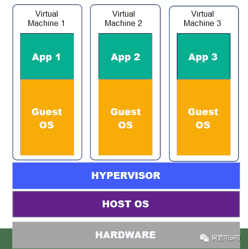
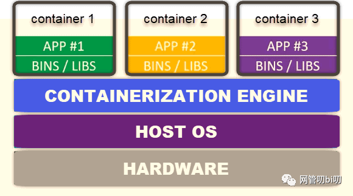

# 容器 Docker

## 简介

### 概述

#### 虚拟化

+ 虚拟化是一种资源管理技术。
+ 虚拟化技术将计算机各种实体资源，如内存、网络等资源抽象、转换之后，使用户更方便管理和使用。

#### 容器 & 虚拟机

**虚拟机**

+ `hypervisor`是一种虚拟化服务器的软件。

+ 从图中能看出虚拟机与它的宿主机拥有不同的操作系统，即：运行应用程序所需的一切都包含在虚拟机里--虚拟化的硬件。

**容器**

+ 而容器则是共用一个操作系统，它通过Linux的`Namespaces`和`Cgroups`技术对应用程序进程进行隔离和限制的。

**对比**

+ 容器与虚拟机相比资源开销更少。
+ 但，容器仍无法提供与虚拟机相同的安全性和稳定性。
  - 由于它们共享主机的内核，因此不能像虚拟机一样完全隔离。

#### docker定义

+ Docker 是一个开源的应用容器引擎。
+ 它让开发者可以打包他们的应用以及依赖包到一个可移植的镜像中，然后发布到任何流行的 Linux或Windows操作系统的机器上，也可以实现虚拟化。

### 术语

**镜像 Image**

+ Docker 镜像就相当于是一个 root 文件系统。比如官方镜像 ubuntu:16.04 就包含了完整的一套 Ubuntu16.04 最小系统的 root 文件系统。

**容器 Container**

+ 镜像和容器的关系，就像是面向对象程序设计中的类和实例一样，镜像是静态的定义，容器是镜像运行时的实体。容器可以被创建、启动、停止、删除、暂停等。

**仓库 Repository**

+ 仓库可看成一个代码控制中心，用来保存镜像。

### 特性

+ Automating the packaging and deployment of applications（使应用的打包与部署自动化）
+ Creation of lightweight, private PAAS environments（创建轻量、私密的PAAS环境）
+ Automated testing and continuous integration/deployment（实现自动化测试和持续的集成/部署）
+ Deploying and scaling web apps, databases and backend services（部署与扩展webapp、数据库和后台服务）

## 参考

**综合**

+ [Docker百度百科](https://baike.baidu.com/item/Docker/13344470?fr=aladdin)

**容器与虚拟机**

+ [虚拟机和容器到底有什么区别](https://blog.csdn.net/kevin_tech/article/details/107194554)

**术语**

+ [docker核心概念及基本操作](https://www.cnblogs.com/whych/p/9446032.html)
+ [docker的架构](https://www.runoob.com/docker/docker-architecture.html)

