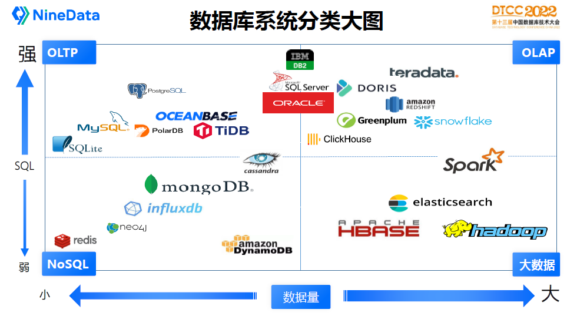

# 数据库

- [数据库](#数据库)
  - [概念](#概念)
  - [分类](#分类)
  - [架构](#架构)
    - [外部](#外部)
    - [单机](#单机)
    - [内部](#内部)
      - [存储引擎](#存储引擎)
      - [查询引擎](#查询引擎)
  - [设计](#设计)
    - [索引](#索引)
    - [范式](#范式)
  - [展望](#展望)
  - [参考](#参考)

## 概念

**SQL vs NoSQL vs NewSQL**：

- SQL databases, also referred to as relational database management systems (RDBMS), are a traditional approach to storing and managing historical data. In an RDBMS, data is organized in a structured manner using tables or relations.
- On the other hand, NoSQL databases, also known as "not only SQL" databases, utilize various data models such as key-value pairs, documents, graph databases, or wide-column stores, and do not follow a fixed schema like RDBMS. NoSQL databases are also horizontally scalable, which means they can scale out across multiple servers, in contrast to RDBMS which are typically scaled vertically by adding more resources to a single server.
- NewSQL databases combine the relational data model of traditional SQL databases with the scalability and performance of NoSQL databases. They offer the benefits of both approaches, enabling high-performance and horizontally scalable relational databases.

**BASE vs ACID**：

- ACID: ACID stands for Atomicity, Consistency, Isolation, and Durability. This is a set of properties that guarantee that database transactions are processed reliably.
- BASE stands for Basically Available, Soft state, Eventual consistency. This is a data consistency model that favors availability and partition tolerance over strict consistency.

**OLAP vs OLTP vs HTAP**：

OLAP（Online Analytical Processing）用于支持在线分析处理应用程序，如商业智能、数据挖掘、数据分析等。OLAP通常需要处理大量的数据，而且需要进行复杂的查询和分析操作。OLAP系统通常使用列式存储和向量化查询技术来提高查询性能。

OLTP（Online Transaction Processing）用于支持在线事务处理应用程序，如电子商务、金融交易、库存管理等。OLTP系统需要处理大量的事务，需要保证数据的一致性和可靠性，并且需要支持高并发的访问。

HTAP（Hybrid Transactional and Analytical Processing）是一种将OLTP和OLAP结合起来的数据处理方式。在HTAP系统中，数据可以同时用于事务处理和分析处理。HTAP系统通常使用混合存储引擎，可以在行式存储和列式存储之间灵活切换，以支持不同的应用场景。

**Database vs Data Warehouse vs Data Lake**：

- A database stores the current data required to power an application.
- A data warehouse stores current and historical data from one or more systems in a predefined and fixed schema, which allows business analysts and data scientists to easily analyze the data.
- A data lake stores current and historical data from one or more systems in its raw form, which allows business analysts and data scientists to easily analyze the data.

## 分类

主流的数据库有几十种，这张图描述了当前数据库主流产品定位，通过管理数据量大小和SQL功能强弱把各个产品分为四大类：

- OLTP：在线事务处理平台，一般都是关系型数据库来支撑，常见的数据库有：SQLite、MySQL、PostgreSQL、PolarDB、TiDB、OceanBase
- OLAP：在线分析业务，一般是数据仓库，常见的产品有：Teradata、Clickhouse、Doris、Greenplum、Snowflake、AWS Redshift
- NoSQL：新数据模型，互联网行业用得非常多，代表产品有：Redis、Neo4j、InfluxDB、MongoDB、Cassandra、AWS DynamoDB
- BigData：大数据业务，和数据仓库比较类似，但是更擅长处理大规模数据分析业务，主流产品有：HBase、Hadoop、ElasticSearch、Spark

## 架构

### 外部

我们可以根据数据库计算节点和存储节点部署整体架构分为几大种类：

### 单机

计算节点和存储节点一般在同一台机器上，通常存储节点是本地硬盘，如单机版的MySQL、Oracle。单机模式没有高可用保障，常用于临时开发测试或者个人学习场景，生产环境不建议使用。

主备读写分离：在单机模式上增加了备用节点，备用节点既可以作为高可用保障，也可以承担只读业务请求，主备之间通过数据库的log实时传输实现。比较常见的有MySQL的Master-Slave，Oracle的Active Dataguard，SQL Server的Always on，主备模式也是当前生产环境最常见的部署架构。

随着数据量或者负载的增加，主备模式已经无法满足业务需求，因此诞生了分布式的软件架构，数据仓库和大数据产品通常都是分布式架构，主要由两种模式：

分布式（Share everything）：Share everything架构通常存储节点采用分布式的共享存储，比如专业的EMC存储设备或者是云存储OSS/S3。因为数据共享问题解决了，计算节点就能扩展多个，从而承担更多业务负载。典型代表有Oracle RAC、阿里云PolarDB、Snowflake、AWS Redshift(RA3)。IBM DB2也是典型的分布式架构，它同时还采用了集中式共享缓存的模式。

分布式（Share nothing）：在没有共享存储的情况下，通常会采用Share Nothing的架构设计。这类架构是存储数据分片存储在不同的节点，因此计算和存储节点都是独立运行，通过MPP计算引擎实现集群资源的调度运算。

### 内部

#### 存储引擎

**HEAP**:

**B+ TREE**:

**COLUMN STORE**:

**LSM-TREE**:

#### 查询引擎

## 设计

### 索引

### 范式

## 展望

**流式数据库**：

## 参考

- [程序员必须掌握的数据库原理](https://dev.amazoncloud.cn/column/article/63ef527a65a6d47c5e10b97c)
- [SQL vs NoSQL vs NewSQL: An In-depth Literature Review](https://blog.reachsumit.com/posts/2022/06/sql-nosql-newsql/)
- [Databases vs. Data Warehouses vs. Data Lakes](https://www.mongodb.com/databases/data-lake-vs-data-warehouse-vs-database)
