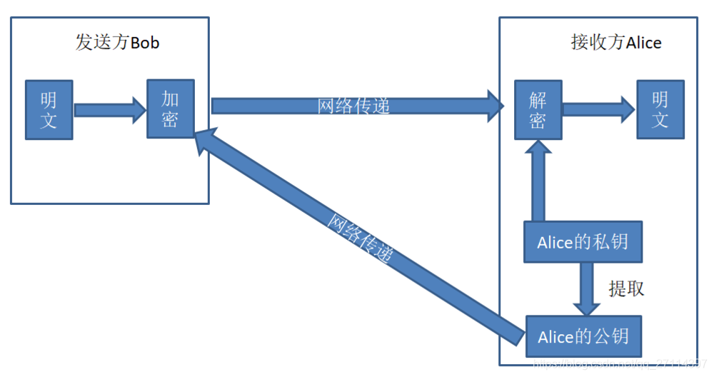
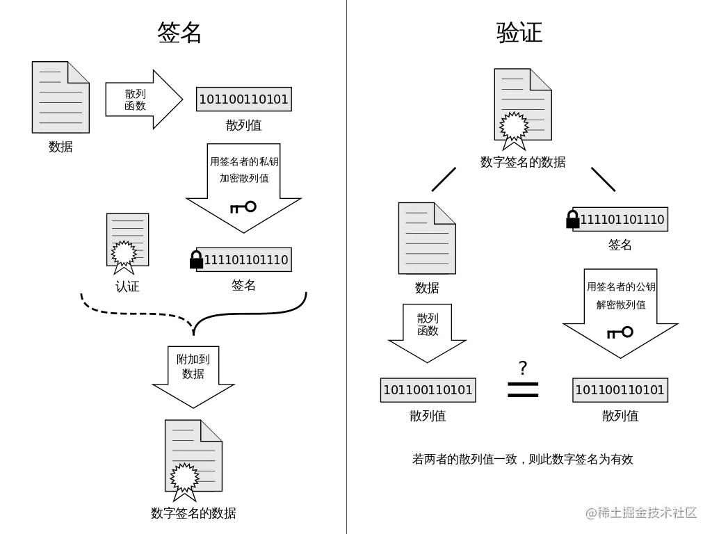
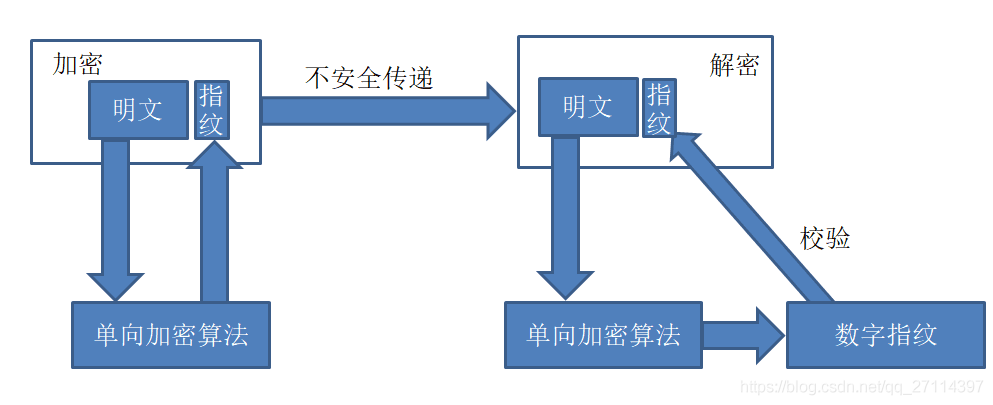

# 加密算法Encryption Algorithm

## 简介

### 概述

+ 数据加密的基本过程就是对原来为明文的文件或数据按某种算法进行处理，使其成为不可读的一段代码为“密文”，使其只能在输入相应的密钥之后才能显示出原容，通过这样的途径来达到保护数据不被非法人窃取、阅读的目的

### 目的

+ 在安全领域，利用密钥加密算法来对通信的过程进行加密是一种常见的安全手段。利用该手段能够保障数据安全通信的三个目标：
  - 数据的保密性，防止用户的数据被窃取或泄露；
  - 保证数据的完整性，防止用户传输的数据被篡改；
  - 通信双方的身份确认，确保数据来源与合法的用户；

### 分类

+ 加密算法通常根据其密钥特点分为两大类：“对称式”和“非对称”
  - 至于密钥，则是一种参数。
    * 它是在明文转换为密文或将密文转换为明文的算法中输入的参数。
    * 密钥分为对称密钥与非对称密钥。

## 对称加密算法

### 简介

+ 对称加密指加密和解密使用相同密钥的加密算法

### 流程

+ 密钥通常来说是通过双方协商，以物理的方式传递给对方，或者利用第三方平台传递给对方；
+ 收发双方分别使用密钥进行解密和加密，从而使得信息得以保密传递。
+ 但由于加解密算法是公开的，密钥的安全传递就成为了保证秘密性的关键了。

### 优缺点：

+ 算法公开、计算量小、加密速度和效率高
+ 密钥单一、密钥管理困难

## 非对称加密算法

### 简介

+ 非对称加密指加密和解密使用不同密钥的加密算法，也称为公私钥加密

### 流程

- 发送方Bob从接收方Alice获取其对应的公钥，并结合相应的非对称算法将明文加密后发送给Alice；
- Alice接收到加密的密文后，结合自己的私钥和非对称算法解密得到明文。
- 这种简单的非对称加密算法的应用其安全性比对称加密算法来说要高，但是==其不足之处在于无法确认公钥的来源合法性以及数据的完整性==。

### 优缺点

- 安全性高、算法强度负复杂
- 加解密耗时长、速度慢，只适合对少量数据进行加密

## 加密算法的应用

### 数字签名

#### 简介

+ 数字签名是一个带有密钥的消息摘要算法
  - 数字摘要是利用哈希算法将需要加密的明文“摘要”成固定长度密文的技术

#### 流程

+ 一套 **数字签名** 通常定义两种 **互补** 的运算，一个用于 **签名**，另一个用于 **验证**
+ 分别由 **发送者** 持有能够 **代表自己身份** 的 **私钥** (私钥不可泄露),由 **接受者** 持有与私钥对应的 **公钥** ，能够在 **接受** 到来自发送者信息时用于 **验证** 其身份

### Https

#### 简介

+ HTTPS 并不是新协议，而是让 HTTP 先和 SSL（Secure Sockets Layer）通信，再由 SSL 和 TCP 通信，也就是说 HTTPS 使用了隧道进行通信

#### Https使用的加密方式

+ 使用非对称密钥加密方式，传输对称密钥加密方式所需要的 Secret Key，从而保证安全性;
+ 获取到 Secret Key 后，再使用对称密钥加密方式进行通信，从而保证效率。

### 数字证书

#### 简介

+ 数字证书是指在互联网通讯中标志通讯各方身份信息的一个数字认证，人们可以在网上用它来识别对方的身份
+ 数字证书认证机构（CA，Certificate Authority）是客户端与服务器双方都可信赖的第三方机构

#### 实现

+ 数字证书实际上就是通过数字签名实现的

#### 流程

**申请证书**

+ 服务器的运营人员向 CA 提出公开密钥的申请，CA 在判明提出申请者的身份之后，会对已申请的公开密钥做数字签名，然后分配这个已签名的公开密钥，并将该公开密钥放入公开密钥证书后绑定在一起。

**使用证书**

+ 进行 HTTPS 通信时，服务器会把证书发送给客户端。
+ 客户端取得其中的公开密钥之后，先使用数字签名进行验证，如果验证通过，就可以开始通信了。

## 哈希算法与加密算法

+ 在数据安全领域， 通常比较加密和散列，但为什么会这样。

  - 加密是一种双向功能，其中数据以明文形式传入，以密文形式传出，这是不可读的。由于加密是双向的，因此数据可以被解密，因此可以再次读取。
  - 另一方面，散列是单向的，这意味着明文通过使用无法解密的盐被加扰成唯一的摘要。从技术上讲，散列可以反转，但解密所需的计算能力使得解密不可行。

+ 哈希的工作方式是使用散列算法

  - 该算法在抗碰撞时最有效。防碰撞意味着所有摘要都是唯一的，并且不会相互重叠。
  - 这意味着散列算法必须足够复杂以至于没有重叠的散列，但又不能复杂到需要太长时间来计算散列。

+ 哈希算法实现数据验证的流程：

  

+ 

+ 总的来说，

  - 如果被保护数据仅仅用作比较验证，在以后不需要还原成明文形式，则使用哈希；
  - 如果被保护数据在以后需要被还原成明文，则需要使用加密。