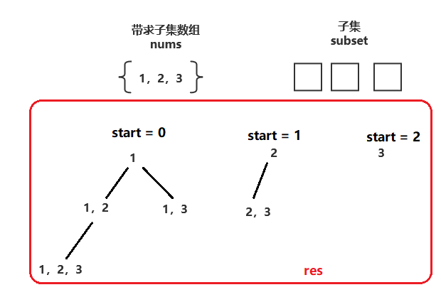
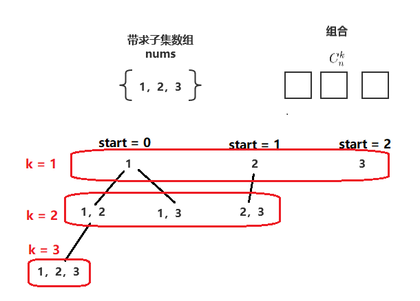
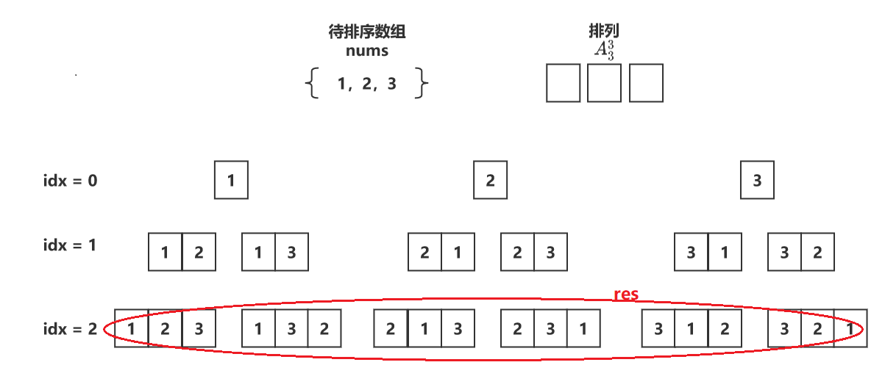

# 回溯算法

- [回溯算法](#回溯算法)
  - [基础概念](#基础概念)
    - [回溯](#回溯)
    - [剪枝](#剪枝)
    - [记忆化搜索](#记忆化搜索)
    - [时间复杂度](#时间复杂度)
  - [题型分类](#题型分类)
    - [子集](#子集)
    - [组合](#组合)
    - [排列](#排列)
  - [经典题目](#经典题目)
    - [基础题](#基础题)
    - [中等题](#中等题)
    - [难题](#难题)

## 基础概念

### 回溯

回溯算法是一种基于深度优先搜索的算法，用于解决组合优化问题、排列问题、选择问题等。其思想是通过逐步地构建解，当发现当前构建的解不满足问题的约束条件时，就回溯到上一步进行调整，继续尝试其他的可能解，直到找到合适的解或所有可能的解都被尝试。一般来说，回溯问题可以使用选或不选以及选哪个的思路来思考。

### 剪枝

剪枝(Pruning)是回溯算法中常用的优化技巧，通过提前排除不符合条件的选择，减少搜索的分支，从而提高算法的效率。比如说，子集回溯问题中针对重复元素的优化，就可以添加下面的剪枝代码。

```c++
void backtracking(vector<vector<int>>& res, const vector<int>& nums, vector<int>& subset, int start) {
  res.push_back(subset);
  for (int i = start; i < nums.size(); i++) {
    if (i > start && nums[i-1] == nums[i]) {
        continue;
    }
    subset.push_back(nums[i]);
    backtracking(res, nums, subset, i + 1);
    subset.pop_back();
  }
}
```

### 记忆化搜索

记忆化搜索(Memoization)是回溯算法中的另一种常用技巧，用于避免重复计算，提高算法的效率。记忆化搜索通过保存中间结果，避免重复的计算过程，当需要再次使用相同的结果时，直接从缓存中获取，避免了重复的计算。

简单来说，记忆化搜索就是递归搜索（回溯）+保存中间结果的一种组合手段。它本质上和动态规划的思想是一致的，即找出规模较大的问题和其子问题的关系，将这些子问题的结果保存，以空间换时间的方式简化运算复杂度。只不过，记忆化搜索算是自顶向下解决问题，而动态规划则是自底向上解决问题。

此外，使用记忆化搜索优化的回溯算法，一般不再将回溯结果放在参数，而是以返回值的形式存储。比如，[486 预测赢家](https://leetcode.cn/problems/predict-the-winner/description/)中使用回溯+记忆化搜索的方式解决问题。

```c++
bool predictTheWinner(vector<int>& nums) {
    int tot = accumulate(nums.begin(), nums.end(), 0);
    int n = nums.size();
    vector<vector<int>> memo(n, vector<int>(n, -1));
    // 返回在nums[i:j]时，能获取到的最大数字和。
    function<int(int, int, int)> dfs = [&](int i, int j, int sum) {
        if (i == j) {
            return nums[i];
        }
        if (j - i == 1) {
            return max(nums[i], nums[j]);
        }
        if (memo[i][j] == -1) {
            memo[i][j] = sum-min(dfs(i+1, j, sum-nums[i]), dfs(i, j-1, sum-nums[j]));
        }
        return memo[i][j];
    };
    // 仅当能获取最大数字和大于全部数字总和的一半时，先选者胜利。
    return 2*dfs(0, n-1, tot) >= tot;
}
```

又比如在[526 优美的排列](https://leetcode.cn/problems/beautiful-arrangement/description/)中，使用回溯+记忆化搜索+bitset状态压缩来解决问题。

```c++
int countArrangement(int n) {
    unordered_map<bitset<15>, int> memo;
    function<int(bitset<15>)> dfs = [&](bitset<15> state) {
        if (state.count() == n) {
            return 1;
        }
        if (memo.count(state)) {
            return memo[state];
        }
        int res = 0;
        int i = state.count()+1;
        for (int perm_i = 1; perm_i <= n; perm_i++) {
            if (state.test(perm_i-1)) {
                continue;
            }
            if (i%perm_i == 0 || perm_i%i == 0) {
                state.set(perm_i-1);
                res += dfs(state);
                state.reset(perm_i-1);
            }
        }
        memo[state] = res;
        return res;
    };
    bitset<15> state;
    return dfs(state);
}
```

### 时间复杂度

分析回溯问题的时间复杂度，有一个通用公式：路径长度×搜索树的叶子数。比如，子集回溯问题，每个元素无外乎取或不取，因此时间复杂度为O(n×2^n)。而排列回溯问题，叶子节点则有n!个，因此时间复杂度为O(n×n!)。

## 题型分类

| 题目类型 | 经典题目                                                     |
| -------- | ------------------------------------------------------------ |
| 子集     | [子集](https://leetcode-cn.com/problems/subsets/)、[子集Ⅱ](https://leetcode-cn.com/problems/subsets-ii/) |
| 组合     | [组合](https://leetcode-cn.com/problems/combinations/)、[组合总和](https://leetcode-cn.com/problems/combination-sum/)、[组合的总和Ⅱ](https://leetcode-cn.com/problems/combination-sum-ii/) |
| 排列     | [全排列](https://leetcode-cn.com/problems/permutations/)、[全排列Ⅱ](https://leetcode-cn.com/problems/permutations-ii/)、[字符串的全排列](https://leetcode-cn.com/problems/zi-fu-chuan-de-pai-lie-lcof/)、[字母大小写全排列](https://leetcode-cn.com/problems/letter-case-permutation/)、[活字印刷](https://leetcode.cn/problems/letter-tile-possibilities/description/)|
| 搜索     | [二进制手表](https://leetcode-cn.com/problems/binary-watch/)、[解数独](https://leetcode-cn.com/problems/sudoku-solver/)、[单词搜索](https://leetcode-cn.com/problems/word-search/)、[N皇后](https://leetcode-cn.com/problems/eight-queens-lcci/)、[分割回文串](https://leetcode-cn.com/problems/palindrome-partitioning/) |
| 记忆化搜索| [优美的排列](https://leetcode.cn/problems/beautiful-arrangement/description/)、[划分为k个相等的子集](https://leetcode.cn/problems/partition-to-k-equal-sum-subsets/description/)、[大礼包](https://leetcode.cn/problems/shopping-offers/description/)、[求出所有子序列的能量和](https://leetcode.cn/problems/find-the-sum-of-subsequence-powers/description/) |

### 子集



``` c++
void backtracking(vector<vector<int>>& res, const vector<int>& nums, vector<int>& subset, int start) {
  res.push_back(subset);
  for (int i = start; i < nums.size(); i++) {
    subset.push_back(nums[i]);
    backtracking(res, nums, subset, i + 1);
    subset.pop_back();
  }
}
```

### 组合



``` C++
void backtracking(vector<vector<int>>& res, vector<int>& combination, const int& n, const int& k, int start) {
  if (combination.size() == k) {
    res.push_back(combination);
    return ;
  }

  for (int i = start; i <= n; i++) {
    combination.push_back(i);
    backtracking(res, combination, n, k, i + 1);
    combination.pop_back();
  }
  return ;
}
```

### 排列



``` c++
  void backtracking(vector<vector<int>>& res, vector<int>& permutation, int idx) {
  if (idx == permutation.size()) {
    res.push_back(permutation);
    return ;
  }

  for (int i = idx; i < permutation.size(); i++) {
    swap(permutation[idx], permutation[i]);
    backtracking(res, permutation, idx + 1);
    swap(permutation[idx], permutation[i]);
  }
  return ;
}
```

## 经典题目

### 基础题

[39 组合总和](https://leetcode-cn.com/problems/combination-sum/_)

与常规求组合或子集不同的时，本题增加了数组中 **同一个** 数字可以 **无限制重复被选取**的条件。因此，只需要在求组合或子集的模板上，将递归调用函数的参数start由i + 1改为i即可。这样就既保证了同一数字可以重复选取，又保证了排在后面的数字不能选排在前面的数字进行组合（避免重复）。

``` c++
class Solution {
    void backtracking(vector<vector<int>>& res, vector<int>& combination, const vector<int>& nums, const int& targetSum, int& currentSum, int start) {
        if (currentSum >= targetSum) {
            if (currentSum == targetSum)
                res.push_back(combination);
            return ;
        }
        for (int i = start; i < nums.size(); i++) {
            combination.push_back(nums[i]);
            currentSum += nums[i];
            backtracking(res, combination, nums, targetSum, currentSum, i); 
            currentSum -= nums[i];
            combination.pop_back();
        }
        return ;
    }
public:
    vector<vector<int>> combinationSum(vector<int>& candidates, int target) {
        vector<vector<int>> res;
        vector<int> combination;
        int sum = 0;
        backtracking(res, combination, candidates, target, sum, 0);
        return res;
    }
};
```

### 中等题

[40 组合总和Ⅱ](https://leetcode-cn.com/problems/combination-sum-ii/)

与[39 组合总和](https://leetcode-cn.com/problems/combination-sum/_) 相比，本题要求所有元素**只能用一次** ，同时候选元素中也**允许重复元素**。

- 组合：要求所有元素只用一次，即：每次start都要更新为i + 1。
- 剪枝：本题的剪枝逻辑与[47 全排列Ⅱ](https://leetcode-cn.com/problems/permutations-ii/ ) 类似， 即：保证每次选择重复数字的第一个。
  - 剪枝前提：对排序数组进行排序，保证重复数字相邻排序
  - 访问记录：用visited数组记录是否访问过该位置的数字
  - 剪枝条件：当前数字与前一个数字相同、且钱一个数字未被访问（放入排列中）

    即：nums[i] == nums[i - 1] && !visited[i - 1]

``` c++
class Solution {
    vector<bool> visited;

    void backtracking(vector<vector<int>>& res, vector<int>& combination, const vector<int>& nums, const int& targetSum, int& currentSum, int start) {
        if (currentSum >= targetSum) {
            if (currentSum == targetSum)
                res.push_back(combination);
            return ;
        }
        for (int i = start; i < nums.size(); i++) {
            if (i > 0 && nums[i] == nums[i - 1] && !visited[i - 1])
                continue;
            
            if (!visited[i]) {
                combination.push_back(nums[i]);
                visited[i] = true;
                currentSum += nums[i];
                backtracking(res, combination, nums, targetSum, currentSum, i + 1);
                currentSum -= nums[i];
                visited[i] = false;
                combination.pop_back();
            }
        }
        return ;
    }
public:
    vector<vector<int>> combinationSum2(vector<int>& candidates, int target) {
        vector<vector<int>> res;
        vector<int> combination;
        int sum = 0;

        visited.resize(candidates.size(), false);
        sort(candidates.begin(), candidates.end());
        backtracking(res, combination, candidates, target, sum, 0);
        return res;
    }
};
```

[1079 活字印刷](https://leetcode.cn/problems/letter-tile-possibilities/description/)

首先，统计给定字符串中出现字符数量；接着，每次递归回溯时确定一个字符并将该字符数量减一。

``` c++
class Solution {
public:
    int numTilePossibilities(string tiles) {
        unordered_map<char, int> count;
        set<char> tile;
        int n = tiles.length();
        for (char c : tiles) {
            count[c]++;
            tile.insert(c);
        }
        return dfs(count, tile, n) - 1;
    }

    int dfs(unordered_map<char, int>& count, set<char>& tile, int i) {
        if (i == 0) {
            return 1;
        }
        int res = 1;
        for (char t : tile) {
            if (count[t] > 0) {
                count[t]--;
                res += dfs(count, tile, i - 1);
                count[t]++;
            }
        }
        return res;
    }
};
```

### 难题

[79 单词搜索](https://leetcode-cn.com/problems/word-search/)

题目就是要求在二维字符网格中找出一个字符串。我首先想到的肯定是用深度优先搜索去做，但深度优先搜索却始终迈不过 *[["A","B","C","E"],["S","F","C","S"],["A","D","E","E"]] "ABCB"* 的情况，因为深度优先搜索的visited数组是针对全局搜索的，而回溯搜索的visited数组确实针对当前这种策略，它会在**策略失败返回重置visited数组**而深度优先搜索却不可以。因此，本题使用回溯进行搜索。在明确使用回溯搜索解决本问题之后，难度就大大减小了。

``` c++
class Solution {
public:
    bool exist(vector<vector<char>>& board, string word) {
        int m = board.size();
        int n = board[0].size();

        visited.resize(m, vector<bool>(n, false));
        for (int i = 0; i < m; i++) {
            for (int j = 0; j < n; j++) {
                if (backtracking(i, j, 0, board, word))
                    return true;
            }
        }
        return false;
    }
private:
    bool backtracking(int& x, int& y, int idx, const vector<vector<char>>& board, const string& word) {
        if (idx == word.size())
            return true;
        
        if (0 <= x && x < board.size() && 0 <= y && y < board[0].size() && !visited[x][y] &&board[x][y] == word[idx]) {
            visited[x][y] = true;
            for (auto& [dx, dy] : directions) {
                x += dx;
                y += dy;
                if (backtracking(x, y, idx + 1, board, word))
                    return true;
                x -= dx;
                y -= dy;
            }
            visited[x][y] =false;
        }
        return false;
    }
    const vector<pair<int, int>> directions = {{1, 0}, {-1, 0}, {0, 1}, {0, -1}};
    vector<vector<bool>> visited;
};
```
