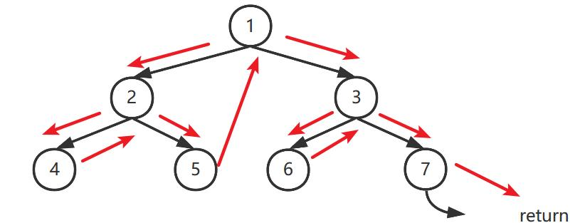

# 二叉树

- [二叉树](#二叉树)
  - [分类](#分类)
  - [遍历](#遍历)
    - [深度优先](#深度优先)
    - [广度优先](#广度优先)
  - [经典题目](#经典题目)

## 分类

**平衡二叉树（AVL树）**:

- 定义：左右子树高度差不超过1，且左右子树也是平衡二叉树
- 意义：解决了二叉查找树退化成链表的问题，把插入，查找，删除的时间复杂度最好情况和最坏情况都维持在O(logN)，但是引入了旋转问题（为了维持平衡）

**二叉搜索树（BST树）**:

- 定义：左子树上所有节点值 < 根节点值  < 右子树所有节点值，且左右子树也分别为二叉搜索树
- 性质：二叉搜索树的中序遍历为一递增序列

## 遍历

### 深度优先

当然树的深度优先遍历也可以用stack加set的传统方式实现，实现如下：

```c++
void dfs(TreeNode* root) {
  stack<TreeNode*> stk;
  set<TreeNode*> visited;

  visited.insert(nullptr);
  stk.push(root);
  while (!stk.empty()) {
    auto node = stk.top();

    if (!node) {
      continue;
    }

    if (!visited.count(node->left)) {
      stk.push(node->left);
    } else if (!visited.count(node->right)) {
      stk.push(node->right);
    } else {
      visited.insert(node);
      stk.pop();
    }
  }
}
```

有些时候，题目会使用描述图的方式来定义树节点之间的关系，比如：使用邻近矩阵描述树中每个节点之间的边情况，此时就更适合使用递归的方式来进行深度优先遍历，比如[2368 受限条件中可到达的节点数量](https://leetcode.cn/problems/reachable-nodes-with-restrictions/solutions/2662538/shu-shang-dfspythonjavacgojsrust-by-endl-0r3a/)就使用了这种方法遍历。其模板代码如下：

```c++
void dfs(int x, int father) {
  for (auto y : adj[x]) {
    if (y != father) {
      dfs(y, x);
    }
  }
}
```

除此之外，树的深度优先遍历还可以按照先序、中序和后序划分和实现，它们各自的含义如下：

- 先序遍历：先根节点，后左右子树
- 中序遍历：先左子树，接着根节点，最后右子树
- 后序遍历：先左右子树，后根节点

而其实现又可以分为递归遍历和Morris遍历，具体如下：

**递归型**：

``` c++
// 以中序遍历为例
void inorder(TreeNode* root, vector<int> seq){
  if (root == nullptr)
    return ;
    
  inorder(root->left);
  seq.push_back(seq);
  inorder(root->right);
  return ;
}
```

**非递归型**（Mirrors遍历：既不用递归调用，也不用栈——传统dfs遍历方法，极大的优化了空间复杂度）
  
Mirros遍历是一种节省空间复杂度的方法。它将叶子节点上的空指针利用起来，指向父节点，当再次遍历到这个节点的时候再修改回来，这样最后二叉树的结构也没有发生改变。其具体实现代码如下：

``` c++
//以中序遍历为例
void inorder(TreeNode* root, vector<int> seq) {
  TreeNode* curr = root;
  while(curr != null) {
    TreeNode* rightMost = curr;
    if (curr->left == nullptr) {
      seq.push_back(curr->val);
      curr = curr->right;
    } else {
      rightMost = curr->left;
      while (rightMost->right != nullptr && rightMost->right != curr) {
        rightMost = rightMost->right;
      }
                
      if (rightMost->right == nullptr) {
        rightMost->right = curr;
        curr = curr->left;
      } else {
        rightMost->left = nullptr;
      }
    }
  }
}
```

变量：

- curr：当前遍历指针；
- rightMost：curr节点左子树的最右边节点
  
流程：

- 如果curr左子树为空，curr向右移
- 如果curr左子树不为空，找到rightMost
- 如果rightMost.right为空，那么令rightMost为curr，curr左移
- 否则，rightMost.right不为空说明rightMost曾被修改过，我们是第二次来到这个节点，那么令curr为rightMost.right，令rightMost.right为空
  
图示：

### 广度优先

``` c++
vector<vector<int>> levelTraversal (TreeNode* root) {
  vector<vector<int>> levels;
  queue<TreeNode*> trace;

  trace.push(root);
  while(!trace.empty()) {
    vector<int> level; 
    for (int i = trace.size(); i > 0; i--) {
      auto p = trace.front();
      trace.pop();
      if (p == nullptr)
        continue;
      level.push_back(p->val);
      trace.push(p->left);
      trace.push(p->right);
    }
    level.push_back(level);
  }
  return levels;
}    
```

## 经典题目

**基础题**:

[94 二叉树的中序遍历](https://leetcode-cn.com/problems/binary-tree-inorder-traversal/)

[101 对称二叉树](https://leetcode.cn/problems/symmetric-tree/description/)

- 思路：
  - 递归：见代码实现
  - 迭代：层序遍历，判断每层是否对称。

- 代码

``` c++
class Solution {
 private:
  bool isSymmetric(TreeNode *p, TreeNode *q) {
    if (p == nullptr || q == nullptr) {
      return q == p;
    }

    if (p->val != q->val) {
      return false;
    }

    return isSymmetric(p->right, q->left) && isSymmetric(p->left, q->right);
  }

 public:
  bool isSymmetric(TreeNode *root) {
    if (root == nullptr) {
      return true;
    }
    return isSymmetric(root->left, root->right);
  }
};
```

[102 二叉树的层序遍历](https://leetcode-cn.com/problems/binary-tree-level-order-traversal/)

[108 将有序数组转化为二叉搜索树](https://leetcode-cn.com/problems/convert-sorted-array-to-binary-search-tree/)

- 分治法思想
  - 先去序列中点，作为二叉树根节点
  - 接着把中点左边序列作为左子树，把右边序列作为右子树

**中等题**:

[99 恢复二叉搜索树](https://leetcode-cn.com/problems/recover-binary-search-tree/)

- 显式中序遍历
  - 二叉搜索树的序列为一递增序列，因此可以通过中序遍历找出问题节点，进而恢复二叉搜索树

- 隐式中序遍历
  - 思想同上，只不过减小了空间复杂度，即：在遍历的同时找出问题节点并修复，而不用分三步——先用vector储存中序遍历结果；找出问题节点；最后修复问题节点。

- 实现

``` c++
class Solution {
public:
    void recoverTree(TreeNode* root) {
        stack<TreeNode*> stk;
        TreeNode* x = nullptr;
        TreeNode* y = nullptr;
        TreeNode* pred = nullptr;

        while (!stk.empty() || root != nullptr) {
            while (root != nullptr) {
                stk.push(root);
                root = root->left;
            }
            root = stk.top();
            stk.pop();
            if (pred != nullptr && root->val < pred->val) {
                y = root;
                if (x == nullptr) {
                    x = pred;
                }
                else break;
            }
            pred = root;
            root = root->right;
        }

        swap(x->val, y->val);
    }
};
```

[109 有序链表转换为二叉搜索树](https://leetcode.cn/problems/convert-sorted-list-to-binary-search-tree/description/)

- 思路：先用快慢指针找到链表中点，再利用分而治之的思想分别构造左右子树。
- 实现：

``` c++
class Solution {
public:
    ListNode* getMedian(ListNode* left, ListNode* right) {
        ListNode* fast = left;
        ListNode* slow = left;
        while (fast != right && fast->next != right) {
            fast = fast->next;
            fast = fast->next;
            slow = slow->next;
        }
        return slow;
    }

    TreeNode* buildTree(ListNode* left, ListNode* right) {
        if (left == right) {
            return nullptr;
        }
        ListNode* mid = getMedian(left, right);
        TreeNode* root = new TreeNode(mid->val);
        root->left = buildTree(left, mid);
        root->right = buildTree(mid->next, right);
        return root;
    }

    TreeNode* sortedListToBST(ListNode* head) {
        return buildTree(head, nullptr);
    }
};
```

[117 填充每个节点的下一个右侧节点指针Ⅱ](https://leetcode.cn/problems/populating-next-right-pointers-in-each-node-ii/description/)

除了显而易见的层序遍历解法之外，这道题还可以使用递归的方法解决。具体流程是，使用当前节点的next指针确认当前节点左右子树的右侧节点，接着递归右子树，再递归左子树即可。

```c++
class Solution {
public:
    Node* connect(Node* root) {
        if (!root) {
            return nullptr;
        }

        Node *right_next = nullptr, *left_next = nullptr;

        auto parent_next = root->next;
        while (parent_next && parent_next->left == nullptr && parent_next->right == nullptr) {
            parent_next = parent_next->next;
        }

        if (root->right) {
            left_next = root->right;
            if (parent_next) {
                right_next = parent_next->left ? parent_next->left : parent_next->right;
            }
        } else if (parent_next) {
            left_next = parent_next->left ? parent_next->left : parent_next->right;
        }

        if (root->left) {
            root->left->next = left_next;
        }
        if (root->right) {
            root->right->next = right_next;
        }
        // 一定要先连右子树才可以，否则连接左子树时会使用未连接好的右子树next指针
        connect(root->right);
        connect(root->left);

        return root;
    }
};
```

[173 二叉树迭代器](https://leetcode.cn/problems/binary-search-tree-iterator/description/)

思路：深度优先遍历

代码：

``` c++
class BSTIterator {
  stack<TreeNode *> inorder;

 public:
  BSTIterator(TreeNode *root) {
    while (root) {
      inorder.push(root);
      root = root->left;
    }
  }

  int next() {
    auto root = inorder.top();
    inorder.pop();
    int ret = root->val;
    root = root->right;
    while (root) {
      inorder.push(root);
      root = root->left;
    }
    return ret;
  }

  bool hasNext() { return !inorder.empty(); }
};
```

[236  二叉树的最近公共祖先](https://leetcode-cn.com/problems/lowest-common-ancestor-of-a-binary-tree/)

实现：

``` c++
class Solution {
public:
    TreeNode* ans;
    bool dfs(TreeNode* root, TreeNode* p, TreeNode* q) {
        if (root == nullptr) return false;
        bool lson = dfs(root->left, p, q);
        bool rson = dfs(root->right, p, q);
        if ((lson && rson) || ((root->val == p->val || root->val == q->val) && (lson || rson))) {
            ans = root;
        } 
        return lson || rson || (root->val == p->val || root->val == q->val);
    }
    TreeNode* lowestCommonAncestor(TreeNode* root, TreeNode* p, TreeNode* q) {
        dfs(root, p, q);
        return ans;
    }
};
```

[662 二叉树的最大宽度](https://leetcode-cn.com/problems/maximum-width-of-binary-tree/)

- 原理：修改原节点的值，使其用来储存树的结构信息
  - 左子节点的值为父节点值的二倍，右节点为值父节点值的二倍加一
  - 当前高度的宽度等于：最右边节点值 - 最左边的节点值 + 1（即：队列首尾值相减再加一）
- 注意：c++实现节点值可能会超出int类型表示范围，需要添加防止溢出的逻辑
- 实现：

  ``` c++
  class Solution {
  public:
      int widthOfBinaryTree(TreeNode* root) {
          if (root == nullptr)
              return 0;
          queue<TreeNode*> trace;
          int maxWidth = 1;
  
          root->val = 1;
          trace.push(root);
          while (!trace.empty()) {
              int right = trace.back()->val;
              int left = trace.front()->val;
              int width = right - left + 1;
              maxWidth = width > maxWidth ? width : maxWidth;
              
              int offest = trace.front()->val;
              for (int k = trace.size(); k > 0; k--) {
                  TreeNode* p = trace.front();
                  trace.pop();
                  
                  //避免int溢出
                  p->val -= offest;
                  if (p->left != nullptr) {
                      p->left->val = 2 * p->val;
                      trace.push(p->left);
                  }
                  if (p->right != nullptr) {
                      p->right->val = 2 * p->val + 1;
                      trace.push(p->right);
                  }            
              }
              
          }
          return maxWidth;
      }
  };
  ```

[450 删除二叉搜索树中的节点](https://leetcode.cn/problems/delete-node-in-a-bst/description/)

思路：递归 + Morris遍历的思想（当root节点值为待删除值时，需要找到继任节点，即：大于它的最小节点或小于他的最大节点，二者交换位置，递归删除，才不会破坏二叉树结构。其中，寻找继任节点使用了Morris遍历的思想）

```c++
class Solution {
public:
    TreeNode* deleteNode(TreeNode* root, int key) {
        if (root == nullptr) {
            return nullptr;
        }
        if (root->val == key) {
            if (root->left == nullptr) {
                return root->right;
            } else if (root->right == nullptr) {
                return root->left;
            }
            auto max_left = root->left;
            while (max_left->right != nullptr) {
                max_left = max_left->right;
            }
            swap(max_left->val, root->val);
            root->left = deleteNode(root->left, key);
        } else if (root->val > key) {
            root->left = deleteNode(root->left, key);
        } else {
            root->right = deleteNode(root->right, key);
        }
        return root;
    }
};
```

**难题**:

[297 序列化与反序列化二叉树](https://leetcode-cn.com/problems/serialize-and-deserialize-binary-tree/)

```c++
// DFS解法
class Codec {
public:
    // Encodes a tree to a single string.
    string serialize(TreeNode* root) {
        if(root==nullptr){
            return "#";
        }
        return to_string(root->val) + ' ' + serialize(root->left) + ' ' + serialize(root->right);
    }

    TreeNode* mydeserialize(istringstream &ss ){
        string tmp;
        ss>>tmp;
        if(tmp=="#"){
            return nullptr;
        }
        TreeNode* node = new TreeNode(stoi(tmp));
        node->left = mydeserialize(ss);
        node->right = mydeserialize(ss);
        return node;
    }

    // Decodes your encoded data to tree.
    TreeNode* deserialize(string data) {
        istringstream ss(data);
        return mydeserialize(ss);
    }
};

// BFS解法
class Codec {
public:

    // Encodes a tree to a single string.
    string serialize(TreeNode* root) {
        string seq;
        queue<TreeNode*> q;
        q.push(root);
        while(!q.empty()) {
            for (int k = q.size(); k > 0; k--) {
                auto node = q.front();
                q.pop();
                if (node == nullptr) {
                    seq.push_back('*');
                    seq.push_back(' ');
                    continue;
                }
                seq += to_string(node->val);
                seq.push_back(' ');
                q.push(node->left);
                q.push(node->right);
            }
        }
        return seq;
    }

    // Decodes your encoded data to tree.
    TreeNode* deserialize(string data) {
        // cout << data << endl;
        if (data[0]=='*') {
            return nullptr;
        }
        TreeNode* root = nullptr;
        queue<TreeNode*> q;

        int i = 0;
        int two = 0;
        while (i < data.size()) {
            int j = i;
            while (j < data.size() && data[j] != ' ') {
                j += 1;
            }    
            TreeNode* node = nullptr;
            if (j - i != 1 || data[i] != '*') {
                int val = stoi(data.substr(i, j - i));
                node = new TreeNode(val);
                if (root == nullptr) {
                    root = node;
                }            
            }
            while (!q.empty() && q.front() == nullptr) {
                q.pop();
            }
            if (!q.empty()) {
                if (two == 0) {
                    q.front()->left = node;
                    two = 1;
                } else {
                    q.front()->right = node;
                    q.pop();
                    two = 0;
                }
            }
            q.push(node);
            
            i = j + 1;
        }
        return root;
    }
};
```
