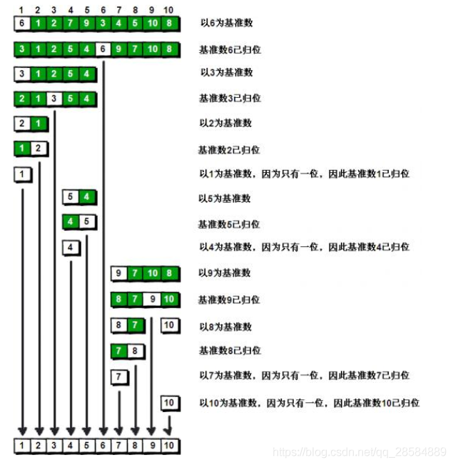

# 排序

- [排序](#排序)
  - [选择排序 Select Sort](#选择排序-select-sort)
  - [冒泡排序 Bubble Sort](#冒泡排序-bubble-sort)
  - [插入排序 Insert Sort](#插入排序-insert-sort)
  - [快速排序 Quick Sort](#快速排序-quick-sort)
  - [归并排序 Merge Sort](#归并排序-merge-sort)
  - [堆排序 Heap Sort](#堆排序-heap-sort)
  - [希尔排序 Shell Sort](#希尔排序-shell-sort)

## 选择排序 Select Sort

## 冒泡排序 Bubble Sort

## 插入排序 Insert Sort

## 快速排序 Quick Sort

- 简介：
  - 快速排序算法通过多次比较和交换来实现排序
- 流程：
  - 具体来说，就是每次设定一个分界值，通过该值将数组分成左右两部分，重复操作直到数组完全排序
  
- 模板：

  ``` c++
  void quickSort(vector<int>& nums, int left, int right) {
    if(left >= right)
      return;
    int i, j, base;
    i = left, j = right;
    base = nums[left];  //取最左边的数为基准数
    while (i < j) {
      while (nums[j] >= base && i < j)
        j--;
      while (nums[i] <= base && i < j)
        i++;
      if(i < j) {
        swap(nums[i], nums[j]);
      }
    }
    //基准数归位
    nums[left] = nums[i];
    nums[i] = base;
    quickSort(nums, left, i - 1);//递归左边
    quickSort(nums, i + 1, right);//递归右边
  }
  ```

- 时间复杂度：`O(nlogn)`

## 归并排序 Merge Sort

- 模板：

  ``` c++
  void mergeSort(vector<int>& nums, int left, int right) {
    if (left >= right)
          return ;
      int mid = left + (right - left)/2;
      mergeSort(nums, left, mid);
      mergeSort(nums, mid + 1, right);
      // algorithm中函数
      merge(nums.begin() + left, nums.begin() + mid, nums.begin() + mid + 1, nums.begin() + right, nums.begin() + left);
      return ;
  }
  ```

- 时间复杂度：`O(nlogn)`

## 堆排序 Heap Sort

- 简介：
  - 堆排序：是利用堆这种数据结构所设计的一种排序算法
  - 堆：是一个近似完全二叉树的数据结构，其子节点总是大于或者小于其父节点
- 流程：
  - 首先，在输入数组上建立大顶堆
    - 即：`nums[i] >= nums[2*i + 1] && nums[i] >= nums[2*i + 2]`
  - 接着，每次将堆首与堆尾交换
    - 堆首其实就是排序好的最大值，因此放到队尾，从而完成了这个数的排序
  - 此时，由于交换，新堆已经不符合堆定义，需要调整结构
  - 重复二三步直到完成排序

- 模板

  ``` c++
  //此处堆化函数必须要有heapSize参数是因为排序时会把堆首与堆尾交换改变堆长度，因此堆化函数必须传入堆长度
  void heapify(vector<int>& nums, int start, int heapSize) {
      //当用数组表示树时，若父节点序号为idx，则两个子节点分别为2*idx+1 和2*idx+2
      int dad = start, son = 2*dad + 1;
      while (son < heapSize) {
          //选出两个子节点中较大的
          if (son + 1 < heapSize && nums[son] < nums[son + 1])
              son += 1;
          //若此时父节点已经大于子节点，则已经符合堆规制；否则继续堆化。
          if (nums[dad] < nums[son]) {
              swap(nums[dad], nums[son]);
              dad = son;
              son = 2*dad + 1;
          }
          else
              break;
      }
  }
  
  void heapSort(vector<int>& nums) {
      //自下而上的建立堆
      for (int i = nums.size() / 2; i >= 0; i--)
          heapify(nums, i, nums.size());
      
      
      for (int i = nums.size() - 1; i > 0; i--) {
          //将堆顶最大值与堆尾交换，重新堆化
          //此处必须要传入heapSize参数，因为堆长度减少了1
          swap(nums[0], nums[i]);
          heapify(nums, 0, i);
      }
      
      return ;
  }
  ```

- 时间复杂度：`O(nlogn)`

**补充**：使用堆排序算法实现一个优先队列（大顶堆）

``` c++
template <typename T>
class priority_queue {
 private:
  std::vector<T> pq;

 public:
  void push(const T& val) {
    pq.push_back(val);
    int son = pq.size() - 1, dad = (son - 1) / 2;

    while (dad >= 0 && pq[dad] < pq[son]) {
      swap(pq[dad], pq[son]);
      son = dad;
      dad -= 1;
      dad /= 2;
    }
  }

  void pop() {
    swap(pq[0], pq[pq.size() - 1]);
    pq.pop_back();

    int dad = 0, son = 2 * dad + 1;
    while (son < pq.size() && pq[dad] < pq[son]) {
      if (son + 1 < pq.size() && pq[son] < pq[son + 1]) {
        son += 1;
      }
      swap(pq[dad], pq[son]);
      dad = son;
      son = 2 * dad + 1;
    }
  }

  T& top() { return pq[0]; }

  bool empty() { return pq.empty(); }
};
```

## 希尔排序 Shell Sort
