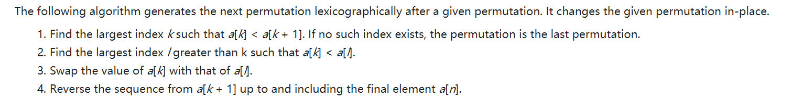

# 双指针&滑动窗口

- [双指针\&滑动窗口](#双指针滑动窗口)
  - [基础概念](#基础概念)
  - [经典例题](#经典例题)
    - [简单题](#简单题)
    - [中等题](#中等题)
    - [难题](#难题)

## 基础概念

基础技巧

|          使用技巧        |      经典题目      |
|-------------------------|-------------------|
|          快慢指针        | [19 删除链表倒数第N个节点](https://leetcode.cn/problems/remove-nth-node-from-end-of-list/)、[142 环形链表](https://leetcode.cn/problems/linked-list-cycle-ii/)、[876 链表的中间节点](https://leetcode-cn.com/problems/middle-of-the-linked-list/) |
|          左右指针        | [11 盛水最多的容器](https://leetcode.cn/problems/container-with-most-water/)、[15 三数之和](https://leetcode-cn.com/problems/3sum/)、[16 最接近的三数之和](https://leetcode.cn/problems/3sum-closest/)、[18 四数之和](https://leetcode.cn/problems/4sum/)|
|          滑动窗口        | [76 最小覆盖子串](https://leetcode-cn.com/problems/minimum-window-substring/) |
|          区间排序        | [56 合并区间](https://leetcode.cn/problems/merge-intervals/description/) [435 无重叠区间](https://leetcode.cn/problems/non-overlapping-intervals/) |

用于维护滑动窗口中某特点而设计的新数据结构

|          使用技巧        |      经典题目      |
|-------------------------|-------------------|
|           单调栈        | [42 接雨水](https://leetcode.cn/problems/trapping-rain-water/)、[239 滑动窗口最大值](https://leetcode.cn/problems/sliding-window-maximum/description/) |
|           对顶堆        | [480 滑动窗口中位数](https://leetcode.cn/problems/sliding-window-median/) |

内容分类

- nSUM问题
  - [15 三数之和](https://leetcode-cn.com/problems/3sum/)
  - [16 最接近的三数之和](https://leetcode.cn/problems/3sum-closest/)
  - [18 四数之和](https://leetcode.cn/problems/4sum/)
- 区间（排序）
  - [56 合并区间](https://leetcode.cn/problems/merge-intervals/description/)
  - [435 无重叠区间](https://leetcode.cn/problems/non-overlapping-intervals/)
  - [452 用最少的箭射爆气球](https://leetcode.cn/problems/minimum-number-of-arrows-to-burst-balloons/)

## 经典例题

### 简单题

[876 链表的中间节点](https://leetcode-cn.com/problems/middle-of-the-linked-list/)

思路：使用快慢双指针，避免遍历两次

``` c++
class Solution {
public:
    ListNode* middleNode(ListNode* head) {
    ListNode* slow = head;
        ListNode* fast = head;
        while (fast != NULL && fast->next != NULL) {
            slow = slow->next;
            fast = fast->next->next;
        }
        return slow;
    }
};
```

### 中等题

[11 盛水最多的容器](https://leetcode.cn/problems/container-with-most-water/description/)

很经典的一道双指针问题，核心思路是理解每次移动容器较短边才有可能获得更大的容积。

```c++
class Solution {
public:
    int maxArea(vector<int>& height) {
        int l = 0, r = height.size() - 1;
        int ret = 0;
        while (l < r) {
            int h = min(height[l], height[r]);
            ret = max(ret, (r - l) * h);

            if (height[l] < height[r]) {
                l += 1;
            } else {
                r -= 1;
            }
        }
        return ret;
    }
};
```

[15 三数之和](https://leetcode-cn.com/problems/3sum/)

简介：这道题很经典，我当时用暴力，回溯都没有做出来，做了很多遍，最后还是看的答案

思路：排序 + 双指针
  
- 排序 + 每次选数与上次不同 保证不重复
- 在三重循环大框架不变的前提下，在确定第一个数之后，将后两个数的确定转化为双指针确定

  ``` c++
  class Solution {
  public:
      vector<vector<int>> threeSum(vector<int>& nums) {
          int n = nums.size();
          sort(nums.begin(), nums.end());
          vector<vector<int>> ans;
          // 枚举 a
          for (int first = 0; first < n; ++first) {
              // 需要和上一次枚举的数不相同
              if (first > 0 && nums[first] == nums[first - 1]) {
                  continue;
              }
              // c 对应的指针初始指向数组的最右端
              int third = n - 1;
              int target = -nums[first];
              // 枚举 b
              for (int second = first + 1; second < n; ++second) {
                  // 需要和上一次枚举的数不相同
                  if (second > first + 1 && nums[second] == nums[second - 1]) {
                      continue;
                  }
                  // 需要保证 b 的指针在 c 的指针的左侧
                  while (second < third && nums[second] + nums[third] > target) {
                      --third;
                  }
                  // 如果指针重合，随着 b 后续的增加
                  // 就不会有满足 a+b+c=0 并且 b<c 的 c 了，可以退出循环
                  if (second == third) {
                      break;
                  }
                  if (nums[second] + nums[third] == target) {
                      ans.push_back({nums[first], nums[second], nums[third]});
                  }
              }
          }
          return ans;
      }
  };
  
  ```

### 难题

[31 下一个排列](https://leetcode.cn/problems/next-permutation/description/)

思路:

``` c++
class Solution {
 public:
  void nextPermutation(vector<int> &nums) {
    int i = nums.size() - 2;
    while (i >= 0 && nums[i] >= nums[i + 1]) {
      i--;
    }
    if (i >= 0) {
      int j = nums.size() - 1;
      while (j >= 0 && nums[i] >= nums[j]) {
        j--;
      }
      swap(nums[i], nums[j]);
    }
    reverse(nums.begin() + i + 1, nums.end());
  }
};
```

[76 最小覆盖子串](https://leetcode-cn.com/problems/minimum-window-substring/)

  ``` c++
  class Solution {
      vector<int> target, source;
      bool isIncluded() {
          for (int i = 0; i < 52; i++) {
              if (target[i] > 0 && target[i] > source[i])
                  return false;
          }
          return true;
      }
      void addRecord(int idx, char& c) {
          if (idx == 0) {
              if ('a' <= c && c <= 'z')
                  target[c - 'a'] += 1;
              else
                  target[c - 'A' + 26] += 1;
          }
          else {
              if ('a' <= c && c <= 'z')
                  source[c - 'a'] += 1;
              else
                  source[c - 'A' + 26] += 1;
          }
      }
      void deleteRecord(char& c) {
          if ('a' <= c && c <= 'z')
              source[c - 'a'] -= 1;
          else
              source[c - 'A' + 26] -= 1;
      }
  public:
      string minWindow(string s, string t) {
          target.resize(52, 0);
          source.resize(52, 0);
          
          for (auto& c : t)
              addRecord(0, c);
          
          int right = 0, left = 0;
          string res;
          while (left <= right && right < s.size()) {
              while (right < s.size() && !isIncluded()) {
                  addRecord(1, s[right]);
                  right++;
              }
              while (left <= right && isIncluded()) {
                  if (res.empty() || res.size() > right - left) {
                      res = string(s, left, right - left);
                  }
                  deleteRecord(s[left]);
                  left++;
              }
          }
  
          return res;
      }
  };
  ```
