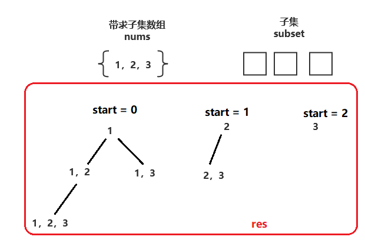
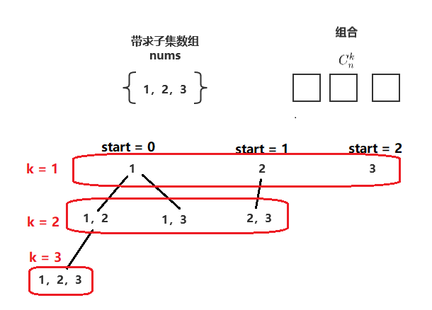
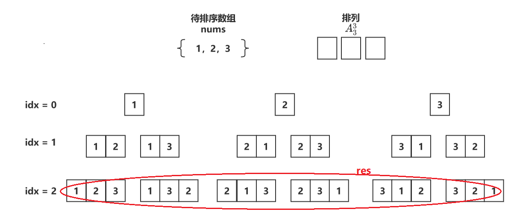

# 回溯算法

- [回溯算法](#回溯算法)
  - [基础概念](#基础概念)
    - [简介](#简介)
    - [分类](#分类)
  - [经典题目](#经典题目)
    - [基础题](#基础题)
    - [中等题](#中等题)
    - [难题](#难题)

## 基础概念

### 简介

回溯

- 回溯算法实际上一个**类似枚举**的搜索尝试过程
  - 主要是在搜索尝试过程中寻找问题的解，当发现已不满足求解条件时，就返回，尝试别的路径
  - 因此，可以用树型结构去理解回溯问题（每一条路径代表一种方法）

剪枝

- 回溯法也是一种**选优搜索法**，按选优条件向前搜索，以达到目标。
  - 当探索到某一步时，发现原先选择并不优或达不到目标，就退回一步重新选择，这一操作也视为**剪枝**（避免了进一步深入，优化了时间复杂度）

### 分类

| 题目类型 | 经典题目                                                     |
| -------- | ------------------------------------------------------------ |
| 子集     | [子集](https://leetcode-cn.com/problems/subsets/)、[子集Ⅱ](https://leetcode-cn.com/problems/subsets-ii/) |
| 组合     | [组合](https://leetcode-cn.com/problems/combinations/)、[组合总和](https://leetcode-cn.com/problems/combination-sum/)、[组合的总和Ⅱ](https://leetcode-cn.com/problems/combination-sum-ii/) |
| 排列     | [全排列](https://leetcode-cn.com/problems/permutations/)、[全排列Ⅱ](https://leetcode-cn.com/problems/permutations-ii/)、[字符串的全排列](https://leetcode-cn.com/problems/zi-fu-chuan-de-pai-lie-lcof/)、[字母大小写全排列](https://leetcode-cn.com/problems/letter-case-permutation/) |
| 搜索     | [二进制手表](https://leetcode-cn.com/problems/binary-watch/)、[解数独](https://leetcode-cn.com/problems/sudoku-solver/)、[单词搜索](https://leetcode-cn.com/problems/word-search/)、[N皇后](https://leetcode-cn.com/problems/eight-queens-lcci/)、[分割回文串](https://leetcode-cn.com/problems/palindrome-partitioning/) |

子集

- 流程：

  - 首先，将当前 subset 数组放入结果数组 res 中；
  - 接着，
    - 更新 subset 数组，从第 start 个数开始按顺序从待求子集数组 nums 中选择第 i 个数放入 subset 数组；
    - 更新 start 为 i + 1，即：表明后续只能从 i + 1 个数开始选择，从而避免重复；
    - 递归调用回溯函数；
    - 回溯结束，弹出 subset数组最后一个数，更新 i 重复上述步骤直到 i 大于等于待求子集数组 nums 的长度。

- 图示：

  

- 代码：

  ``` c++
  void backtracking(vector<vector<int>>& res, const vector<int>& nums, vector<int>& subset, int start) {
    res.push_back(subset);
    for (int i = start; i < nums.size(); i++) {
      subset.push_back(nums[i]);
      backtracking(res, nums, subset, i + 1);
      subset.pop_back();
    }
  }
  ```

组合

- 流程：

  - 首先，若当前 combination 数组已经抽取够 k 个， 则将此 combination 数组放入结果数组 res 中；
  - 接着，
    - 更新 combination 数组，从第 start 个数开始按顺序从待求子集数组 nums 中选择第 i 个数放入 subset 数组；
    - 更新 start 为 i + 1，即：表明后续只能从 i + 1 个数开始选择，从而避免重复；
    - 递归调用回溯函数；
    - 回溯结束，弹出 combination 数组最后一个数，更新 i 重复上述步骤直到 i 大于等于待求组合数组 nums 的长度；

- 图示：

  

- 代码：

  ``` C++
  void backtracking(vector<vector<int>>& res, vector<int>& combination, const int& n, const int& k, int start) {
    if (combination.size() == k) {
      res.push_back(combination);
      return ;
    }
  
    for (int i = start; i <= n; i++) {
      combination.push_back(i);
      backtracking(res, combination, n, k, i + 1);
      combination.pop_back();
    }
    return ;
  }
  ```

排列

- 流程：

  - 首先，若当前排列已确定数个数 idx 为 n 时， 则将此 permutation 数组放入结果数组 res 中；
  - 接着，
    - 更新 permutation 数组，将第 idx 个数和第 i 个数交换，以确定第 idx 个数的值；
    - 更新 idx 为 idx + 1，即：表明下一次需要确定第 idx + 1 个数的值；
    - 递归调用回溯函数；
    - 回溯结束，更新 i 重复上述步骤， 直到 i 大于等于待排序数组的长度。

- 图示：

  

- 代码：

  ``` c++
   void backtracking(vector<vector<int>>& res, vector<int>& permutation, int idx) {
    if (idx == permutation.size()) {
      res.push_back(permutation);
      return ;
    }
  
    for (int i = idx; i < permutation.size(); i++) {
      swap(permutation[idx], permutation[i]);
      backtracking(res, permutation, idx + 1);
      swap(permutation[idx], permutation[i]);
    }
    return ;
  }
  ```

搜索

## 经典题目

### 基础题

[39 组合总和](https://leetcode-cn.com/problems/combination-sum/_)

- 简介：

  - 与常规求组合或子集不同的时，本题增加了数组中 **同一个** 数字可以 **无限制重复被选取**的条件

- 思路：

  - 与求组合或子集的模板相比，只需要将递归调用回溯函数时，参数start由 i + 1 改为 i 即可
  - 即保证了同一数字可以重复选取，又保证了排在后面的数字不能选排在前面的数字进行组合（避免重复）

- 代码：

  ``` c++
  class Solution {
      void backtracking(vector<vector<int>>& res, vector<int>& combination, const vector<int>& nums, const int& targetSum, int& currentSum, int start) {
          if (currentSum >= targetSum) {
              if (currentSum == targetSum)
                  res.push_back(combination);
              return ;
          }
          for (int i = start; i < nums.size(); i++) {
              combination.push_back(nums[i]);
              currentSum += nums[i];
              backtracking(res, combination, nums, targetSum, currentSum, i); 
              currentSum -= nums[i];
              combination.pop_back();
          }
          return ;
      }
  public:
      vector<vector<int>> combinationSum(vector<int>& candidates, int target) {
          vector<vector<int>> res;
          vector<int> combination;
          int sum = 0;
          backtracking(res, combination, candidates, target, sum, 0);
          return res;
      }
  };
  ```

[46 全排列](https://leetcode-cn.com/problems/permutations/)

- 与基础概念介绍中的一致

[77 组合](https://leetcode-cn.com/problems/combinations/)

- 与基础概念介绍中的一致

[78 子集](https://leetcode-cn.com/problems/subsets/)

- 与基础概念介绍中的一致

### 中等题

[40 组合总和Ⅱ](https://leetcode-cn.com/problems/combination-sum-ii/)

- 简介：

  - 与 [39 组合总和](https://leetcode-cn.com/problems/combination-sum/_) 相比，要求所有元素 **只能用一次** ，同时候选元素中也 **允许重复元素**

- 思路：

  - 要点：
    - 组合：要求所有元素只用一次，即：每次 start 都要更新为 i + 1
    - 剪枝：本题的剪枝逻辑与 [47 全排列Ⅱ](https://leetcode-cn.com/problems/permutations-ii/ ) 类似， 即：保证每次选择重复数字的第一个
      - 剪枝前提：对排序数组进行排序，保证重复数字相邻排序
      - 访问记录：用visited数组记录是否访问过该位置的数字
      - 剪枝条件：当前数字与前一个数字相同、且钱一个数字未被访问（放入排列中）

        即：nums[i] == nums[i - 1] && !visited[i - 1]

  - 流程：
    - 当当前组合和 currentSum 大于等于目标组合和 targetSum 时
      - 若当前组合和 currentSum 等于目标组合和 targetSum ，将当前组合数组 combination 加入结果数组 res
      - 结束回溯，返回；
    - 当当前组合和 currentSum 小于目标组合和 targetSum 时
      - 若当前数字与前一个数字相同、且前一个数字未被访问（放入组合中），则剪枝；
      - 否则，在当前数字未被加入组合的情况下，进行递归回溯

- 代码：

  ``` c++
  class Solution {
      vector<bool> visited;
  
      void backtracking(vector<vector<int>>& res, vector<int>& combination, const vector<int>& nums, const int& targetSum, int& currentSum, int start) {
          if (currentSum >= targetSum) {
              if (currentSum == targetSum)
                  res.push_back(combination);
              return ;
          }
          for (int i = start; i < nums.size(); i++) {
              if (i > 0 && nums[i] == nums[i - 1] && !visited[i - 1])
                  continue;
              
              if (!visited[i]) {
                  combination.push_back(nums[i]);
                  visited[i] = true;
                  currentSum += nums[i];
                  backtracking(res, combination, nums, targetSum, currentSum, i + 1);
                  currentSum -= nums[i];
                  visited[i] = false;
                  combination.pop_back();
              }
          }
          return ;
      }
  public:
      vector<vector<int>> combinationSum2(vector<int>& candidates, int target) {
          vector<vector<int>> res;
          vector<int> combination;
          int sum = 0;
  
          visited.resize(candidates.size(), false);
          sort(candidates.begin(), candidates.end());
          backtracking(res, combination, candidates, target, sum, 0);
          return res;
      }
  };
  ```

[47 全排列Ⅱ](https://leetcode-cn.com/problems/permutations-ii/)

- 简介：

  - 本题与基础题[46 全排列](https://leetcode-cn.com/problems/permutations/)相比，增加了重复数字的情况
  - 实际就是在[46 全排列](https://leetcode-cn.com/problems/permutations/)的基础上增加了剪枝的逻辑

- 思路：

  - 概述：
    - 通过某种逻辑实现剪枝，达成消去重复排列的目的；
    - 当然更直接的方法是直接用集合set储存回溯结果，最后返回时在进行转换，但这样会增大空间复杂度
  - 要点：
    - 剪枝：保证在填入第idx个数的时候，重复数字只会被填入一次，即：总是填入重复数组的第一个未访问的数字
      - 剪枝前提：对排序数组进行排序，保证重复数字相邻排序
      - 访问记录：用visited数组记录是否访问过该位置的数字
      - 剪枝条件：当前数字与前一个数字相同、且前一个数字未被访问（放入排列中）
        即：nums[i] == nums[i - 1] && !visited[i - 1]
  - 流程：
    - 当已经确定数字个数 idx 等于待求排列数组长度时，将当前排列数组 permutation 加入结果数组 res；
    - 当已经确定数字个数 idx 小于待求排列数组长度时
      - 若当前数字与前一个数字相同、且前一个数字未被访问（放入排列中），则剪枝；
      - 否则，在当前数字未被加入排列的情况下，进行递归回溯

- 代码：

  ``` c++
  class Solution {
      vector<bool> visited;
      void backtracking(vector<vector<int>>& res, vector<int>& permutation, const vector<int>& nums, int idx) {
          if (permutation.size() == nums.size()) {
              res.push_back(permutation);
              return ;
          }
  
          for (int i = 0; i < nums.size(); i++) {
              if (i > 0 && nums[i] == nums[i - 1] && !visited[i - 1])
                  continue;
              if (!visited[i]) {
                  permutation.push_back(nums[i]);
                  visited[i] = true;
                  backtracking(res, permutation, nums, idx + 1);
                  visited[i] = false;
                  permutation.pop_back();
              }
          }
          return ;
      }
  public:
      vector<vector<int>> permuteUnique(vector<int>& nums) {
          vector<vector<int>> res;
          vector<int> permutation;
          visited.resize(nums.size(), false);
          sort(nums.begin(), nums.end());
          backtracking(res, permutation, nums, 0);
          return res;
      }
  };
  ```

[90 子集Ⅱ](https://leetcode-cn.com/problems/subsets-ii/)

- 简介：

  - 本题与基础题[子集](https://leetcode-cn.com/problems/subsets/)相比，增加了重复数字的情况

- 思路：

  - 要点：
    - 剪枝：剪枝逻辑与 [47 全排列Ⅱ](https://leetcode-cn.com/problems/permutations-ii/) 类似，只不过是在求子集模板的基础上增加剪枝逻辑
      - 剪枝前提：对排序数组进行排序，保证重复数字相邻排序
      - 访问记录：用visited数组记录是否访问过该位置的数字
      - 剪枝条件：当前数字与前一个数字相同、且钱一个数字未被访问（放入排列中）

        即：nums[i] == nums[i - 1] && !visited[i - 1]
  - 流程：
    - 将当前 subset 数组放入结果数组 res 中
    - 从 start 到待求子集数组长度进行循环
      - 若当前数字与前一个数字相同、且前一个数字未被访问（放入组合中），则剪枝；
      - 否则，在当前数字未被加入组合的情况下，进行递归回溯

- 代码：

  ``` c++
  class Solution {
      vector<bool> visited;
      void backtracking(vector<vector<int>>& res, vector<int>& subset, const vector<int>& nums, int start) {
          res.push_back(subset);
          for (int i = start; i < nums.size(); i++) {
              if (i > 0 && nums[i] == nums[i - 1] && !visited[i - 1])
                  continue;
              
              if (!visited[i]) {
                  subset.push_back(nums[i]);
                  visited[i] = true;
                  backtracking(res, subset, nums, i + 1);
                  visited[i] = false;
                  subset.pop_back();
              }
          }
          return ;
      }
  public:
      vector<vector<int>> subsetsWithDup(vector<int>& nums) {
          vector<vector<int>> res;
          vector<int> subset;
  
          visited.resize(nums.size(), false);
          sort(nums.begin(), nums.end());
          backtracking(res, subset, nums, 0);
          return res;
      }
  };
  ```

### 难题

[79 单词搜索](https://leetcode-cn.com/problems/word-search/)

- 简介：

  - 题目就是要求在 二维字符网格 中 找出一个字符串
    - 首先想到的肯定是用深度优先搜索去做，但深度优先搜索却始终迈不过 *[["A","B","C","E"],["S","F","C","S"],["A","D","E","E"]] "ABCB"* 的情况，因为深度优先搜索的visited数组是针对全局搜索的，而回溯搜索的visited数组确实针对当前这种策略，它会在**策略失败返回重置visited数组**而深度优先搜索却不可以
    - 在明确使用回溯搜索解决本问题之后，难度就大大减小了

- 思路：

  - 要点：
    - 用方向数组 directions 是一种简化搜索代码常规手段，需要记住
    - visited 数组和整数 x、y 需要在当前回溯策略失败后重置
  - 流程：略

- 代码：

  ``` c++
  class Solution {
  public:
      bool exist(vector<vector<char>>& board, string word) {
          int m = board.size();
          int n = board[0].size();
  
          visited.resize(m, vector<bool>(n, false));
          for (int i = 0; i < m; i++) {
              for (int j = 0; j < n; j++) {
                  if (backtracking(i, j, 0, board, word))
                      return true;
              }
          }
          return false;
      }
  private:
      bool backtracking(int& x, int& y, int idx, const vector<vector<char>>& board, const string& word) {
          if (idx == word.size())
              return true;
          
          if (0 <= x && x < board.size() && 0 <= y && y < board[0].size() && !visited[x][y] &&board[x][y] == word[idx]) {
              visited[x][y] = true;
              for (auto& [dx, dy] : directions) {
                  x += dx;
                  y += dy;
                  if (backtracking(x, y, idx + 1, board, word))
                      return true;
                  x -= dx;
                  y -= dy;
              }
              visited[x][y] =false;
          }
          return false;
      }
      const vector<pair<int, int>> directions = {{1, 0}, {-1, 0}, {0, 1}, {0, -1}};
      vector<vector<bool>> visited;
  };
  ```

[51 N皇后问题](https://leetcode.cn/problems/n-queens/description/)

代码:

``` c++
class Solution {
    void backtracking(vector<vector<int>>& ret, vector<int>& mode,const int& n) {
        if (mode.size() == n) {
            ret.push_back(mode);
            return ;
        }

        int nrow = mode.size();
        for (int ncol = 0; ncol < n; ncol++) {
            bool available = true;
            for (int row = 0; row < mode.size(); row++) {
                int col = mode[row];
                if (col == ncol || row + col == nrow + ncol || row - col == nrow - ncol) {
                    available = false;
                    break;
                }
            }
            if (available) {
                mode.push_back(ncol);
                backtracking(ret, mode, n);
                mode.pop_back();
            }
        }

        return ;
    }
public:
    vector<vector<string>> solveNQueens(int n) {
        vector<vector<int>> tmp_ret;
        vector<int> mode;
        backtracking(tmp_ret, mode, n);

        vector<vector<string>> ret(tmp_ret.size());

        for (int k = 0; k < tmp_ret.size(); k++) {
            for (int i = 0; i < n; i++) {
                string row(n, '.');
                row[tmp_ret[k][i]] = 'Q';
                ret[k].push_back(row);
            }
        }
        return ret;
    }
};
```
