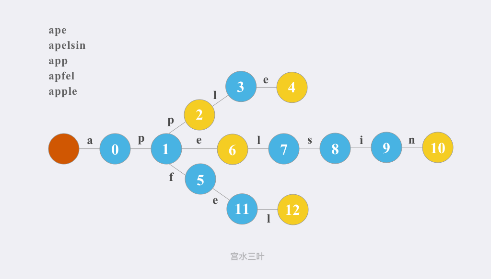

# 数据结构

## 字典树

### 概述

**描述**

+ Trie（发音类似 "try"）或者说 前缀树 是一种树形数据结构，用于高效地存储和检索字符串数据集中的键。

**应用**

+ 字符串前缀搜索
+ 自动补全
+ 拼写检查

### 实现

**图示**



**代码**

``` c++
class Trie {
private:
    vector<Trie*> children;
    bool isEnd;

    Trie* searchPrefix(string prefix) {
        Trie* node = this;
        for (char ch : prefix) {
            ch -= 'a';
            if (node->children[ch] == nullptr) {
                return nullptr;
            }
            node = node->children[ch];
        }
        return node;
    }

public:
    Trie() : children(26), isEnd(false) {}

    void insert(string word) {
        Trie* node = this;
        for (char ch : word) {
            ch -= 'a';
            if (node->children[ch] == nullptr) {
                node->children[ch] = new Trie();
            }
            node = node->children[ch];
        }
        node->isEnd = true;
    }

    bool search(string word) {
        Trie* node = this->searchPrefix(word);
        return node != nullptr && node->isEnd;
    }

    bool startsWith(string prefix) {
        return this->searchPrefix(prefix) != nullptr;
    }
};
```

### 例题

#### [实现字典树](https://leetcode-cn.com/problems/implement-trie-prefix-tree/)

#### [字典中最长的单词](https://leetcode-cn.com/problems/longest-word-in-dictionary/)

#### [字典序的第K小数字](https://leetcode-cn.com/problems/k-th-smallest-in-lexicographical-order/submissions/)

**描述**

+ 给定整数 `n` 和 `k`，返回 `[1, n]` 中字典序第 `k` 小的数字。

**解法**

+ 对`n`个数字建立字典树，对其进行前序遍历；
  - 实际不需要真的构造字典树，只需要确定目标节点位置即可；
+ 具体做法是，计算当前节点子树节点数，进而确定目标节点是否在该子树中；
  - 如果在，则进入该子树搜索；
  - 否则，换到下一个节点（+ 1）。
+ 确定子树节点数的方法使用层序遍历（step函数）。

**代码**

``` c++
class Solution {
public:
    int getSteps(int curr, long n) {
        int steps = 0;
        long first = curr;
        long last = curr;
        while (first <= n) {
            steps += min(last, n) - first + 1;
            first = first * 10;
            last = last * 10 + 9;
        }
        return steps;
    }

    int findKthNumber(int n, int k) {
        int curr = 1;
        k--;
        while (k > 0) {
            int steps = getSteps(curr, n);
            if (steps <= k) {
                k -= steps;
                curr++;
            } else {
                curr = curr*10;
                k--;
            }
        }
        return curr;
    }
};
```

## 对顶堆

### 概述

**描述**

+ 

**应用**

+ 中位数
+ 第k大的数

### 实现

+ 

### 例题

+ [数据流的中位数](https://leetcode-cn.com/problems/find-median-from-data-stream/)
