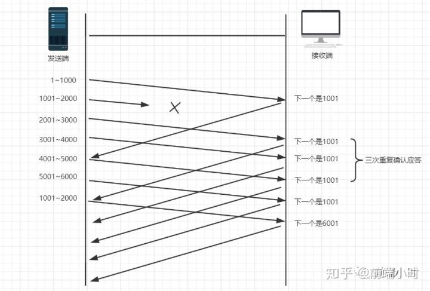
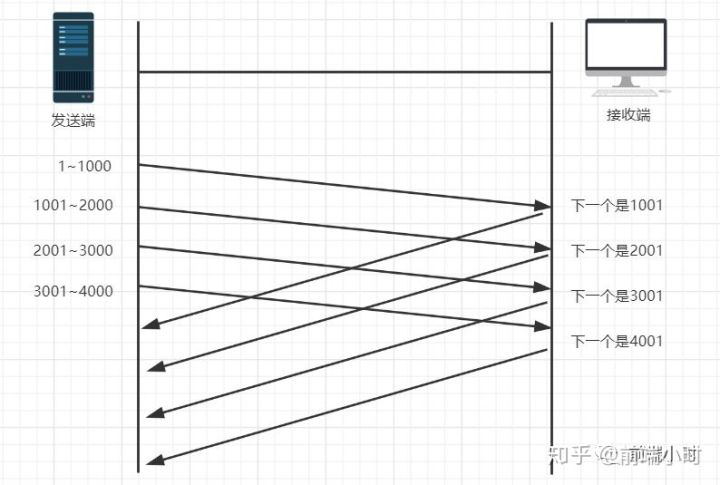

# UDP

## 简述

### 概述

+ 

### 特点

+ 

### 使用场景

+ 

# TCP

## 简介

### 概述

+ 传输控制协议TCP（Transmission Control Protocol）是一种面向连接的、可靠的、基于字节流的传输层通信协议

### 特点

+ 一对一
+ 面向连接（字节流）
+ 全双工通信
+ 有流量控制和拥塞控制
+ 提供可靠交付

## 连接

### 三次握手

  
 

假设 A 为客户端，B 为服务器端。

- 首先 B 处于 LISTEN（监听）状态，等待客户的连接请求。

- A 向 B 发送连接请求报文，SYN=1，ACK=0，选择一个初始的序号 x。

- B 收到连接请求报文，如果同意建立连接，则向 A 发送连接确认报文，SYN=1，ACK=1，确认号为 x+1，同时也选择一个初始的序号 y。

- A 收到 B 的连接确认报文后，还要向 B 发出确认，确认号为 y+1，序号为 x+1。

- B 收到 A 的确认后，连接建立。

**三次握手的原因**  

第三次握手是为了防止失效的连接请求到达服务器，让服务器错误打开连接。

客户端发送的连接请求如果在网络中滞留，那么就会隔很长一段时间才能收到服务器端发回的连接确认。客户端等待一个超时重传时间之后，就会重新请求连接。但是这个滞留的连接请求最后还是会到达服务器，如果不进行三次握手，那么服务器就会打开两个连接。如果有第三次握手，客户端会忽略服务器之后发送的对滞留连接请求的连接确认，不进行第三次握手，因此就不会再次打开连接。

### 四次挥手

  
 

以下描述不讨论序号和确认号，因为序号和确认号的规则比较简单。并且不讨论 ACK，因为 ACK 在连接建立之后都为 1。

- A 发送连接释放报文，FIN=1。

- B 收到之后发出确认，此时 TCP 属于半关闭状态，B 能向 A 发送数据但是 A 不能向 B 发送数据。

- 当 B 不再需要连接时，发送连接释放报文，FIN=1。

- A 收到后发出确认，进入 TIME-WAIT 状态，等待 2 MSL（最大报文存活时间）后释放连接。

- B 收到 A 的确认后释放连接。

**四次挥手的原因**  

客户端发送了 FIN 连接释放报文之后，服务器收到了这个报文，就进入了 CLOSE-WAIT 状态。这个状态是为了让服务器端发送还未传送完毕的数据，传送完毕之后，服务器会发送 FIN 连接释放报文。

## 机制

### 校验和

**实现**

+ 发送的数据包的二进制相加然后取反
+ 如果收到段的检验和有差错，那么TCP将丢弃这个报文段和不确认收到此报文段

**目的**

+ 检测数据在传输过程中的任何变化

### 确认应答+序列号

**接收流程**

+ 接收方每接收到一个包就会向发送方发送确认信息
  - 但这个确认是累积确认，即：会向发送方不断发送连续序号的最后一个（如上图所示，发送1001）
+ 接收方之后会将排序好的包组合，并交给应用层

### 超时重传

**重传流程**

+ 当TCP发出一个段后，它启动一个定时器，等待目的端确认收到这个报文段。
+ 如果不能及时收到一个确认，将重发这个报文段。 

**等待时长**

+ 等待时间为最大超时时间，是动态计算的

### 滑动窗口——流量控制

**提出原因**

+ 超时重传机制要求TCP必须等待上一个包确认之后，才能传输新的包，这导致TCP传输效率会很低
+ 滑动窗口使得TCP连接的双方都有固定大小的缓存空间，避免了发送太快来不及接收或者发送太慢效率低下的问题

**收发流程**

+ 通过下一次的确认包可以判断接收端是否已经接收到了数据，如果已经接收了窗口就向前滑动

**窗口大小**

+ 窗口的大小就是在无需等待确认包的情况下，发送端还能发送的最大数据量。

### 拥塞控制

**拥塞窗口cwnd**

+ 注意拥塞窗口与发送方窗口的区别：拥塞窗口只是一个状态变量，实际决定发送方能发送多少数据的是发送方窗口

**主要算法**

+ 慢开始、拥塞避免、快重传、快恢复

