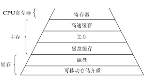

# 存储管理

- [存储管理](#存储管理)
  - [存储器](#存储器)
  - [物理内存](#物理内存)
  - [虚拟内存](#虚拟内存)
  - [分段 Segment](#分段-segment)
  - [分页 Paging](#分页-paging)
    - [慢表 页表](#慢表-页表)
    - [快表 TLB](#快表-tlb)
  - [参考](#参考)

## 存储器

**逻辑地址和物理地址**：

- 逻辑地址（Logical Address） 是指由程序产生的与段相关的偏移地址部分。
- 物理地址（Physical Address） 是指出现在CPU外部地址总线上的寻址物理内存的地址信号，是地址变换的最终结果地址

## 物理内存

物理内存是相对虚拟内存而言的；

物理内存就是指计算机实际拥有的储存硬件。

## 虚拟内存

**简介**：

虚拟内存是计算机内存管理的一种技术。

**作用**：

虚拟内存使得应用程序认为它拥有连续可用的内存。

一般来说，只有当物理内存完全耗尽不够再此分配时，才会使用虚拟内存用磁盘等外存补偿。

**调度方式**：

- 页式调度
- 段式调度
- 段页式调度

分段和分页都可以在虚拟内存之上进行，并非只有分页才行。

**缺页和命中**：

**页面置换算法**：

- LRU(Last Recently Used)
- NRU(Not Recently Used) 只看上一个指令周期的
- FIFO(First In First Out)

## 分段 Segment

**简介**：

分段机制就是把逻辑地址组织成一些长度可变的内存单元，这些内存单元被称为段。

**段表**：

段表是一张逻辑地址到物理地址的对照表。每个条目都有：

- 基地址：驻留在内存中的起始物理地址。
- 限制：段长。

**地址**：

段序号 + 段偏移量

**组成**：

一般来说，包括代码段、数据段和堆栈段

**优点**：

- 段内部没有碎片；
- 与分页中的页表相比，段表占用空间更少

**缺点**：

随着进程的加载和删除，可用空间被分成小块，导致外部碎片。

## 分页 Paging

**术语**：

`line or block`：缓存的最小单位；

`page`：虚拟内存的最小单位；

`frame`：逻辑内存的最小单位。

一般来说，`frame`和`page`大小相同。

**地址**：

虚拟页号 + 页内偏移量

**地址翻译**：

使用虚拟内存技术时，CPU 把虚拟地址通过地址总线送到内存管理单元（Memory Management Unit，简称 MMU），MMU 将虚拟地址翻译成物理地址之后再通过内存总线去访问物理内存。

**优点**：

不会导致外部碎片。

**缺点**：

但会产生内部碎片，即页内可能有无效内存。

### 慢表 页表

**简介**：

每次进行虚拟地址到物理地址的映射之时，都需要读取页表。从数学角度来说页表就是一个函数，入参是虚拟页号（Virtual Page Number，简称 VPN），输出是物理页框号（Physical Page Number，简称 PPN，也就是物理地址的基址）。

页表由多个页表项（Page Table Entry, 简称 PTE）组成。一般来说，每个条目都有：

- 有效位
- 脏位
- 物理地址

**页表分级**：

### 快表 TLB

TLB(Translation Look-aside Buffer)是页表的副本，存在缓存中，能加速地址翻译。

## 参考

**综合**:

- [深入理解计算机系统-第9章 虚拟内存](https://hansimov.gitbook.io/csapp/)

**虚拟内存**：

- [深入剖析虚拟内存工作原理](https://cloud.tencent.com/developer/article/1821336)

**分段与分页**：

- [geeks - Differences between paging and segment](https://www.geeksforgeeks.org/difference-between-paging-and-segmentation/)
