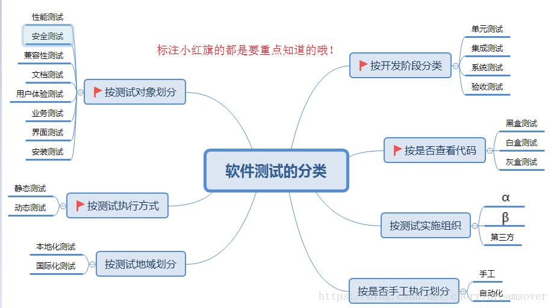

# 软件测试

## 简介

## 分类

### 按开发阶段分类

#### 单元测试

单元测试，又称模块测试。对软件的组成单位进行测试，其目的是检验软件基本组成单位的正确性。测试的对象的是软件你测试的最小单位：模块。

+ 测试阶段：编码后或者编码前
+ 测试对象：模块
+ 测试人员：白盒测试工程师或开发人员
+ 测试依据：代码和注释+详细文档
+ 测试方法：白盒测试
+ 测试内容：模块接口测试、局部数据测试、路径测试、错误处理测试、边界测试

#### 集成测试

集成测试也称联合测试（联调）、组装测试：将程序模块采用适当的集成策略组装起来，对系统的接口及集成后的功能进行正确性检测的测试工作。集成主要目的是检查软件单位之间的接口是否正确。

+ 测试阶段：一般是单元测试之后
+ 测试对象：模块间的接口
+ 测试人员：白盒测试工程师或开发工程师
+ 测试依据：单元测试的文档+概要设计文档
+ 测试方法：黑盒测试与白盒测试（灰盒测试）
+ 测试内容：模块之间数据传输、模块之间功能冲突、模块组装功能的正确性、全局数据结构、单模块缺陷对系统的影响

#### 系统测试

系统测试：将软件系统看成是一个系统的测试。包括对功能、性能以及软件所运行的软硬件环境进行测试。时间大部分在系统测试执行阶段，包括回归测试和冒烟测试。

+ 测试阶段：集成测试阶段之后
+ 测试对象：整个系统（软件、硬件）
+ 测试人员：黑盒测试工程师
+ 测试依据：需求规格说明文档
+ 测试方法：黑盒测试
+ 测试内容：功能、界面、可靠性、易用性、性能、兼容性、安全性等

**回归测试 Regression Testing**

指修改了旧的代码之后，重新进行测试以确认修改没有引入新的错误或导致其他代码产生错误。（自动回归测试将大幅度降低系统测试、维护升级等阶段的成本）。

**冒烟测试 Smoke Test**

该术语来自硬件，指对一个硬件或一组硬件进行更改或修复后，直接给设备加电。如果没有冒烟，则该组件就通过了测试，也可以理解为该种测试耗时短，仅用一袋烟的功夫就足够了。

+ 冒烟测试的对象是每一个新编译的需要正式测试的软件版本，目的是确认软件基本功能正常，可以进行后续正式的测试工作。
+ 冒烟测试的执行者是版本编译人。
+ 冒烟测试一般在开发人员开发完毕后送给测试人员来进行测试时，测试人员会先进行冒烟测试，保证基本功能正常，不阻碍后续测试。

#### 验证测试

验收测试（交付测试）：是部署软件之前的最后一个测试操作。它是技术测试的最后一个阶段，也称为交付测试。验收测试的目的是确保软件准备就绪，按照项目合同、任务书、双方约定的验收依据文档，向软件购买都展示该软件系统满足原始需求。

+ 测试阶段：系统测试通过后
+ 测试对象：整个系统（包括软硬件）
+ 测试人员：主要是最终用户或者需求方
+ 测试依据：用户需求、验收标准
+ 测试方法：黑盒测试
+ 测试内容：同系统测试（功能、各类文档文档等）

## 参考

+ [软件测试的分类](https://blog.csdn.net/cherrydreamsover/article/details/81385643)