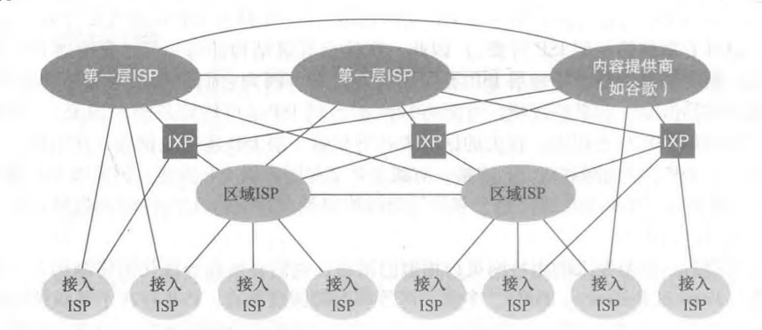

# 计算机网络

- [计算机网络](#计算机网络)
  - [什么是因特网](#什么是因特网)
    - [网络协议](#网络协议)
    - 
  - [应用层](#应用层)
  - [传输层](#传输层)
  - [网络层](#网络层)
  - [链路层](#链路层)
  - [参考](#参考)

## 什么是因特网

**因特网 Internet**：

因特网是一个世界范围的计算机网络，它连接了遍及全世界各地设备。事实上，它是上是一个庞大的网络集合，由全球各地许多网络构成，如下图所示。这些网络可以是ISP网络、学术网络、企业内部网络等。它们通过不同规模的网关路由器互相连接，组成了一个庞大的广域网络。

> 值得注意的是，万维网（World Wide Web）只是因特网的一个子集。前者是建立在因特网上的一个分布式信息系统，通过统一资源标志符（URL）来共享信息文件、图片、多媒体等资源。

**网络服务商 ISP**：

狭义上的网络服务商（Internet Service Provider）指为个人或企业提供互联网访问的公司。它们通常是一些大型电信公司，比如AT&T。但广义上，ISP还能提供一些诸如：主机托管、电子邮件、域名服务、代理服务器和云计算的服务。

事实上，因特网核心骨架结构是由几家大型顶级ISP和区域ISP网络构建而成的，如图所示。这些服务商ISP可以从互联网管理机构获得许多IP地址，同时拥有通信线路以及路由器等联网设备，个人或机构向 ISP 缴纳一定的费用就可以接入互联网。

**局域网 LAN**：

局域网（Local Area Network, LAN），又称内网，是指覆盖局部区域（如办公室或楼层）的计算机网络。若想访问公网，则需要向网络服务商缴费，通过接入其内部网络进而访问公网。

IEEE 802系列规则的出现推动了局域网技术的标准化。而其中的以太网（IEEE 802.3标准）和WiFi（IEEE 802.11）则是最常用的局域网组网方式。

**网关 Gateway**：

### 网络协议

协议（Protocol）定义了在两个或多个通信实体之间交换的报文的格式和顺序，以及报文发送和/或接收一条报文或其他事件所采取的动作。

**网络协议簇 Internet Protocl Suite**：

网络层为主机提供逻辑通信服务，而运输层为主机上的进程提供逻辑通信。换句话说，只有在计算机网络中，只有端设备才拥有运输层及其之上的应用层的网络栈。

**开放式系统互联模型 OSI Model**：

### 

## 应用层

## 传输层

## 网络层

## 链路层

## 参考
