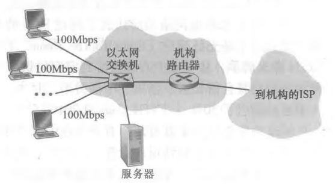

# 计算机网络

- [计算机网络](#计算机网络)
  - [什么是因特网](#什么是因特网)
    - [网络组成](#网络组成)
    - [接入公网](#接入公网)
    - [网络协议](#网络协议)
  - [应用层](#应用层)
  - [传输层](#传输层)
  - [网络层](#网络层)
  - [链路层](#链路层)
  - [参考](#参考)

## 什么是因特网

**网络的网络 internet**：

网络把主机连接起来，而互连网（internet）是把多种不同的网络连接起来，因此互连网是网络的网络。

**因特网 Internet**：

因特网是一个世界范围的计算机互连网，它连接了遍及全世界各地设备。事实上，它是上是一个庞大的网络集合，由全球各地许多网络构成，如图1所示。这些网络可以是ISP网络、学术网络、企业内部网络等。它们通过不同规模的网关路由器互相连接，组成了一个庞大的广域网络。

> 值得注意的是，万维网（World Wide Web）只是因特网的一个子集。前者是建立在因特网上的一个分布式信息系统，通过统一资源标志符（URL）来共享信息文件、图片、多媒体等资源。

### 网络组成

事实上，因特网核心骨架结构是由几家大型顶级ISP和区域ISP网络构建而成的，如图2所示。这些服务商ISP可以从互联网管理机构获得许多IP地址，同时拥有通信线路以及路由器等联网设备，个人或机构向ISP缴纳一定的费用就可以接入互联网。

**网络服务商 ISP**：

狭义上的网络服务商（Internet Service Provider）指为个人或企业提供互联网访问的公司。它们通常是一些大型电信公司，比如AT&T。但广义上，ISP还能提供一些诸如：主机托管、电子邮件、域名服务、代理服务器和云计算的服务。

**局域网 LAN**：

局域网（Local Area Network, LAN），又称内网，是指覆盖局部区域（如办公室或楼层）的计算机网络。IEEE 802系列规则的出现推动了局域网技术的标准化。而其中的以太网（IEEE 802.3标准）和WiFi（IEEE 802.11）则是最常用的局域网组网方式。

**网络设备 Internte Device**：

在图1中，我们看到除了端设备，还有很多其他设备一起构成了因特网，如图3所示。

- 路由器（Router）是一种用于连接不同网段或不同类型子网络的设备。它的核心功能是转发与路由。其中，前者是指根据数据包的目的地址决定输出端口，后者则是指根据算法选择最优路径。此外，现代路由器还集成了许多其他功能。比如，内置了调制解调的功能，代替拨号上网中的调制解调器；提供NAT网关，帮助私有IP转换；充当DHCP服务器，避免每次启动手动配置主机IP等等。
- 交换机（Switch）是一种用于局域网内部数据帧高速转发的设备。传统的二层交换机工作在OSI 7层模型中的第二层，也就是数据链路层。和路由器不同的是，它存储的是MAC地址到MAC地址的映射表，而非IP地址到MAC地址的映射表。目前，也出现了三层交换机，即在二层交换机的基础上，增加了路由模块，工作在网络层。
- 调制解调器（Modem）是一种信号转换的设备，也被人们根据音译称为“猫”。其中，调制(Modulation)是指把原信号转化成适用于传输的信号类型，而解调（Demodulation）就是其反过程，两者结合实现双向通信。常见的调制解调器包括：1、将数字信号变为无线电磁波的天线系统；2、将数字信号转化为光信号的光调制解调器；3、将数字信号转化为模拟信号的ADSL调制解调器。

**网关 Gateway**：

### 接入公网

之前提到，若想访问公网，则需要向网络服务商缴费购买其宽带服务，通过接入其内部网络进而访问公网。事实上，ISP提供了多种接入方法，下面介绍最常见的几种接入机制。

****

### 网络协议

协议（Protocol）定义了在两个或多个通信实体之间交换的报文的格式和顺序，以及报文发送和/或接收一条报文或其他事件所采取的动作。

**网络协议簇 Internet Protocl Suite**：

网络层为主机提供逻辑通信服务，而运输层为主机上的进程提供逻辑通信。换句话说，只有在计算机网络中，只有端设备才拥有运输层及其之上的应用层的网络栈。

**开放式系统互联模型 OSI Model**：

## 应用层

## 传输层

## 网络层

## 链路层

## 参考
