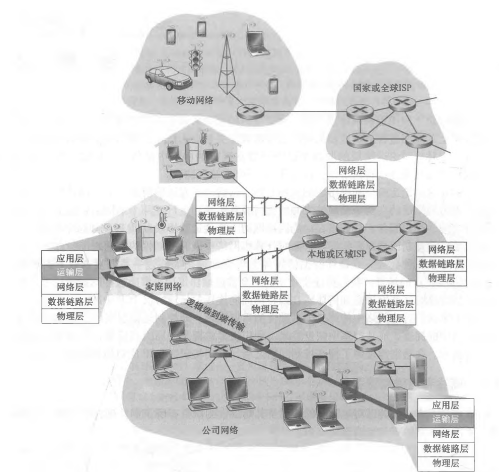
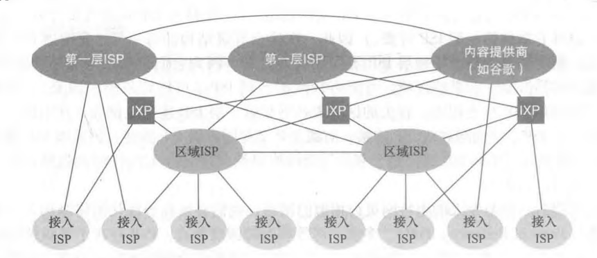
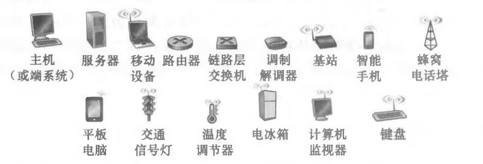
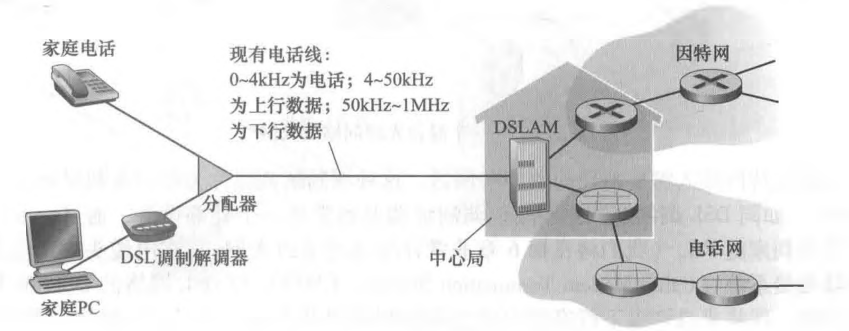
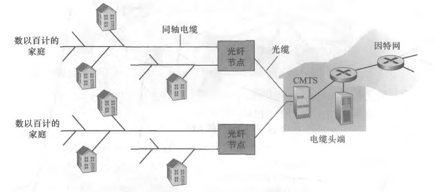
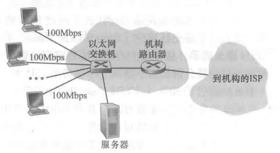

# 计算机网络基础

- [计算机网络基础](#计算机网络基础)
  - [什么是因特网](#什么是因特网)
    - [网络组成](#网络组成)
  - [网络设备](#网络设备)
  - [接入公网](#接入公网)
  - [网络协议](#网络协议)

## 什么是因特网

**网络的网络 internet**：

网络把主机连接起来，而互连网（internet）是把多种不同的网络连接起来，因此互连网是网络的网络。

**因特网 Internet**：

因特网是一个世界范围的计算机互连网，它连接了遍及全世界各地设备。事实上，它是上是一个庞大的网络集合，由全球各地许多网络构成，如图1所示。这些网络可以是ISP网络、学术网络、企业内部网络等。它们通过不同规模的网关路由器互相连接，组成了一个庞大的广域网络。

> 值得注意的是，万维网（World Wide Web）只是因特网的一个子集。前者是建立在因特网上的一个分布式信息系统，通过统一资源标志符（URL）来共享信息文件、图片、多媒体等资源。

### 网络组成

事实上，因特网核心骨架结构是由几家大型顶级ISP和区域ISP网络构建而成的，如图2所示。这些服务商ISP可以从互联网管理机构获得许多IP地址，同时拥有通信线路以及路由器等联网设备，个人或机构向ISP缴纳一定的费用就可以接入互联网。

**网络服务商 ISP**：

狭义上的网络服务商（Internet Service Provider）指为个人或企业提供互联网访问的公司。它们通常是一些大型电信公司，比如AT&T。但广义上，ISP还能提供一些诸如：主机托管、电子邮件、域名服务、代理服务器和云计算的服务。

**局域网 LAN**：

局域网（Local Area Network, LAN），又称内网，是指覆盖局部区域（如办公室或楼层）的计算机网络。IEEE 802系列规则的出现推动了局域网技术的标准化。而其中的以太网（IEEE 802.3标准）和WiFi（IEEE 802.11）则是最常用的局域网组网方式。

## 网络设备

在图1中，我们看到除了端设备，还有很多其他设备一起构成了因特网，如图3所示。

路由器（Router）是一种用于连接不同网段或不同类型子网络的设备。它的核心功能是转发与路由。其中，前者是指根据数据包的目的地址决定输出端口，后者则是指根据算法选择最优路径。此外，现代路由器还集成了许多其他功能。比如，内置了调制解调的功能，代替拨号上网中的调制解调器；提供NAT网关，帮助私有IP转换；充当DHCP服务器，避免每次启动手动配置主机IP等等。

交换机（Switch）是一种用于局域网内部数据帧高速转发的设备。传统的二层交换机工作在OSI 7层模型中的第二层，也就是数据链路层。和路由器不同的是，它存储的是MAC地址到MAC地址的映射表，而非IP地址到MAC地址的映射表。目前，也出现了三层交换机，即在二层交换机的基础上，增加了路由模块，工作在网络层。

调制解调器（Modem）是一种信号转换的设备，也被人们根据音译称为“猫”。其中，调制(Modulation)是指把原信号转化成适用于传输的信号类型，而解调（Demodulation）就是其反过程，两者结合实现双向通信。常见的调制解调器包括：1、将数字信号变为无线电磁波的天线系统；2、将数字信号转化为光信号的光调制解调器；3、将数字信号转化为模拟信号的ADSL调制解调器。

**网关 Gateway**：

网关是网络中一种特殊概念，它常常和路由器、交换机等实体设备混淆。实际上，它并非一种特定的设备，而是一个抽象的概念。总体来说，网关就是网络中的中介节点。根据其连接两端的不同类型以及其自身的功能，可以大致分为几类：

- 传输类网关，如路由器Router等，在网络拓扑中位于子网边界，发挥连接传输的作用；
  - 路由器作为默认网关，可以连接两个不同网段，为不同网段的主机提供路由和转发服务；
  - 可以说路由器是网关，但不能说网关是路由器，以偏概全了；
- 转换类网关或翻译类网关，如媒体网关，信令网关，NAT网关等。这类网关发挥的是转化器和翻译器的作用。
  - NAT网关则是将私网地址转换为了公网地址或指定端口；
- 安全类网关，如防火墙，或身份认证网关，在不同网络之间，提供安全防护的功能，起到过滤和门禁的作用；
- 代理类网关，如API网关，作为服务器的反向代理，处理并响应客户端提出的各种传入API调用请求，而不是由服务器直接响应客户端的请求；

## 接入公网

之前提到，若想访问公网，则需要向网络服务商缴费购买其宽带服务，通过接入其内部网络进而访问公网。事实上，ISP提供了多种接入方法，下面介绍最常见的几种接入机制。

**拨号上网**：

拨号上网是指用户从提供有线电话服务的电话公司处获得数字用户线（Digital Subscriber Line，DSL）因特网接入。

**电视线上网**：

DSL利用电话公司现有的本地电话基础设施，而电缆因特网接入（Cable Internet Access）利用了有线电视公司现有的有线电视基础设施。

**光纤到户**：

相比电视线上网，光纤上网进一步提高了数据传输的速度。

**以太网 & Wi-Fi**：

在公司和大学校园以及越来越多的家庭环境中，使用局域网将端系统连接到ISP的边缘路由器进而接入公网变得越来越流行。

**移动蜂窝上网**：

## 网络协议

协议（Protocol）定义了在两个或多个通信实体之间交换的报文的格式和顺序，以及报文发送和/或接收一条报文或其他事件所采取的动作。为了更好的组织网络协议并划分其界限，网络设计者以分层（Layer）的方式组织协议以及实现这些协议的网络硬件和软件。下面分别介绍两种重要的网络协议栈，如图7所示。

**开放式系统互联模型 OSI Model**：

开放式系统互联模型（Open System Interconnection Model，OSI）是一种概念模型，由国际标准化组织提出，一个试图使各种计算机在世界范围内互连为网络的标准框架。

**TCP/IP协议簇 TCP/IP Protocl Suite**：

TCP/IP协议族是一种网络通信模型，也代指整个网络传输协议家族。它是构成现实网络基础设施的协议标准，而不仅限于一个抽象模型。它将网络具体分成四层：

- 应用层：为特定应用程序提供数据传输服务，以HTTP、SMTP、DNS等协议为代表。数据单位为报文（Message）。
- 传输层：为进程提供通用数据传输服务，以TCP和UDP协议为代表。数据单位为段（Segment）
- 网络层：为一台主机提供到另一台主机的数据传输服务，以IP协议为代表。数据单位为数据包（Datagram）。
- 链路层：为一台主机提高到另一台存在物理连线的主机传输服务，以以太网和Wi-Fi等为代表。数据单位为帧（Frame）。

其中，链路层实现点到点通信，而网络层实现端到端通信。前者指的是发送端把数据传给与它直接相连的设备，后者则是建立在点到点的基础之上的，由若干的点到点实现和组成。

此外，网络层为主机提供逻辑通信服务，而运输层为主机上的进程提供逻辑通信。换句话说，只有在计算机网络中，只有端设备才拥有运输层及其之上的应用层的网络栈。
