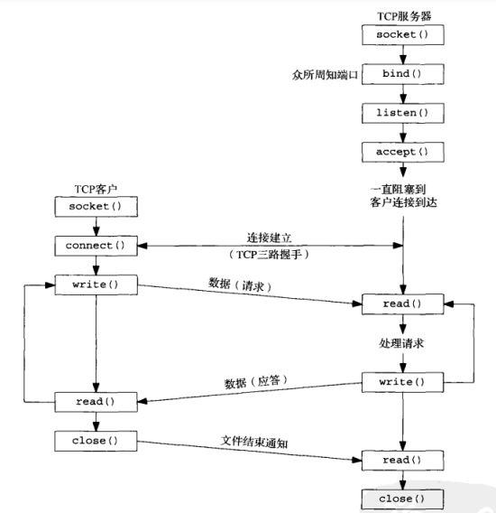
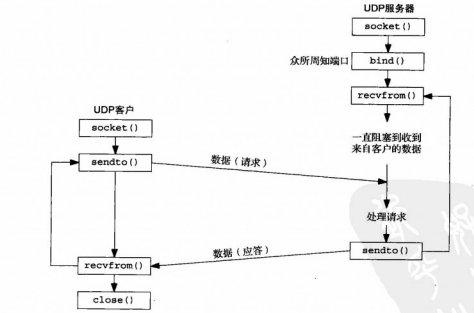

# Socket

- [Socket](#socket)
  - [Socket API](#socket-api)
    - [TCP Socket](#tcp-socket)
    - [UDP Socket](#udp-socket)
  - [I/O Model](#io-model)
    - [Blocking I/O and Multiprocess](#blocking-io-and-multiprocess)
    - [I/O Multiplexing](#io-multiplexing)
    - [Reactor](#reactor)
    - [Proactor](#proactor)

套接字（Socket）实际是位于传输层和应用层之间的一个编程接口。

## Socket API

为了执行网络I/O，一个进程必须做的第一件事就是调用socket函数，并指定期望的通信协议类型去创建一个socket。当socket函数成功时，它返回一个非负整数，与文件描述符类似，我们将其称为套接字描述符(Socket Descriptor)，一般简写为sockfd。

```c++
#include<sys/socket.h>
int socket(int family, int type, int protocol);
```

其中，family参数指定协议簇，type指定套接字类型，protocol指定协议。它的取值分别如下：

- AP_INET：
- AP_INET6：
- AP_LOCAL
- AP_ROUTE

- SOCK_STREAM
- SOCK_DGRAM
- SOCK_SEQPACKET
- SOCK_RAW

- IPPROTO_TCP
- IPPROTO_UDP
- IPPROTO_STCP

### TCP Socket



### UDP Socket



## I/O Model

### Blocking I/O and Multiprocess

以TCP服务为例，如果想要为服务器添加并发响应的能力，那么就需要引入多线程或多进程。比如，下面这个例子就是每次accept一个客户端请求之后，就fork一个子进程去响应。

```c++
int main() {
    int serverSocket, clientSocket;
    struct sockaddr_in serverAddr, clientAddr;
    socklen_t clientAddrLen = sizeof(clientAddr);
    
    // 创建socket
    serverSocket = socket(AF_INET, SOCK_STREAM, 0);
    
    // 设置服务器地址和端口
    serverAddr.sin_family = AF_INET;
    serverAddr.sin_addr.s_addr = INADDR_ANY;
    serverAddr.sin_port = htons(80);
    
    // 绑定端口
    bind(serverSocket, (struct sockaddr*) &serverAddr, sizeof(serverAddr));
    // 监听端口
    listen(serverSocket, 5);
    
    while (1) {
        // 接受客户端连接
        clientSocket = accept(serverSocket, (struct sockaddr*) &clientAddr, &clientAddrLen);
        
        // 创建一个新线程处理客户端请求
        int id = fork();
        if (id == 0) {
          close(serverSocket);
          // 服务逻辑
          // ...
          return 0；
        }
        close(clientSocket);
    }

    close(serverSocket);
    return 0;
}
```

### I/O Multiplexing

为了避免多进程或多线程间上下文切换的消耗，Unix系统中引入了select/poll/epoll这三种函数，以提供I/O复用的能力。关于这三者的详细介绍，可以查看我的另一篇[笔记](https://github.com/Zhytou/CS-Notes/blob/main/field/operating%20system/persistence/input%20%26%20ouput%20devices.md)。下面给出使用epoll实现的一个简单TCP服务器代码。

```c++
int main() {
  int server_socket = socket(AF_INET, SOCK_STREAM, 0);
  struct sockaddr_in server_addr;
  server_addr.sin_family = AF_INET;
  server_addr.sin_addr.s_addr = INADDR_ANY;
  server_addr.sin_port = htons(8888);
  bind(server_socket, (struct sockaddr *)&server_addr, sizeof(server_addr));
  listen(server_socket, 5);

  // 创建一个epoll实例
  int epoll_fd = epoll_create(20);
  struct epoll_event event;
  event.events = EPOLLIN;
  event.data.fd = server_socket;
  // 添加需要监视的文件描述符
  // ...
  epoll_ctl(epoll_fd, EPOLL_CTL_ADD, server_socket, &event);

  std::vector<struct epoll_event> events(10);

  while (1) {
    // 等待直到被监视的文件描述符就绪
    int num_events = epoll_wait(epoll_fd, events.data(), static_cast<int>(events.size()), -1);
    for (int i = 0; i < num_events; ++i) {
      // 遍历就绪文件描述符，根据不同fd做逻辑处理
      switch(events[i].data.fd) {
        case server_socket: {
          int client_socket = accept(server_socket, nullptr, nullptr);
          // ...
        }
        // ...
        default: {
          break;
        }
      }
    }
  }

  close(server_socket);
  close(epoll_fd);

  return 0;
}
```

### Reactor

Reactor是一种常见的网络设计模式，它是多线程和I/O复用两种方法的综合。具体来说，Reactor对象通过select/poll/epoll监控客户端请求事件，然后将就绪的文件描述符交由线程池中相应的Handler处理。一个常见的单Reactor多线程模型如下图所示。


### Proactor

Proactor是另一种设计模式，它结合了异步I/O和多线程。和Reactor相比，Proactor模式关注的不是就绪事件，而是完成事件，这是二者的最大区别。
