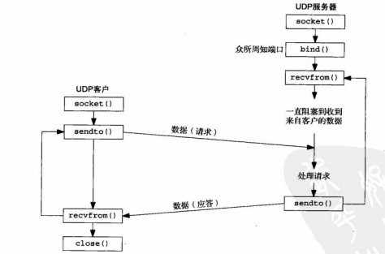

# Socket

套接字（Socket）实际是位于传输层和应用层之间的一个编程接口。

## socket函数

为了执行网络I/O，一个进程必须做的第一件事就是调用socket函数，并指定期望的通信协议类型去创建一个socket。当socket函数成功时，它返回一个非负整数，与文件描述符类似，我们将其称为套接字描述符(Socket Descriptor)，一般简写为sockfd。

```c++
#include<sys/socket.h>
int socket(int family, int type, int protocol);
```

其中，family参数指定协议簇，type指定套接字类型，protocol指定协议。它的取值分别如下。

- AP_INET：
- AP_INET6：
- AP_LOCAL
- AP_ROUTE

- SOCK_STREAM
- SOCK_DGRAM
- SOCK_SEQPACKET
- SOCK_RAW

- IPPROTO_TCP
- IPPROTO_UDP
- IPPROTO_STCP

## TCP Socket


## UDP Socket


