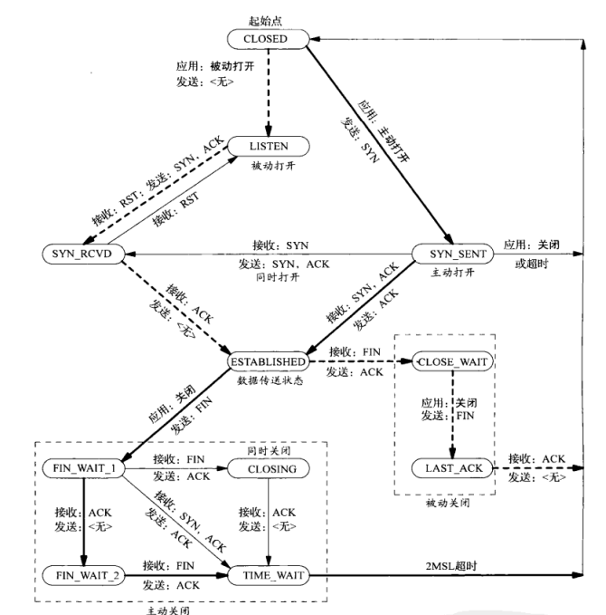

# 传输层

- [传输层](#传输层)
  - [UDP](#udp)
  - [TCP](#tcp)
    - [TCP首部](#tcp首部)
    - [三次握手](#三次握手)
    - [四次挥手](#四次挥手)
    - [TCP状态](#tcp状态)
    - [滑动窗口](#滑动窗口)
    - [自动重传](#自动重传)
    - [SACK](#sack)
    - [拥塞控制](#拥塞控制)
    - [沾包和拆包](#沾包和拆包)
  - [其他](#其他)
    - [端口](#端口)
    - [多路复用和多路分用](#多路复用和多路分用)
    - [TLS/SSL](#tlsssl)

## UDP

用户数据报协议UDP（User Datagram Protocol）是一种无连接的，尽最大可能交付、面向报文的传输层通信协议。它的特点包括：

- 无连接：无需维护连接状态。
- 尽最大可能交付：没有滑动窗口等机制确保可靠连接。
- 面向报文：对于应用程序传下来的报文不合并也不拆分，只是添加UDP包头。
- 多种连接方式：支持一对一、一对多、多对一和多对多的交互通信。
- 首部开销小：TCP首部20字节，UDP首部8字节。
- 无沾包问题：TCP面向流会出现沾包问题，而UDP不会。

## TCP

传输控制协议TCP（Transmission Control Protocol）是一种面向连接的、可靠的、提供拥塞控制和流量控制的传输层通信协议。它的特点包括：

- 面向连接（字节流）：把应用层传下来的报文看成字节流，根据网络情况把字节流组织成大小不等的数据块。
- 提供可靠交付：依靠确认应答以及超时重传机制保证可靠传输。
- 有流量控制和拥塞控制：通过滑动窗口和拥塞窗口实时调整发送速率，TCP能很好适应网络拥塞情况，保证可靠高效传输。
- 仅支持支持一对一连接，无法实现广播和多播通信。
- 双工通信，即客户端和服务端都可以同时充当发送者和接收者的角色。

### TCP首部


**标志位 Flag**：

TCP首部中的标志位（1 bit）用于标识TCP报文段的不同属性和状态。FIN、ACK和SYN是TCP包头中的三个重要的符号位。

- SYN（Synchronize）：SYN标志位用于建立一个TCP连接。在三次握手过程中，主动发起连接的一方会将SYN标志位置为1，表示请求建立连接。接收方收到SYN标志位后，会发送一个SYN+ACK报文作为响应，表示同意建立连接。
- FIN（Finish）：FIN标志位用于结束一个TCP连接。当发送方希望关闭连接时，会将FIN标志位置为1，通知接收方不再发送数据。接收方收到FIN标志位后，会发送一个ACK确认消息，并准备关闭连接。
- ACK（Acknowledgement）：ACK标志位用于确认收到的数据。在TCP协议中，除了用于传输数据的报文段外，还有专门用于确认的ACK报文段。ACK标志位置为1表示该报文段是一个确认报文段，用于确认接收到的数据。

指的注意的是，SYN和FIN才是相对的两个标志位，而非SYN和ACK，因为SYN用于开启TCP连接，而FIN用于关闭TCP连接。至于ACK，它在连接建立后将一直保持为1。

此外，在TCP中，SYN标志位置为1的报文，即SYN报文，不能携带数据，同时还需要消耗一个序号。类似的还有FIN报文，它即使不携带数据也需要消耗一个序号。而与之相反的则是ACK报文，尽管它也允许携带数据，但当它不携带数据时则不消耗序号。

**序号 Sequence Number**：

在TCP报文中只能够提供一个32位的区域用于存储报文序号。当报文序号超过这个范围时，序号字段将循环回零重新计数。换句话说，TCP报文中的序号只是一个相对序号。

在实际通信中，发送者会随机初始化一个32位的起始报文序号（Initial Sequence Number，ISN），并告知接收者。此时，接收者就可以通过将报文中的相对序号（Sequence Number，seqno）与起始序号相加的方式获取实际的绝对序号（Absolute Sequence Number）。这三者的关系如下：


**确认号 Acknowledgement Number**：

TCP是一种双工通信协议，这意味着其客户端和服务端都既是发送者也是接收者。这也是为什么它的首部中同时存在序号和确认号两个值。前者在其作为发送方时标识数据包的序列号，而后者则在其作为接收方时表示望接收的下一个字节的序列号。换句话说，确认号其实就是滑动窗口中第一个缺失值序号。

### 三次握手


如上图所示，客户端A主动向服务器端B建立TCP连接的流程如下：

- 首先B处于LISTEN（监听）状态，等待客户的连接请求。
- A向B发送连接请求报文（SYN=1），同时将随机初始化一个序号x。
- B收到连接请求报文，如果同意建立连接，则向A发送连接连接确认报文（SYN=1, ACK=1）。其中，确认号为x+1，而序号则为其随机初始化的一个值y。
- A收到B的连接确认报文后，还要向B发出确认，确认号为y+1，序号为x+1。
- B收到A的确认后，连接建立。

**随机初始序号的原因**：

如果每次建立连接，客户端和服务端的初始化序列号都是一样的话，很容易出现历史报文被下一个相同四元组的连接接收的问题。

**三次握手的原因**  ：

尽管在第二次握手时，客户端和服务端实际已经建立了连接，但TCP仍然设计了第三次握手来确认连接完成。这是因为第三次握手能够防止过期失效的连接请求到达服务器让服务器错误打开连接。

假设移除第三次握手，那么服务端一旦接收到SYN报文就会进入ESTABLISHED状态。此时，如果客户端发送的连接请求如果在网络中滞留，那么就会隔很长一段时间才能收到服务器端发回的连接确认。客户端等待一个超时重传时间之后，就会重新请求连接。但是这个滞留的连接请求最后还是会到达服务器，如果不进行三次握手，那么服务器就会打开两个连接。尽管客户端可以通过上下文，关闭历史连接，但这仍旧造成了服务器资源浪费。因此，使用三次握手第一时间阻止失效请求建立连接是最简单有效的方法。

**第一次握手丢失**：

当客户端想和服务端建立TCP连接的时候，它会发送一个SYN报文，也就是进行第一次握手，然后进入到SYN_SENT状态。如果客户端迟迟收不到服务端的SYN-ACK报文（第二次握手），就会触发超时重传机制，重传一份序列号相同的SYN报文。它会重复上述步骤，直到超过最大重传数量限制或连接成功。值得注意的是，TCP重传机制要求每次间隔时间是上一次的两倍，用来平衡性能。

**第二次握手丢失**：

类似第一次握手丢失，当服务端的SYN-ACK报文丢失时，客户端和服务端都会进行重传，直到超过最大重传数量限制或连接成功。

**第三次握手丢失**：

第三次握手的ACK是对第二次握手的SYN的确认报文，所以当第三次握手丢失了，如果服务端那一方迟迟收不到这个确认报文，就会触发超时重传机制，重传SYN-ACK报文，直到收到第三次握手，或者达到最大重传次数。这是因为ACK报文是不会有重传的，当ACK丢失了，就由对方重传对应的报文。

**SYN攻击**：

SYN攻击就是攻击者短时间伪造多个SYN报文，使服务器所有TCP端口都陷入ACK报文等待（即第三次握手），从而致使其无法正常工作。

应对这种攻击的方法包括：

- 减少SYN+ACK重传次数，从而使服务器尽快主动断开连接。
- 开启syncookies功能，从而在不使用SYN半连接队列的情况下成功建立连接。
- 增大TCP半连接队列，避免正常请求因半连接队列满了而丢弃。

### 四次挥手


如上图所示，客户端A和服务器端B断开TCP连接的流程如下：

- A发送连接释放报文（FIN=1），B收到之后发出确认。此时，TCP属于半关闭状态，B能向A发送数据但是A不能向B发送数据。
- 当B不再需要连接时，发送连接释放报文（FIN=1）。
- A收到后发出确认，进入TIME-WAIT状态，等待2*MSL（最大报文存活时间）后释放连接。
- B收到A的确认后释放连接。

**四次挥手的原因**  ：

根本原因就是TCP就是一个双工通信协议，客户端和服务端可以互相发送信息。因此，关闭这两个信道就一共需要两个FIN报文和两个ACK报文。

**MSL vs TTL**：

最大报文存活时间(Maximum Segment Lifetime, MSL)是任何报文在网络上存在的最长时间，超过这个时间报文将被丢弃。而TTL是IP首部中的一个字段，它表示该IP包被路由器丢弃之前允许通过的最大网段数量，即路由跳数量。由于TCP是依赖于IP的，所以MSL往往大于TTL消耗到0的时间，以确保报文自热消亡。换句话说，假如TTL的值为64，而MSL是30秒，这就意味着该数据报文经过64个路由器的时间不会超过30秒，如果超过了，就认为报文已经消失在网络中了。

### TCP状态

在了解了TCP建立连接和释放连接的过程之后，可以得到TCP状态转化图如下：



其中，CLOSE_WAIT和TIME_WAIT是两个经常容易被提及的状态。

**CLOSE_WAIT状态**：

被动关闭连接的一方在发送确认关闭的ACK报文之后进入的状态被称为CLOSE_WAIT。当它也完成数据传输后，则会发送FIN报文请求关闭连接。同时它的状态也由CLOSE_WAIT变为等待ACK的LAST_ACK。

**TIME_WAIT状态**：

主动发起关闭连接的一方，才会有TIME-WAIT状态。它指的是，先断开连接并且已经确认的一方在接收到另一方发送的FIN报文后所进入的状态。TIME_WAIT的存在尽可能保证了其发出的ACK报文能被收到，即保证连接正确关闭。

**为什么TIME_WAIT等待时间为2*MSL**：

2MSL时长其实是相当于至少允许报文丢失一次。因为若ACK在一个MSL内丢失，这样被动方重发的FIN报文会在第2个MSL内到达，TIME_WAIT状态的连接可以应对。

### 滑动窗口

滑动窗口是TCP协议中的一种流量控制机制。它的本质实际上是位于接收方和发送方之间的一块缓冲区。发送方将数据划分为多个等长的数据段（也称为报文段），每个数据段都有一个序列号，用于在接收方进行排序和重组。接收方维护一个滑动窗口，表示它当前可以接收的数据段的范围。

它使得发送方和接收方能够根据网络状况和接收能力动态调整数据传输速率，防止发送方发送过多的数据导致接收方无法及时处理，从而保证了数据传输的可靠性和效率。

### 自动重传

TCP之所以是一种可靠的协议，正是因为其自动重传的机制。自动重传请求（Automatic Repeat-reQuest, ARQ）是OSI模型中数据链路层和传输层的错误纠正协议之一。它通过使用确认和超时这两个机制，在不可靠服务的基础上实现可靠的信息传输。具体来说，它可分为以时间驱动的超时重传（Timeout Retransmition）和以数据驱动的快速重传（Fast Retransmition）。其中，前者是指，如果发送方在发送后一段时间之内没有收到确认信息，即ACK报文，它会重新发送该信息，直到收到确认或者重试超过一定的次数。而后者则要求接收方每收到一个失序的报文段就立即发出确认报文，而不要等到自己发送数据时才捎带确认。同时，它还规定发送方在接收到3个重复确认时，直接重传丢失段，而不必继续等待为其设置的重传计时器到期。

**RTT vs RTO**：

其中，超时重传中发送方的等待时间被称为重传超时时间（Retrasmition Timeout, RTO）。而往返时间（Round-Trip Time, RTT）也是自动重传中一个重要的概念。它是指从发送数据段开始，到收到对方确认该数据段所需的时间。

**RTO确定**：

为了平衡效率，RTO并不是一尘不变的。发送方会根据收到的ACK持续估算RTT的值，并据此设置合理的RTO值。具体来说，它的设置方法通常包括：

- 固定超时时间：发送方使用一个固定的超时时间作为RTO的值。这种方法简单，但不灵活，无法适应网络状况的变化。
- 加权移动平均：发送方使用加权移动平均方法计算RTO的值。每次测量到的RTT都会根据一定的权重影响RTO的计算。常见的加权移动平均算法有Jacobson算法和Karn算法。
- 超时时间偏差：发送方根据测量的RTT和偏差来计算RTO的值。偏差可以通过计算RTT的标准差或平均绝对偏差来得到。这种方法可以根据RTT的变化调整RTO的值。
- 自适应方法：发送方根据网络的状况动态调整RTO的值。比如，通过根据RTT的变化来调整RTO的倍数或增加一个固定的增量。

### SACK

选择性确认（Selective Acknowledgment, SACK）机制是一种增强的确认机制，用于在TCP连接中提供更高效的重传机制。它允许接收方在确认消息中指示已正确接收的数据段范围，而不仅仅是最后一次接收的数据段。发送方可以根据接收方提供的SACK信息，只重传丢失的数据段，而不是重传已经正确接收的数据段，从而提高重传的效率。

### 拥塞控制

**拥塞窗口**：

拥塞窗口（Congestion Window，cwnd）是TCP拥塞控制中的一个重要概念。它是发送方维持的一个状态变量，其大小根据网络状况动态调整，进而限制发送方向网络发送数据的速度，以避免网络拥塞。事实上，发送方的滑动窗口大小上限正是拥塞窗口和接收方滑动窗口中的最小值，即`swnd_max=min(cwnd, rwnd)`。

**主要算法**：

一般来说，cwnd的变化过程可以分成三个阶段，而这三个阶段也正好对应不同的变化策略。它们依次如下：

- 慢启动（Slow Start）：cwnd开始设置为较小值，每收到一个确认后指数增大cwnd。即每经历一个RTT后，cnwd翻倍。
- 拥塞避免（Congestion Avoidance）：当cwnd开始接近慢开始门限（Slow Start Threshold, ssthresh）时，改为线性加大cwnd。即每经历一个RTT后，cnwd增加一。
- 快重传和快恢复（Fast Retrasmition and Fast Recovery）：
  - 快重传要求接收方每收到一个失序的报文段就立即发出确认报文，而不要等到自己发送数据时才捎带确认。同时，它还规定发送方在接收到3个重复确认时，直接重传丢失段，而不必继续等待为其设置的重传计时器到期。
  - 快恢复要求在发送方在接收到3个重复确认时，就将慢开始门限减半，即ssthresh变为原来的二分一，来预防潜在拥塞。当后续发送方能够接收到接收方的确认报文时，即实际没有发生拥塞，cwnd进入线性增长阶段，直到再次遇到3个ACK报文。

指的一提的是，上述慢开始算法并不是指cwnd增长速率慢，而是指其TCP初始发送速度满。此外，拥塞避免阶段也并不是指使用该策略能够完全避免拥塞，而是说将该节点cwnd换成线性增长后，网络比较不容易出现拥塞。

至于，快重传和快恢复，是丢包发生之后的一种处理手段。如果不使用它们，当TCP发生丢包时，慢启动门限会直接减半，cwnd变为1，即重新进入慢启动阶段。

### 沾包和拆包

**沾包和拆包只发生在TCP中**：

TCP协议是面向字节流的协议。虽然应用程序和TCP的交互是一次一个数据块（大小不等），但TCP的每次分割都可能不同。因为，它把应用程序交付下来的数据仅仅看成是一串无结构的字节流，所以无法包含应用层中的每条信息的边界。

而UDP是面向消息的协议，每个UDP段都是一条消息，应用程序必须以消息为单位提取数据，不能一次提取任意字节的数据。因此，UDP通信不会发生粘包问题。

**出现沾包的原因**：

- 在发送数据时，TCP会根据nagle算法，将数据量小的，且时间间隔较短的数据一次性发给对方。也就是说，如果发送端连续发送了好几个数据包，经过nagle算法的优化，这些小的数据包就可能被封装成一个大的数据包，一次性发送给接收端，而TCP是面向字节流的通信，没有消息保护边界，所以就产生了粘包问题。
- 还有一种情况会产生粘包，就是接收方没有及时接收数据。可能发送端发来了一段数据，但接收端只接收了部分数据，剩下的小部分数据还遗留在接收缓冲区。那么在下一次接收时，接收缓冲区上不但有上一次遗留的数据，还可能有来自其它报文数据，它们作为一个整体被接收端接收了，这就也造成了粘包。

**Nagle算法和延迟确认**：

**出现拆包的原因**：

如果发送端缓冲区的长度大于网卡的MTU时，TCP会将这次发送的数据拆成几个数据包发送出去。也就是说，发送端可能只发送了一次数据，接收端却要分好几次才能收到完整的数据。

## 其他

### 端口

在网络技术中，端口（Port）大致有两种意思：一是物理意义上的端口，比如，USB端口、串行端口等等；二是逻辑意义上的端口，一般是指TCP/IP协议中的端口，端口号的范围从0到65535，比如用于浏览网页服务的80端口，用于FTP服务的21端口等等。

面向连接服务TCP协议和无连接服务UDP协议使用16bits端口号来表示和区别网络中的不同应用程序，网络层协议IP使用特定的协议号（TCP 6，UDP 17）来表示和区别传输层协议。换句话说，TCP和UDP的端口号范围都是0到65535，但是同一时间内同一端口只能被TCP或UDP中的一个使用。下面是一些常见应用的默认端口：

- HTTP (Hypertext Transfer Protocol)：80
- HTTPS (HTTP Secure)：443
- FTP (File Transfer Protocol)：20（控制连接），21（数据连接）
- SSH (Secure Shell)：22
- SMTP (Simple Mail Transfer Protocol)：25
- POP3 (Post Office Protocol version 3)：110
- IMAP (Internet Message Access Protocol)：143
- DNS (Domain Name System)：53
- Telnet：23
- MySQL：3306
- PostgreSQL：5432

### 多路复用和多路分用

多路复用（Multiplexing）是一个通信和计算机网络领域的专业术语，表示在一个信道上传输多路信号或数据流的过程和技术。它可根据使用的技术可以分为时分复用（TDM）、频分复用（FDM）、空分复用（SDM）和码分复用（CDM）。

在TCP/UDP协议中，多路复用主要是体现在端口上。具体来说，服务器和客户端一旦建立一个连接之后，不同的应用可以同时在该连接上传输信息，并且用端口来进行区分。具体来说，运输层报文段中的数据交付到正确的套接字的工作称为多路分解，而在源主机中从不同套接字中收集数据块，并为每个数据块封装上首部信息从而生成报文段，然后将报文段传递到网络层，所有这些工作称为多路复用。


对于无连接的多路复用来说，也就是UDP多路复用，服务端在使用recvform函数收到客户端发送来的数据之后（返回收到字节数），可以直接在用sendto函数向该socket写入发往客户端的信息。而TCP的多路复用则不同，它的服务端在使用accept函数收到客户端信息之后，会返回一个新socket用于和客户端通信。二者差异具体可由下代码显示：

```c++
// UDP
int recvBytes = recvfrom(sockfd, buffer, sizeof(buffer), 0, (struct sockaddr*)&clientAddr, &len);
if (recvBytes < 0) {
    std::cerr << "Error receiving data" << std::endl;
    break;
}
// 在buffer中写入信息
// ...
// 原样返回给客户端
sendto(sockfd, buffer, strlen(buffer), 0, (struct sockaddr*)&clientAddr, len);

// TCP
clientSocket = accept(serverSocket, (struct sockaddr*) &clientAddr, &clientAddrLen);
// 发送响应给客户端
send(clientSocket, response.c_str(), response.size(), 0);
close(clientSocket);
```

值得注意的是，这一点和I/O模型中I/O复用（select/poll/epoll函数）是不同的。此处的多路复用描述的是传输层协议的一种特征，而I/O复用则是一种在服务端不引入多进程的前提下实现并发API服务的方法。关于I/O模型的具体介绍和编程实战，可以查看这两篇笔记[Socket](https://github.com/Zhytou/CS-Notes/blob/main/field/computer%20networking/socket.md)和[I/O设备](https://github.com/Zhytou/CS-Notes/blob/main/field/operating%20system/persistence/input%20%26%20ouput%20devices.md)。

### TLS/SSL

传输层安全性协议（Transport Layer Security, TLS），前身称为安全套接层（Secure Sockets Layer, SSL）是一种安全协议，目的是为互联网通信提供安全及数据完整性保障。它的优势是与高层的应用层协议（如HTTP、FTP、Telnet等）无耦合。应用层协议能透明地运行在TLS协议之上，由TLS协议进行建立加密通道需要的协商和认证。应用层协议传送的数据在通过TLS协议时都会被加密，从而保证通信的私密性。

**TLS建立连接流程**：

- 客户端发送连接请求。
- 服务端收到请求后，发送自己的数字证书给客户端，该证书包含服务器的公钥。
- 客户端验证服务器的数字证书的合法性，包括检查证书的有效性、验证证书链和检查证书的签名等。
- 客户端生成一个随机数，用服务器的公钥对该随机数进行加密，并发送给服务器。
- 服务器使用自己的私钥对客户端发送的随机数进行解密，得到一个对称加密的密钥。
- 客户端和服务器使用这个对称加密的密钥来加密和解密通信的数据。
- 客户端和服务器交换握手消息，确认TLS连接的建立。

**和SSH比较**：

SSH（Secure Shell）是一种用于安全远程访问和文件传输的协议。虽然TLS和SSH都提供了安全的通信机制，但它们在以下几个方面有所不同：

- 用途：TLS主要用于在互联网上的客户端和服务器之间的安全通信，而SSH主要用于远程登录和文件传输等安全访问。
- 应用层协议：TLS是在传输层上的安全协议，可以用于加密任何传输层协议，如HTTP、SMTP等。而SSH是一个应用层协议，通常用于安全远程登录和文件传输。
- 证书验证：TLS使用数字证书来验证服务器的身份，而SSH使用主机密钥来验证服务器的身份。
- 密钥交换：TLS使用公钥加密算法和密钥交换协议来协商对称加密密钥，而SSH使用公钥加密算法和Diffie-Hellman算法来协商对称加密密钥。
- 端口号：TLS通常在TCP的443端口上运行，而SSH通常在TCP的22端口上运行。
