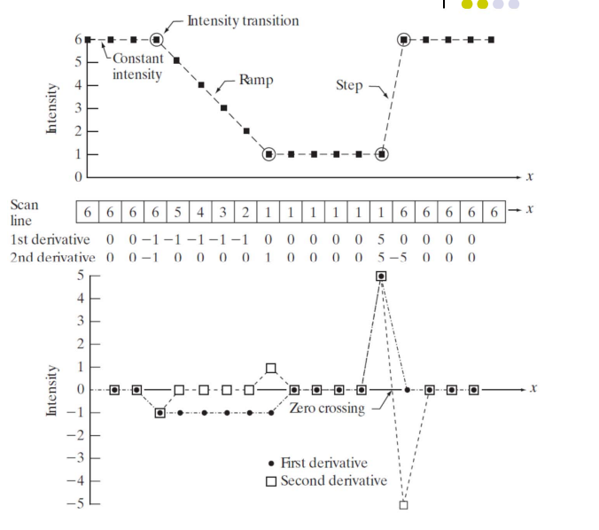

# 计算机视觉基础

- [计算机视觉基础](#计算机视觉基础)
  - [特征检测与描述 Detector and Descriptor](#特征检测与描述-detector-and-descriptor)
    - [边缘检测](#边缘检测)
      - [边缘检测算子](#边缘检测算子)
      - [滤波器基础](#滤波器基础)
      - [Canny算法](#canny算法)
    - [角点检测](#角点检测)
      - [Harris](#harris)
      - [Harris-Laplace](#harris-laplace)
    - [斑点检测](#斑点检测)
      - [LoG](#log)
      - [DoG](#dog)
    - [特征描述](#特征描述)
      - [SIFT](#sift)
      - [SURF](#surf)
  - [拟合与对齐 Fitting and Alignment](#拟合与对齐-fitting-and-alignment)
    - [霍夫变换](#霍夫变换)
      - [霍夫直线变换](#霍夫直线变换)
      - [霍夫圆变换](#霍夫圆变换)
    - [RANSAC](#ransac)
    - [应用——图像融合](#应用图像融合)
  - [分类和识别 Categorization and Object Recognition](#分类和识别-categorization-and-object-recognition)
    - [聚类分析](#聚类分析)
    - [语义分割](#语义分割)
    - [人脸识别](#人脸识别)
      - [PCA](#pca)
  - [其他](#其他)
    - [连通域分析](#连通域分析)
    - [阈值处理](#阈值处理)
  - [参考](#参考)

## 特征检测与描述 Detector and Descriptor

在计算机视觉领域中，常见的[特征](https://en.wikipedia.org/wiki/Feature_(computer_vision))可分为三类，分别是：

- Edge
- Corner/Interest Points/Key Points
- Blob/Region Of Interest Points

### 边缘检测

在图像中，一个物体的边缘或者轮廓往往会发生灰度值突变。因此，可以采用计算其灰度值导数（即相邻像素灰度差分）的方式检测边缘。一个最简单的边缘检测步骤如下：

- 将彩色图像转为灰度图像；
- 使用边缘检测算子计算灰度值变换率和变换方向，即求导得出梯度（方向和大小）；
- 使用单一阈值将梯度阈值进行二值化，得到二值边缘图。

#### 边缘检测算子

边缘检测算子也就是在检测边缘中用于计算灰度值梯度的运算符。它可依据求导次数分为一阶导数算子和二阶导数算子。当计算图像边缘的导数时，一阶导数通常产生较粗的边缘，即边缘处导数一直非零；而二阶导数则产生两个有间距的双边缘（由零分开，单像素宽）。关于二者区别，具体如下图所示。

常见的边缘检测算子包括：

- **Roberts算子**：利用对角相邻像素点进行卷积计算梯度。
- **Sobel算子**：该算子包含两组3x3的矩阵，分别为横向及纵向。将之与图像作平面卷积，即按所示方程式计算：
  $$
  G_x*A = [[1, 0, -1], [2, 0, -2], [1, 0, -1]]*A = [f(x+1, y-1)+2*f(x+1, y)+f(x+1, y+1)]-[f(x-1, y-1)+2*f(x-1, y)+f(x-1, y+1)]
  G_y*A = [[1, 2, 1], [0, 0, 0], [-1, -2, -1]]*A = [f(x-1, y+1)+2*f(x, y+1)+f(x+1, y+1)]-[f(x-1, y-1)+2*f(x, y-1)+f(x+1, y-11)]
  $$
- **Prewitt算子**：原理与Sobel类似，但使用不同的卷积核。

#### 滤波器基础

事实上，这些用于边缘检测的算子正是数字图像处理中的锐化滤波器。它基于卷积差分，能够增强边界和突出细节。而与之对应的正是基于卷积求和的平滑滤波器，二则一起组成了空间域滤波器。其中，平滑滤波器可按计算方法分为平滑线性滤波器和统计排序（非线性）滤波器，包括：

- **均值滤波器**是最简单的线性滤波器，它通过计算像素邻域内的像素值平均值来替换中心像素的值。这有助于消除噪声，但可能导致边缘模糊。
- **加权线性滤波器**使用不同权重的邻域像素值进行滤波，权重通常随着距离中心像素的增加而减小。
- **高斯滤波器**是加权线性滤波器的一个例子，其权重由高斯函数决定，对中心像素赋予最大权重，对远离中心的像素赋予较小权重，这在平滑图像的同时能较好地保持边缘。
- **中值滤波器**是一种非线性滤波器，它将中心像素替换为其邻域像素排序后的中值。这种方法对椒盐噪声有很好的去除效果，同时能较好地保护边缘。

#### Canny算法

尽管使用边缘检测算子得到灰度值梯度之后，可以直接用其梯度幅度二值化得到边缘二值图像，但是这样做有两个缺点：

- 没有充分利用梯度的方向信息；
- 仅简单使用单阈值进行处理。

因此，Canny边缘检测算法被提出了。它针对上面两个缺点提出了改进，分别是：

- 基于边缘梯度方向的非极大值抑制；
- 双阈值的滞后阈值处理。

具体来说，Canny算法的步骤为：

- 噪声抑制：在梯度计算之前，Canny算法先进行高斯滤波以平滑图像，有效地减少了噪声对边缘检测的影响。
- 非极大值抑制：Canny算法在梯度幅值图上进行非极大值抑制，确保边缘的精确定位。简单来说，它会去寻找像素点局部最值。在每一点上，领域中心与沿着其对应的梯度方向的两个像素相比，若中心像素为最大值，则保留；否则中心置0。这样可以抑制非极大值，保留局部梯度最大的点，以细化边缘。
- 双阈值检测：Canny算法使用双阈值检测来区分强边缘和弱边缘。
  - 如果某一像素位置的幅值超过高阈值，该像素为强边缘像素，将会被保留。
  - 如果某一像素位置的幅值小于低阈值，该像素被排除。
  - 如果某一像素位置的幅值在两个阈值之间，该像素为弱边缘像素，按和强边缘的连通性选择是否保留。
- 边缘连接：Canny算法根据弱边缘和强边缘的连通性选择是否保留弱边缘。

### 角点检测

在计算机视觉领域中，关键点，也被称为兴趣点或角点，是指图像中独特且重要的点或特征。它们的特点是，在任意方向上的一个微小变化造成其灰度的剧烈变化。一般来说，角点通常位于两条或多条边缘的交汇处。

#### Harris

**基本原理**：

Harris角点检测的原理是，使用指定大小的窗口中在图片各个方向上平移，观察窗口内容的相似程度。其判定方法和示例图如下：

- 当沿任意方向窗口内部图像均基本无变化时，判定为Flat；
- 当且仅当沿某方向窗口内部图像基本无变化时，判定为edge；
- 当沿任意方向窗口内部图像均发生变化时，判定为Corner。

**数学推导**：

当站在数学角度进行严格推导时，该算法使用自相关函数去描述平移后窗口w(x, y)内图片I(x, y)的相似程度，其公式如下：$E(u, v)=\Sigma_x\Sigma_yw(x, y)[I(x+u, y+v)-I(x, y)]^2$。

当平移量u和v很小时，可以对E(u, v)进行泰勒展开，其公式如下：$E(u, v)=[I(x, y)+uI_x+vI_y-I(x, y)]^2=u^2I_x^2+v^2I_y^2+2uvI_xI_y$。

对于上述自相关函数E(u, v)，可以进一步对其使用特征分解得到特征值$\lambda_1, \lambda_2$，而使用该特征值进行判定的方法如下图。

然而在实际运用中，无需具体计算特征值，而使用一个量化指标R去判断。该指标的计算方法如下：$R=det(M)-trace(M)^2$。其中det(M)和trace(M)分别为矩阵M的行列式和迹。

- 当R大于零，且其绝对值很大时，为角点；
- 当R小于零，且其绝对值也很大时，为边。

**算法特点**：

- 旋转、平移不变性；
- 图像有偏置时极值点不变；
- 无尺度不变性。 ——> Solution: Harris-Laplace / SIFT

关于Harris角点检测的详细介绍，可以参考博客[图像特征之Harris角点检测](https://senitco.github.io/2017/06/18/image-feature-harris/)。

#### Harris-Laplace

### 斑点检测

斑点是图像中具有一致性特征的区域，这些特征可能是亮度、颜色或者纹理等。一般来说，斑点通常是图像中的局部极值点，即在某个邻域内有显著不同于周围像素的点。斑点检测的目的是找出这些极值点及其所在的区域。

#### LoG

高斯拉普拉斯(Laplacian of Gaussian, LoG)算子是最常见的斑点检测算法。它首先将图片与高斯核进行卷积以平滑影像，然后应用拉普拉斯算子，斑点在拉普拉斯响应达到显著值的点处被检测出来。

#### DoG

高斯差(Differential of Guassian)算子是一种近似LoG的斑点检测算法。它通过计算两个不同标准差的高斯平滑图像的差值来近似LoG的效果。

### 特征描述

> 

#### SIFT

> 关于SIFT算法的详细介绍，可以参考博客[你对SIFT算法了解多少—原理详解与演示](https://blog.csdn.net/DIPDWC/article/details/117605628)。

尺度不变特征变换(Scale Invariant Feature Transform, SIFT)是计算机视觉中一种检测、描述和匹配图像局部特征点的方法，通过在不同的尺度空间中检测极值点或特征点 (Conrner Point, Interest Point) ，提取出其位置、尺度和旋转不变量，并生成特征描述子，最后用于图像的特征点匹配。也就是说，和Harris、FAST这类特征点检测算法相比，SIFT算法不仅能够检测还能够描述进而用于后续的匹配操作，比如图像融合等。

**Scale Space**：

尺度空间(Scale Space)理论描述了图像的模糊程度和人感知其大小的关系。近距离看一个物体和远距离看一个物体，模糊程度是不一样的；从近到远，图像越来越模糊的过程，也是图像的尺度越来越大的过程。

#### SURF

## 拟合与对齐 Fitting and Alignment

> 关于拟合和对齐概念层面更详细的介绍，可以参考UIUC CS 543的[课件](https://courses.engr.illinois.edu/cs543/sp2015/lectures/Lecture%2009%20-%20Fitting%20and%20Registration%20-%20Vision_Spring2015.pdf)。

拟合和对齐是计算机视觉中两项重要的技术。拟合指的是找到一个模型的参数，使其能够最好的适应数据；而对齐则是找到一个变换的参数，使得匹配的点能够最佳对齐。二者的解决方法类似，都需要设计一个描述相似度的损失函数，并且设计一个优化方式来避免局部最优解，同时确保运算速度足够快。

常见的拟合与对齐手段包括：

- 全局优化/参数搜索（Global Optimization / Search for Parameters）：
  - 最小二乘拟合（Least Squares Fit）：通过最小化误差的平方和来找到最佳拟合参数。
  - 鲁棒最小二乘（Robust Least Squares）：针对存在噪声和异常值的数据，通过加权最小二乘法或其他鲁棒技术来提高拟合的准确性。
  - 迭代最近点算法（Iterative Closest Point, ICP）：用于两组点云的对齐，通过反复迭代寻找最近点对，来优化变换参数。
- 假设与检验（Hypothesize and Test）：
  - 广义霍夫变换（Generalized Hough Transform）：通过投票机制在参数空间中寻找最佳参数。
  - 随机抽样一致性（RANSAC）：通过随机抽样和迭代优化找到鲁棒的变换参数。

对于假设和检验方法来说，其具体步骤可分为四步：

- 提出参数（Propose Parameters）：尝试所有可能的参数。每个点对所有一致的参数进行投票。反复采样足够多的点以求解参数。
- 对参数进行评分（Score the Given Parameters）：计算一致点的数量，并可能根据距离进行加权。
- 选择参数（Choose from Among the Set of Parameters）：选择得分最高的参数，可以是全局或局部最大值。
- 参数细化（Possibly Refine Parameters Using Inliers）：使用内点对参数进行进一步优化。

### 霍夫变换

霍夫变换(Hough Transform)则是通过将图像从图像空间变换到参数空间，使得同一个曲线上的点在参数空间内具有相同的参数值。利用参数空间上的累加器统计每个参数值出现的频率，最大频率处即为所求形状的方程参数。哈夫变换的经典应用是从边缘像素中检测直线和圆形等。

**优点**：

- 对离群值具有鲁棒性：每个点单独投票。
- 相对高效（比尝试所有参数集要快得多）。
- 提供多个良好的拟合结果。

**缺点**：

- 对噪声有一定敏感性。
- 需要在噪声容忍度、精度和速度/内存之间进行权衡，难以找到最佳点。
- 不适合处理多个参数，网格大小呈指数级增长。

#### 霍夫直线变换

在图像x−y坐标空间中，经过点(xi,yi)的直线表示为：$y_i=a*x_i+b$。其中，参数a为斜率，b为截矩。

通过点(xi,yi)的直线有无数条，且对应于不同的a和b值。如果将xi和yi视为常数，而将原本的参数a和b看作变量，则原直线表达式上可以表示为：$b=-x_i*a+y_i$。考虑到图像坐标空间中的另一点(xj,yj)，它在参数空间中也有相应的一条直线，表示为：$b=-x_j*a+y_j$。这条直线与点(xi,yi)在参数空间的直线相交于一点(a0,b0)，如图所示：

可见，(a0,b0)就是点(xi,yi)和点(xj,yj)确定的参数。根据这个特性，给定图像坐标空间的一些边缘点，就可以通过Hough变换确定连接这些点的直线方程。

在实际运用中，首先确定(a, b)两个参数可能的范围并定义一个二维数组A，然后依次将每个点(x, y)和a所有取值代入，从而计算出所有可能b取值。接着使用二维数组记录所有(a, b)对出现的次数。最后将其二值化，高出阈值的就是最终得到的所有直线。

#### 霍夫圆变换

霍夫变换同样适用于方程已知的曲线检测，比如圆。其图像坐标空间到参数空间的变换公式如下：$x=a+Rcos(\theta), y=b+Rsin(\theta)$。因此，参数空间可以表示为(a,b,r)，图像坐标空间中的一个圆对应参数空间中的一个点。具体计算时，与前面讨论的方法相同，只是数组累加器为三维A(a,b,r)。 计算过程是让a,b在取值范围内增加，解出满足上式的r值，每计算出一个(a,b,r)值，就对相应的数组元素A(a,b,r)加1.计算结束后，找到的最大的A(a,b,r)所对应的a,b,r就是所求的圆的参数。

### RANSAC

随机抽样一致算法(Random Sample Consensus, RANSAC)采用迭代的方式从一组包含离群的被观测数据中估算出数学模型的参数。它的一般流程是：

- 在数据中随机选择若干个点设定为内点群；
- 计算拟合内点群的模型；
- 把其它刚才没选到的点带入刚才建立的模型中，计算是否属于内点群；
- 记下内点群数量；
- 重复以上步骤；
- 比较哪次计算中内点群数量最多，内点群最多的那次所建的模型就是我们所要求的解。

**优点**：

- 对离群值（非内点）具有鲁棒性。
- 适用于比霍夫变换更多的目标函数参数。
- 优化参数比霍夫变换更容易选择。

**缺点**：

- 随着离群值比例和参数数量的增加，计算时间迅速增长。
- 不适合获取多个拟合结果（尽管可以通过每次拟合后移除内点并重复来解决）。

### 应用——图像融合

图像的对齐和拼接(Image Alignment and Stitching)是模型匹配最重要的应用，

## 分类和识别 Categorization and Object Recognition

### 聚类分析

### 语义分割

### 人脸识别

#### PCA

## 其他

### 连通域分析

### 阈值处理

## 参考

- [UIUC cs543 Computer Vision](https://courses.engr.illinois.edu/cs543/sp2015/)
- [Princeton COS 429 - Computer Vision](https://www.cs.princeton.edu/courses/archive/fall17/cos429/cos429.html)
- [浙江大学计算机视觉](https://qsctech.github.io/zju-icicles/%E8%AE%A1%E7%AE%97%E6%9C%BA%E8%A7%86%E8%A7%89/)
