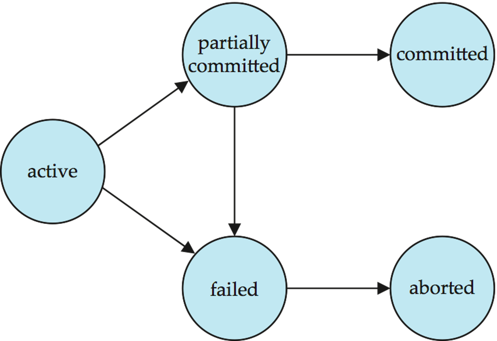

# 数据库事务

- [数据库事务](#数据库事务)
  - [事务模型](#事务模型)
    - [ACID](#acid)
    - [BASE](#base)
  - [并发与隔离](#并发与隔离)
    - [并发问题](#并发问题)
    - [隔离级别](#隔离级别)
  - [日志](#日志)
    - [预写式日志机制](#预写式日志机制)
    - [恢复算法 ARIES](#恢复算法-aries)
    - [MySQL日志](#mysql日志)
  - [并发控制](#并发控制)
    - [锁](#锁)
    - [MVCC](#mvcc)

数据库事务是数据库运行中的逻辑工作单位，单个逻辑工作单元所执行的一系列操作，要么都执行，要么都不执行。

**事务状态**：



- 活动：初始状态；事务在执行时保持此状态
- 部分提交：在某些情况下，一个事务可能包含多个独立的操作，这些操作可以被分成多个阶段进行提交。
- 失败：发现无法继续正常执行后。
- 中止：事务回滚后，数据库恢复到事务开始前的状态。中止后有两个选项：
  - 重新启动事务：只有在没有内部逻辑错误的情况下才能完成
  - 终止事务：
- 已提交 – 成功完成后。

## 事务模型

ACID和BASE是两种不同的数据库事务模型，它们确定数据库组织和操作数据的方式。ACID数据库优先考虑一致性而不是可用性，如果事务中的任何步骤出现错误，整个事务都会失败。相比之下，BASE数据库优先考虑可用性而不是一致性。用户可以暂时访问不一致的数据，而不是让事务失败。数据一致性可以实现，但不能立即实现。

一般来说，关系型数据库往往遵从ACID特性，而分布式数据库则遵从BASE特性。

### ACID

**原子性 Atomicity**：事务的原子性指的是，事务中包含的程序作为数据库的逻辑工作单位，它所做的对数据修改操作要么全部执行，要么完全不执行。这种特性称为原子性。

**一致性 Consistency**：事务的一致性指的是在一个事务执行之前和执行之后数据库都必须处于一致性状态。这种特性称为事务的一致性。假如数据库的状态满足所有的完整性约束，就说该数据库是一致的。

**隔离性 Isolation**：分离性指并发的事务是相互隔离的。即一个事务内部的操作及正在操作的数据必须封锁起来，不被其它企图进行修改的事务看到。假如并发交叉执行的事务没有任何控制，操纵相同的共享对象的多个并发事务的执行可能引起异常情况。

**持久性 Durability**：持久性意味着当系统或介质发生故障时，确保已提交事务的更新不能丢失。即一旦一个事务提交，DBMS保证它对数据库中数据的改变应该是永久性的，即对已提交事务的更新能恢复。持久性通过数据库备份和恢复来保证。

> Atomicity, isolation, and durability are properties of the database, whereas consis‐ tency (in the ACID sense) is a property of the application. The application may rely on the database’s atomicity and isolation properties in order to achieve consistency, but it’s not up to the database alone. ---DDIA

值得一提的是，原子性，隔离性和持久性是数据库的属性，而一致性是应用程序的属性。以MySQL为例，它通过undo log保证原子性，通过lock和MVCC保证隔离性，通过redo log保证持久性，最终得到一致性。换句话说说AID是手段，C是目的！

### BASE

**基本可用性 Bascially Available**：系统在出现故障或异常情况时仍然能够保证基本的可用性，即使在部分功能受限的情况下。

**软状态 Soft State**：这意味着系统的状态可以随着时间而改变，即使没有输入。

**最终一致性 Eventual Consistency**：系统允许在不同节点之间存在短暂的数据不一致，但最终会达到一致状态。

## 并发与隔离

### 并发问题

在典型的应用程序中，多个事务并发运行。若不添加适当的并发控制，则往往会造成以下问题。

**脏读**：事务A读到了事务B未提交的数据。

**不可重复读**：事务A第一次查询得到一行记录row1，事务B提交修改后，事务A第二次查询得到row1，但列内容发生了变化。

**幻读**：事务A第一次查询得到一行记录row1，事务B提交修改后，事务A第二次查询得到两行记录row1和row2。

### 隔离级别

根据使用并发控制程度不同，可用获得不同的事务隔离性，如下图所示。


## 日志

在数据库系统中，日志一般指定就是事务日志(Transcation Log)。它用于记录事务的修改操作，以便在系统崩溃或异常情况下进行恢复或重做。对于关系型数据库来说，日志和并发控制是其保证ACID特性的重要机制；而对于分布式数据库来说，多节点、基于分布式日志的一致性算法和节点复制是其保证BASE的特性的机制。可见，日志在数据库系统的重要性。

**影子分页**：

此外，除了使用日志保证数据库事务的原子性和持久性之外，还可以使用影子分页技术(Shadow Paging)来实现这些特性。它是一种写时复制技术，以避免原地修改页面。当一个页面将被修改，一个影子页面被分配。由于影子页面没有被别的地方引用，可以自由修改，不必顾虑一致性。当影子页面变得可以持久，所有引用原页面的地方都被修改为引用影子页面。由于影子页面直到修改完毕才被激活，这保证了原子性。关于日志和影子分页技术两者的对比，可以查看这篇文章[Write-ahead logs and shadow paging](https://misfra.me/wal-and-shadow-paging/)。

**日志组成**：

数据库日志记录一般由以下部分组成：

- 日志序列号(Log Sequence Number, LSN)：日志记录的唯一ID。使用LSN，可以在恒定时间内恢复日志。大多数LSN都按单调递增顺序分配，这在恢复算法中很有用。
- 上一个LSN：指向其最后一个日志记录的链接。这意味着数据库日志以链接列表形式构建。
- 事务ID号：对生成日志记录的数据库事务的引用。
- 类型：描述数据库日志记录的类型。
- 有关触发写入日志记录的实际更改的信息。

### 预写式日志机制

实际上，采用日志来实现事务原子性和持久性的数据库都实现了一种名为预写式日(Write-Ahead Logging, WAL)的机制。它指的所有数据的修改在生效之前都要先写入日志文件中。

**数据缓存Buffer Pool**：

为了提高存储效率并减少磁盘I/O次数，几乎所有数据库都在主存中开辟了一块内存用作磁盘中数据页缓存。以InnoDB为例，它设计了Buffer Pool用于存储数据页和索引页，且读写操作均直接作用于该缓存。显然，它是一种易失性存储(Volatile Storage)，即断电就丢失数据的存储器。

因此，为了避免在系统断电后丢失Buffer Pool中还没落盘的脏数据，InnoDB存储引擎实现了名为预写式日志的机制。

**重做和回滚Redo & Undo**：

**日志缓存Log Buffer**：

### 恢复算法 ARIES

一个优秀的恢复算法必须考虑多种因素，包括：

- 尽管事务的一些数据库修改仅存在于主内存的磁盘缓冲区中，而不存在于磁盘上的数据库中，但事务可能已提交。
- 事务可能在处于活动状态时修改了数据库，并且由于后续故障而需要中止。

**检查点Checkpoint**：

### MySQL日志

MySQL中最重要的日志包括重做日志(redo Log)、回滚日志(undo log)和归档日志(binlog)三类。其中，前两者由InnoDB存储引擎层生成，分别实现了原子性和持久性，即WAL日志；后者由Server层生成，主要用于数据备份和主从复制。

Undo Log是一种用于撤销回退的日志。在事务没提交之前，MySQL会先记录更新前的数据到 undo log 日志文件里面，当事务回滚时，可以利用 undo log 来进行回滚。

## 并发控制

并发控制是数据库管理系统中确保多个事务在并发执行时保持数据一致性的重要机制。常见的并发控制机制包括：

- Lock-Based Protocols：锁机制是最常见的并发控制方法，它通过在数据对象上设置不同类型的锁（如共享锁、排他锁）来控制事务的访问。
- Timestamp-Based Protocols：基于时间戳的协议为每个事务分配一个时间戳，事务按照时间戳顺序执行，避免了锁的使用。
- Validation-Based Protocols：验证协议在事务提交前检查其对数据的修改是否与并发执行的其他事务冲突。

### 锁

从锁粒度来看，锁可分为全局锁、页级锁(BDB引擎)、表级锁和行级锁；从锁定策略来看，锁可分为乐观锁和悲观锁；从锁定行为来看，锁可分为读锁/共享锁和写锁/互斥锁。其中，乐观锁和悲观锁是抽象的概念，并不对应特定的锁类型。前者认为并发时不会发生数据冲突，因此默认读操作不加锁，仅在写操作时判断数据是否发生修改。如果检测到数据冲突，则放弃写操作。而后者则认为并发时会发生数据冲突，因此读写操作均需要获取锁保证数据一致性。

**MySQL的锁**：

MySQL中锁可按粒度分为全局锁、页级锁(BDB引擎)、表级锁和行级锁。其中，仅InnoDB引擎是支持行级锁的，而MyISAM引擎并不支持行级锁。因此，关于行级锁的介绍主要放在了下一节中。本节主要介绍全局锁和表级锁。

全局锁是针对整个数据库的。当数据库被施加全局锁时，整个库就处于只读状态了，任何DML(Data Manipulation Language)和DDL(Data Definition Language)语句都会被阻塞。它主要用于全库的逻辑备份，其保证了在备份期间，不会因为数据或表结构的更新，而出现备份文件的数据与预期的不一样。

表级锁主要分为表锁(Table Lock)和元数据锁(MetaData Lock, MDL)。其中，表锁是针对整张表的。它可分为读锁和写锁，读锁可共享而写锁互斥。比如，为表t1添加锁表可以，使用如下命令：

```sql
/* 给表t1添加读锁或写锁 */
LOCK TABLES t1 READ | WRITE;
/* 释放该表锁 */
UNLOCK TABLES
```

至于元数据锁，它则用于保证表结构在并发下的数据一致性。对于DML(Data Manipulation Language)操作来说，它执行之前需要获取元数据读锁；而对于DDL(Data Definition Language)操作来说，它执行之前则需要获取元数据写锁。和表锁相比，元数据锁则不需要在SQL语句中显示调用，由MySQL自动添加和释放。

此外，InnoDB引擎还提供了两种特殊的表级锁——自增锁(Auto-Inc Lock)和意向锁(Intention Lock)。其中，自增锁主要用于管理自增列值的分配。当向表中插入数据时，就需要先获取其自增锁。通过自增锁，InnoDB能够生成一组连续的自增列值供多个并发事务无冲突地消费，从而避免了"偶然递增"或"重复分配"的现象。自增锁分为三种模式：

- 传统模式：每次为单个INSERT语句分配一个自增值，需要持有自增锁直到事务结束。
- 连续模式(MySQL5.5引入)：对于Simple Insert不使用表级锁，而是使用轻量级互斥锁生成自增值；对于Bulk Insert使用表级锁。
- 交错锁模式(MySQL8.0引入)：所有插入操作都不使用表级锁，只使用轻量级互斥锁。

InnoDB引擎提供的意向锁分为意向共享锁(Intention Shared Lock, IS)和意向互斥锁(Intention Exclusive Lock, IX)，用于指明事务稍后会对行数据进行读或写的意向。换句话说，如果事务想要在一张表上加行锁，必须先获得该表的相应意向锁。因此，可以说InnoDB支持多粒度锁定，允许行锁和意向锁共存。尽管意向锁之间不会生数据冲突，也不会和行锁发生数据冲突，但它会阻止其他事务获取表读写锁。值得一提的是，意向锁同样是由数据引擎自己维护的，用户无法使用SQL语句手动操作意向锁。

**InnoDB的锁**：

不同于其他存储引擎，InnoDB引擎实现行级锁定。而其提供的行级锁基本都可以分为共享锁(Shared Lock, S)和互斥锁(Exclusive Lock, X)，比如，共享/互斥意向锁、共享/互斥记录锁和共享/互斥临键锁。前者可同时被多个读操作事务获取，后者一次仅能被一个写操作事务获取。

另外，InnoDB引擎提供的行级锁可按锁定对象分为记录锁(Record Lock)、间隙锁(Gap Lock)、临键锁(Next-Key Lock)和插入意向锁(Insert Intention Lock)。其中，记录锁总是锁定实际数据，即在聚簇索引上加锁，即使创建表时没有显式指定主键索引。

间隙锁是锁定索引记录之间的间隙，或锁定第一个索引记录之前或最后一个索引记录之后的间隙。例如，`SELECT c1 FROM t WHERE c1 BETWEEN 10 and 20 FOR UPDATE;`可防止其他事务将值15插入列t.c1，无论该列中是否已有这样的值，因为范围内所有现有值之间的间隙均已锁定。间隙可能跨越单个索引值、多个索引值，甚至为空。值得一提的是，间隙锁之间是兼容的，可以同时有多个事务获取到同一间隙锁，且它们都只能保护间隙不能被插入新值。

临键锁是记录锁和间隙锁的一个组合。它不仅锁定记录本身，还会锁定一个范围的间隙。因此，临键锁即能保护记录本身，也能阻止新纪录插入到被保护的间隙中去。

插入意向锁时一种特殊的间隙锁。一个事务在插入一条记录的时候，需要判断插入位置是否已被其他事务加了间隙锁。如果有的话，插入操作就会发生阻塞，直到拥有间隙锁的那个事务提交为止（释放间隙锁的时刻），在此期间会生成一个插入意向锁，表明有事务想在某个区间插入新记录，但是现在处于等待状态。

关于InnoDB中锁的详细介绍可以查看MySQL手册[17.7.1 InnoDB Locking](https://dev.mysql.com/doc/refman/8.4/en/innodb-locking.html)

**SQL语句与锁**：

```sql
/* 全局锁 */
/* 整个库处于只读状态 */
FLUSH TABLES WITH READ LOCK
/* 释放全局锁 */
UNLOCK TABLES

/* 表级锁 */
/* 锁定表以只读方式，不允许其他事务写入 */
LOCK TABLES ... READ
/* 锁定表以读写方式，阻止其他事务访问 */
LOCK TABLES ... WRITE
/* 释放表锁*/
UNLOCK TABLES

/* 行级锁*/
/* 对读取的记录加共享锁 */
SELECT ... LOCK IN SHARE MODE 
/* 对读取的记录加独占锁 */
SELECT ... FOR UPDATE
/* 修改操作自动加独占锁 */
```

### MVCC

多版本并发控制(Multi-Version Concurrency Control, MVCC)是MySQL中用于在可重复读和提交读两个隔离级别下实现事务并发的机制。它利用Undo Log记录数据库更改前数据，并用ReadView拍下快照，从而为后续并发读访问提供支持。换句话说，MVCC在每次修改时都保存一个快照，并关联一个时间戳。

当一个事务执行读取操作时，它会选择符合最接近其事务开始时间的一个快照进行读取，从而避免读取到其他事务修改期间的脏数据。而当一个事务执行写操作时，它会生成一个新数据版本并将修改后的数据写入数据库。

**实现原理**：
