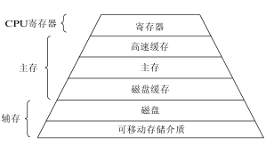

# 存储管理

- [存储管理](#存储管理)
  - [虚拟内存](#虚拟内存)
    - [地址翻译](#地址翻译)
  - [分段](#分段)
    - [泛化的的基址/界限](#泛化的的基址界限)
    - [操作系统对分段的支持](#操作系统对分段的支持)
  - [分页](#分页)
    - [慢表 页表](#慢表-页表)
    - [快表 TLB](#快表-tlb)
  - [存储层级](#存储层级)
    - [交换空间](#交换空间)
    - [页错误](#页错误)
  - [参考](#参考)

在进程的笔记中，我们提到了操作系统为进程提供了地址空间（Address Space）这个易用的物理内存抽象。通过这一机制，每个程序都会认为它将被加载到特定地址的内存中，并且具有非常大的空间。而地址空间背后的技术正是我们这次笔记的主要内容——虚拟内存。

## 虚拟内存

虚拟内存是计算机内存管理的一种技术。它使得每一个进程认为自己拥有连续可用的内存，同时将让进程彼此隔离从而防止相互造成伤害。一般来说，虚拟内存有三大目标：

- 透明性：程序不应该感知到内存被虚拟化的事实，相反，程序的行为就好像它拥有自己的私有物理内存。在幕后，操作系统（和硬件）完成了所有的工作，让不同的工作复用内存，从而实现这个假象。
- 高效率：操作系统总是追求虚拟化尽可能高效，包括时间上（即不会使程序运行得更慢）和空间上（即不需要太多额外的内存来支持虚拟化）。
- 隔离性：操作系统应确保进程受到保护，不会受其他进程影响，操作系统本身也不会受进程影响。

此外，虚拟内存可以由分段或分页实现，后续我会详细介绍二者的机制。

### 地址翻译

虚拟内存技术的核心就是完成地址翻译，即将程序的逻辑地址（Logical Address）翻译成实际存储的物理地址（Physical Address）。

**MMU**：

在计算机中，CPU利用内存管理单元（Memory Management Unit，MMU）来完成地址翻译。MMU是计算机中负责管理内存的硬件，它除了能够翻译地址之外，还能寻找空闲地址扩展空间。

## 分段

到目前为止，我们一直假设将所有进程的地址空间完整地加载到内存中，如图1所示。利用基址和界限寄存器，操作系统很容易将不同进程重定位到不同的物理内存区域。但是，栈和堆之间的大块空闲空间就会显得很浪费。

### 泛化的的基址/界限

为了改善这个问题，工程师们提出了分段（Segementation）的概念。在MMU中引入不止一个基址和界限寄存器对，而是给地址空间内的每个逻辑段一对寄存器。因此，地址空间中的不同段被重定位到物理内存中，从而避免了虚拟地址空间中的未使用部分占用物理内存。

**段表**：

段表描述了地址空间内的每个逻辑段地址到物理地址的对照关系。每个条目都有：

- 基地址：驻留在内存中的起始物理地址。
- 限制：段长。

### 操作系统对分段的支持

为了支持分段，操作系统需要解决两个问题。首先，在上下文切换时，操作系统必须保证各个段寄存器中的内容必须保存和恢复。其次，操作系统需要使用额外的手段管理空闲的物理空间。

**外部碎片**：

在多次创建进程并分配空间之后，物理内存很快充满了许多空闲空间的小洞，因而很难分配给新的段，或扩大已有的段。这种问题被称为外部碎片（External Fragmentation）。常见的解决方案包括：

- 重新安排原有的段。操纵系统先终止运行的进程，将它们的数据复制到连续的内存区域中去，改变它们的段寄存器中的值，指向新的物理地址，从而得到了足够大的连续空闲空间。
- 利用空闲列表管理算法。

## 分页

分页（Paging）是另一种实现内存虚拟化的手段。和分段将地址空间分割成几个不同长度的逻辑段不同，它选择将内存分割为称之为页（Page）的固定大小单元。而在物理内存与之对应的单元则被称为页帧（Page Frame）。

分页解决了分段产生外部内存碎片的问题，但它却无法避免加载页内的无效内存，即导致内部碎片（Internal Fragmentation）。

### 慢表 页表

在分页机制中，系统会为每个进程分配一个用于存储页实际存储位置的数据结构——页表（Page Table）。从数学角度来说页表就是一个函数，入参是虚拟页号（Virtual Page Number，简称 VPN），输出是物理页帧号（Physical Page Number，简称 PPN，也就是物理地址的基址）。
由此，一个由虚拟页号和页内偏移量表示的逻辑地址就可以被正确解析到其物理地址。

**页表项**：

页表由多个页表项（Page Table Entry, 简称 PTE）组成。一般来说，每个条目都有：

- 有效位（Valid Bit）指示特定地址转换是否有效。
- 保护位（Protection Bit）：表明页是否可以读取、写入或执行。
- 脏位（Dirty Bit）：表明页面被带入内存后是否被修改过。
- 物理地址

**多级页表**：

简单的线性页表往往会占用过多内存。为了解决这个问题，工程师提出了名为多级页表的解决方案。它将一个线性页表变成了类似树的结构，从而去掉页表中大量无效的区域。具体来说，多级页表首先将原页表分成页大小的单元，接着使用新结构——页目录（Page Directory）追踪原页表。其中，页目录也由多个页目录项（Page Directory Entry）组成，这些项一一对应着原页表中被分成的页，如图3所示。

**页表与磁盘**：

尽管多级页表能够有效地减少页表占用内存，但对于需要支持同时运行多个进程的系统来说，物理内存仍是短缺的。因此，一些系统选择将页表放入内核虚拟内存（Kernel Virtual Memory），从而允许系统在内存压力较大时，将这些页表中的一部分暂时交换到磁盘。

### 快表 TLB

**加速地址翻译**：

使用分页作为核心机制来实现虚拟内存就意味着较高的性能开销。这是因为分页中地址翻译需要先访问页表，再读取实际想要的信息，即分页逻辑上需要一次额外的内存访问。

由此，工程师们提供了地址转换旁路缓冲存储器(Translation Look-aside Buffer，TLB)来加速地址翻译。TLB是页表的一个小副本，也是一种硬件缓存。当系统需要进行地址翻译时，它会首先访问TLB，检查是否存有需要的信息，如果有，则不需要再访问页表，从而大大提升了地址翻译速度。

**局部性**：

缓存是计算机系统中最基本的性能改进技术之一。它背后的思想是利用指令和数据引用的局部性（Locality）。通常有两种局部性：

- 时间局部性（Temporal Locality）是指，最近访问过的指令或数据项可能很快会再次访问。比如：循环中的循环变量或指令，它们就会被多次反复访问。
- 空间局部性（Spatial Locality）是指，当程序访问某个地址的内存时，它可能很快会访问邻近该地址的内存。比如：遍历数组之类的情况。

**TLB未命中**：

当TLB未命中时，可能会由硬件或软件（操作系统）来处理。对于前者来说，硬件会“遍历”页表，找到正确的页表项，取出想要的转换映射，用它更新TLB，并重试该指令。而后者则是首先由硬件抛出一个异常，操作系统会重新获取CPU控制权（切换到内核模式）陷阱处理程序（Trap Handler）来更新TLB。

**TLB替换策略**：

和其他缓存类似，TLB也需要考虑缓存替换的策略。其常见的方法如下：

- LRU(Last Recently Used)
- NRU(Not Recently Used) 只看上一个指令周期的
- FIFO(First In First Out)

**上下文切换与TLB**：

由于TLB中存储的仅与当前进程相关的映射信息，因此最简单的方法就是清空TLB。不过这种方案在进程初始化时，会频繁的触发TLB未命中并带来大量的CPU开销，所以人们又提供了一种TLB共享的方案。通过添加地址空间标识符，来帮助TLB同时缓存不同进程的地址空间映射。

## 存储层级

计算机将其内部的存储设备按价格高低和读取速度划分成几个层级，如图2所示。

在之前我们提到，由于页表过大，操作系统会将部分页表条目放在磁盘。在实际应用中，系统也会将没有使用的页存放在磁盘中，而非让其常驻在内存里。换句话说，主存就是磁盘的缓存，类似TLB和页表的关系。

> 补充：廉价磁盘冗余阵列（Redundant Array of Inexpensive Disks，RAID）指的是利用虚拟化存储技术把多个硬盘组成一个或多个硬盘阵列组的技术，它能使得磁盘整体可用性性提升。

### 交换空间

交换空间（Swap Space）是操作系统在硬盘上开辟一部分空间用于物理页的移入和移出。

### 页错误

访问不在物理内存中的页，这种行为通常被称为页错误（Page Fault）。一般来说，这就意味着程序正在访问的虚拟地址空间的一部分，被操作系统交换到了硬盘上。此时，操作系统就会夺回CPU控制权，使用页错误处理程序将缺页置换到内存中，重新执行发生错位的指令。

## 参考

- [深入理解计算机系统-第9章 虚拟内存](https://hansimov.gitbook.io/csapp/)
- [深入剖析虚拟内存工作原理](https://cloud.tencent.com/developer/article/1821336)
- [geeks - Differences between paging and segment](https://www.geeksforgeeks.org/difference-between-paging-and-segmentation/)
