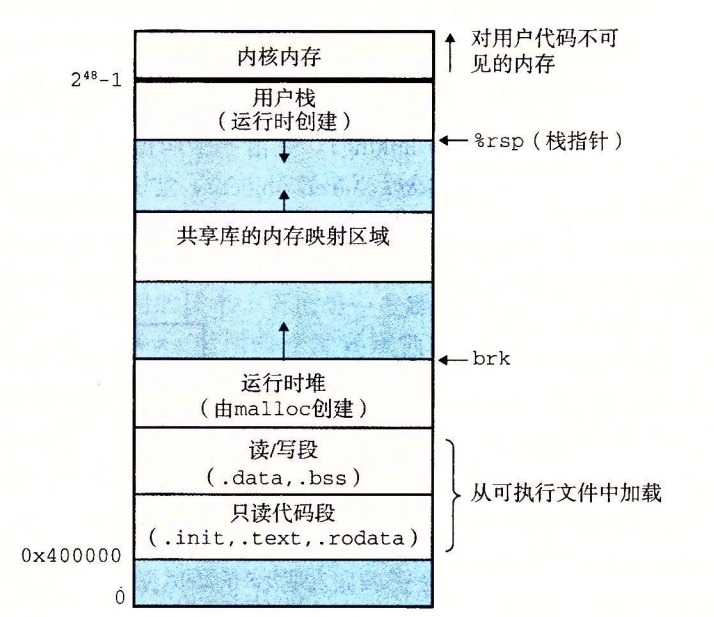

# 链接

- [链接](#链接)
  - [概述](#概述)
  - [目标文件](#目标文件)
  - [符号和符号表](#符号和符号表)
  - [符号解析](#符号解析)
  - [重定位](#重定位)
  - [动态链接共享库](#动态链接共享库)
  - [参考](#参考)

`链接（linking）`是将各种代码和数据片段收集并组合成为一个单一文件的过程，这个文件可被加载（复制）到内存并执行。

## 概述

链接器的存在使得`分离编译（separate compilation）`成为可能，即：我们不用再将一个应用程序组织成一个巨大的源文件，而是可以将它们分解成更好管理的小模块，可以独立地修改和编译这些模块。

根据链接执行时间的不同，可将链接分为三类：

- 静态链接（Static Linking）：静态链接是在编译时将所有需要的代码和库文件链接成一个单独的可执行文件，程序运行时不再需要额外的依赖文件。静态链接可以提高程序的运行效率和稳定性，但是会导致程序体积增大，不利于程序的更新和维护。
- 动态链接（Dynamic Linking）：动态链接是在程序运行时将需要的代码和库文件链接成一个单独的可执行文件，程序运行时需要依赖动态链接库文件。动态链接可以减小程序体积，便于程序的更新和维护，但是会增加程序运行时的开销。
- 装载时链接（Load-time Linking）：装载时链接是在程序运行时将需要的代码和库文件链接成一个单独的可执行文件，但是不同于动态链接，装载时链接库文件是在程序加载到内存时进行的。装载时链接可以减小程序体积，但是会增加程序加载时间，并且不同的操作系统和平台可能具有不同的实现方式。

为了构造可执行文件，链接器必须完成两个主要任务：

- 符号解析（symbol resolution）。目标文件定义和引用符号，每个符号对应于一个函数、一个全局变量或一个静态变量（即 C 语言中任何以 static 属性声明的变量）。符号解析的目的是将每个符号引用正好和一个符号定义关联起来。
- 重定位（relocation）。编译器和汇编器生成从地址 0 开始的代码和数据节。链接器通过把每个符号定义与一个内存位置关联起来，从而重定位这些节，然后修改所有对这些符号的引用，使得它们指向这个内存位置。链接器使用汇编器产生的重定位条目（relocation entry）的详细指令，不加甄别地执行这样的重定位。

## 目标文件

目标文件有三种形式：

- 可重定位目标文件。包含二进制代码和数据，其形式可以在编译时与其他可重定位目标文件合并起来，创建一个可执行目标文件。
- 可执行目标文件。包含二进制代码和数据，其形式可以被直接复制到内存并执行。
- 共享目标文件。一种特殊类型的可重定位目标文件，可以在加载或者运行时被动态地加载进内存并链接。

一般来说，编译器和汇编器生成可重定位目标文件（包括共享目标文件）；而链接器则可生成可执行目标文件。

**ELF文件**：

`ELF(Executable and Linkable Format)`是一种常见的二进制文件格式，它通常由四部分组成，分别是`ELF头(ELF header)`、`程序头表(Program header table)`、`节(Section)`和`节头表(Section header table`。

**常见节**：

- .text：已编译程序的机器代码。
- .bss：未初始化的全局和静态 C 变量，以及所有被初始化为 0 的全局或静态变量。
- .data：已初始化的全局和静态 C 变量。

**加载可执行目标文件**：

如果要在Linux系统中运行可执行目标文件xxx，我们可以在命令行中输入`./xxx`。此时，因为`./xxx`不是一个内置的命令，所以系统会认为`./xxx`是一个可执行目标文件，通过调用某个驻留在存储器中称为`加载器（loader）`的操作系统代码来运行它。

每个 Linux 程序都有一个运行时内存映像，类似于上图所示。

当加载器运行时，它创建类似于上图所示的内存映像。在程序头部表的引导下，加载器将可执行文件的片（chunk）复制到代码段和数据段。接下来，加载器跳转到程序的入口点，也就是 _start函数的地址。这个函数是在系统目标文件 ctrl.o 中定义的，对所有的 C 程序都是一样的。_start 函数调用系统启动函数 __libc_start_main，该函数定义在 libc.so 中。它初始化执行环境，调用用户层的 main 函数，处理 main 函数的返回值，并且在需要的时候把控制返回给内核。

## 符号和符号表

每个可重定位目标模块 m 都有一个符号表，它包含 m 定义和引用的符号的信息。在链接器的上下文中，有三种不同的符号：

- 由模块 m 定义并能被其他模块引用的全局符号。全局链接器符号对应于非静态的 C 函数和全局变量。
- 由其他模块定义并被模块 m 引用的全局符号。这些符号称为外部符号，对应于在其他模块中定义的非静态 C 函数和全局变量。
- 只被模块 m 定义和引用的局部符号。它们对应于带 static 属性的 C 函数和全局变量。这些符号在模块 m 中任何位置都可见，但是不能被其他模块引用。

## 符号解析

**解析多重定义的全局符号**：

在编译时，编译器向汇编器输岀每个全局符号，或者是强（strong）或者是弱（weak），而汇编器把这个信息隐含地编码在可重定位目标文件的符号表里。函数和已初始化的全局变量是强符号，未初始化的全局变量是弱符号。
根据强弱符号的定义，Linux 链接器使用下面的规则来处理多重定义的符号名：

- 不允许有多个同名的强符号。
- 如果有一个强符号和多个弱符号同名，那么选择强符号。
- 如果有多个弱符号同名，那么从这些弱符号中任意选择一个。

**链接静态库**：

编译系统都提供一种机制，将所有相关的目标模块打包成为一个单独的文件，称为静态库（staticlibrary），它可以用做链接器的输入。当链接器构造一个输出的可执行文件时，它只复制静态库里被应用程序引用的目标模块。

## 重定位

一旦链接器完成了符号解析这一步，就把代码中的每个符号引用和正好一个符号定义（即它的一个输入目标模块中的一个符号表条目）关联起来。

定位由两步组成：

- 重定位节和符号定义。在这一步中，链接器将所有相同类型的节合并为同一类型的新的聚合节。
- 重定位节中的符号引用。在这一步中，链接器修改代码节和数据节中对每个符号的引用，使得它们指向正确的运行时地址。

## 动态链接共享库

**静态库的问题**：

静态库解决了许多关于如何让大量相关函数对应用程序可用的问题。然而，静态库仍然有一些明显的缺点。静态库和所有的软件一样，需要定期维护和更新。如果应用程序员想要使用一个库的最新版本，他们必须以某种方式了解到该库的更新情况，然后显式地将他们的程序与更新了的库重新链接。

**共享库 & 动态链接**：

共享库（shared library）是致力于解决静态库缺陷的一个现代创新产物。共享库是一个目标模块，在运行或加载时，可以加载到任意的内存地址，并和一个在内存中的程序链接起来。这个过程称为动态链接（dynamic linking），是由一个叫做动态链接器（dynamic linker）的程序来执行的。共享库也称为共享目标（shared object），在 Linux 系统中通常用 .so 后缀来表示。微软的操作系统大量地使用了共享库，它们称为 DLL（动态链接库）。

**优势**：

- 节省内存空间：由于多个程序可以共用同一个共享库，因此可以节省内存空间。
- 更新方便：当共享库需要升级时，只需替换共享库本身，而不需要重新编译和链接应用程序。
- 节省编译时间：由于共享库是在程序运行时加载和链接，因此编译时不需要将共享库链接到可执行程序中，可以节省编译时间。
- 灵活性：动态链接可以动态加载和卸载共享库，使得程序更加灵活和可扩展。

**共享方式**：

- 不需要像静态库的内容那样被复制和嵌入到引用它们的可执行的文件中，而是在运行时直接由可执行程序共享该库中的代码和数据。
- 在内存中，一个共享库的 .text 节的一个副本可以被不同的正在运行的进程共享。

**执行时共享**：

我们除了可以在应用程序被*加载后执行前*使用动态链接器加载和链接共享库之外，还可以在应用程序*运行时*要求动态链接器加载和链接某个共享库，而无需在编译时将那些库链接到应用中。比如：现代高性能的 Web 服务器可以使用基于动态链接的更有效和完善的方法来生成动态内容。

## 参考

[深入理解计算机系统-第7章 链接](https://hansimov.gitbook.io/csapp/part2/ch07-linking)
