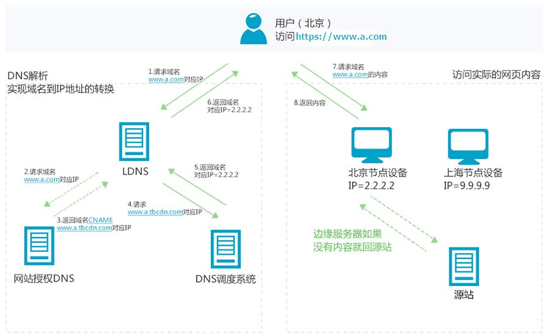

# 内容分发网络 CDN

- [内容分发网络 CDN](#内容分发网络-cdn)
  - [流程](#流程)
  - [技术](#技术)
    - [内容发布](#内容发布)
    - [内容路由](#内容路由)
  - [参考](#参考)

内容分发网络（Content Delivery Network，简称CDN）是建立并覆盖在承载网之上，由分布在不同区域的边缘节点服务器群组成的分布式网络。

简单来说，CDN可以看作服务器的替身，帮助缓解服务器访问压力。因此，CDN也被是视作一种缓存。此外，CDN也在选择节点的同时起到了负载均衡的作用。因此，CDN也是实现负载均衡的方法之一。

## 流程

下面，借用阿里云官网的例子来简单介绍CDN的工作原理。假设某用户访问了使用CDN加速的`www.a.com`，那么其工作流程如下：
  
首先，客户端会进行域名解析。它会先查看本地DNS缓存中是否有`www.a.com`的IP地址记录。如果有，则直接返回给终端用户；反之，则向顶级DNS发送域名解析请求并一步步传递该请求直至解析完成。在这个解析流程中，DNS可能会得到`www.a.com`的CNAME，而其会根据请求来源分配最佳节点IP地址，从而达成CDN实现负载均衡。最终，用户会获取到解析后的IP地址，并按此对资源进行访问。

**CNAME**：

CNAME（Canonical Name）指的是域名解析中的别名记录。它用来把一个域名解析到另一个域名（CNAME域名），再由CNAME域名来解析到需要访问的服务器IP地址。

一般来说，CNAME域名是CDN生成的。在购买CDN加速服务后，只需要在DNS解析服务商处，添加一条CNAME记录，将加速域名唯一解析到CNAME域名，记录生效后域名解析就正式转向CDN服务，该域名所有的请求都将转向CDN的节点，达到加速效果。至于CNAME域名将会解析到具体哪个CDN节点IP地址，将由CDN的调度系统来综合区域、运营商、节点资源水位等多个条件来决定。

## 技术

### 内容发布

内容发布是指将内容从源服务器传输到CDN的边缘节点服务器的过程。在内容发布阶段，源服务器会将网站的静态内容（如图片、视频、文本等）复制到CDN的边缘节点服务器上。这样一来，当用户请求某个内容时，CDN可以直接从最接近用户的边缘节点服务器上获取内容，而不是从源服务器上获取，从而减少了网络延迟和传输时间，提高了内容的传输速度和用户体验。

目前主要有两种主流的内容分发技术：

- **PUSH**：当你服务器上内容发生变动时，推送CDN接受新内容。直接推送给CDN并重写URL地址以指向你的内容的CDN地址。你可以配置内容到期时间及何时更新。内容只有在更改或新增是才推送，流量最小化，但储存最大化。
- **PULL**：CDN拉取是当第一个用户请求该资源时，从服务器上拉取资源。一般来说，高流量站点使用CDN拉取效果不错，因为只有最近请求的内容保存在CDN中，流量才能更平衡地分散。此外，因为存活时间（TTL）会决定缓存多久时间，所以如果过期文件并在实际更改之前被拉取，则会导致冗余的流量。

### 内容路由

内容路由是指CDN系统根据用户请求的内容和用户的位置，选择合适的边缘节点服务器来响应用户请求的过程。内容路由可以根据用户的地理位置、网络拓扑结构、服务器负载等因素来选择合适的边缘节点服务器。通常，CDN系统会使用负载均衡算法（如轮询、最小连接数等）来决定将用户请求路由到哪个边缘节点服务器上，以实现内容的快速响应和负载均衡。通过有效的内容路由，CDN可以提高内容传输的速度和可靠性，使用户能够更快地获取所需的内容。

## 参考

- [system-design-primer](https://github.com/donnemartin/system-design-primer#sharding)
- [CDN是什么?使用CDN有什么优势？](https://www.zhihu.com/question/36514327?rf=37353035)
- [CDN](https://baike.baidu.com/item/CDN/420951?fr=aladdin)
