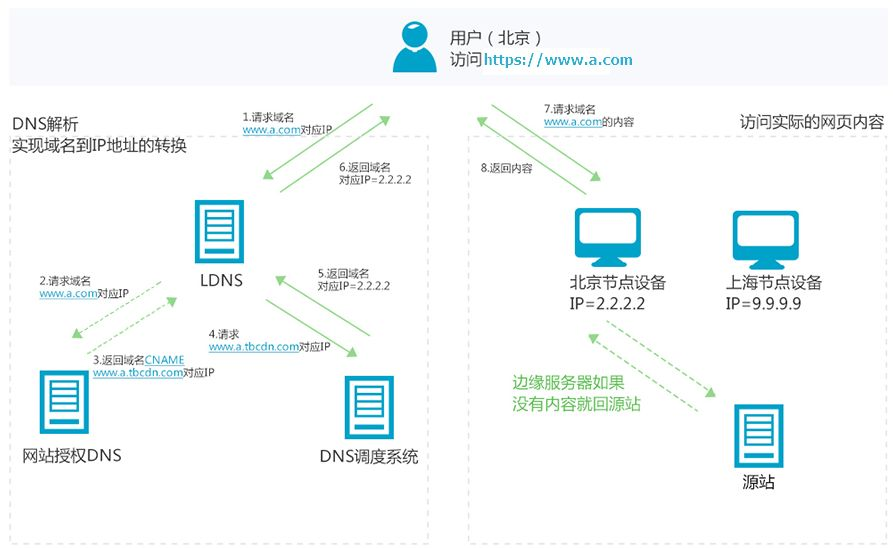

# 内容分发网络 CDN

## 简介

### 概述

- 内容分发网络（Content Delivery Network，简称CDN）是建立并覆盖在承载网之上，由分布在不同区域的边缘节点服务器群组成的分布式网络。
- 简单来说，CDN可以看作服务器的替身，帮助缓解服务器访问压力。
  - 因此，==CDN 也被是视作一种缓存==。
- 此外，CDN也在选择节点的同时起到了负载均衡的作用。
  - 因此，==CDN也是实现负载均衡的方法之一==。

### 流程

- 借用阿里云官网的例子，来简单介绍CDN的工作原理。

- 假设通过CDN加速的域名为`www.a.com`，接入CDN网络，开始使用加速服务后，当终端用户（北京）发起HTTP请求时，处理流程如下：
  - 当终端用户（北京）向`www.a.com`下的指定资源发起请求时，首先向LDNS（本地DNS）发起域名解析请求。
  - Local DNS检查缓存中是否有`www.a.com`的IP地址记录。如果有，则直接返回给终端用户；如果没有，则向授权DNS查询。
  - 当授权DNS解析`www.a.com`时，返回域名CNAME `www.a.tbcdn.com`。
  - 名解析请求发送至阿里云DNS调度系统，并为请求分配最佳节点IP地址。
  - Local DNS获取DNS返回的解析IP地址。
  - 用户获取解析IP地址。
  - 用户向获取的IP地址发起对该资源的访问请求。

### 功能

- 节省骨干网络带宽，减少带宽需求量；
- 提供服务端加速服务，解决由于用户访问量大造成的服务器过载问题；
- 服务商能使用Web Cache技术在本地缓存用户访问过的Web页面和对象，实现相同对象的访问无须占用主干的出口带宽，并提高用户访问因特网页面的相应时间的需求；
- 能克服网站分布不均的问题，并且能降低网站自身建设和维护成本。

## 技术

### 内容发布

#### 描述

- 内容分发包含从内容源到CDN边缘的Cache的过程。
- 从实现上，有两种主流的内容分发技术：PUSH和PULL。

#### 分类

**PUSH**：

- 当你服务器上内容发生变动时，推送 CDN 接受新内容。直接推送给 CDN 并重写 URL 地址以指向你的内容的 CDN 地址。你可以配置内容到期时间及何时更新。内容只有在更改或新增是才推送，流量最小化，但储存最大化。

**PULL**：

- CDN 拉取是当第一个用户请求该资源时，从服务器上拉取资源。你将内容留在自己的服务器上并重写 URL 指向 CDN 地址。直到内容被缓存在 CDN 上为止，这样请求只会更慢，
- 存活时间（TTL）决定缓存多久时间。CDN 拉取方式最小化 CDN 上的储存空间，但如果过期文件并在实际更改之前被拉取，则会导致冗余的流量。
- 高流量站点使用 CDN 拉取效果不错，因为只有最近请求的内容保存在 CDN 中，流量才能更平衡地分散。

### 内容路由

- CDN网络利用了负载均衡技术和内容路由器中的重定向（DNS）机制，以使用户请求得到最近内容源的响应。

## 参考

- [system-design-primer](https://github.com/donnemartin/system-design-primer#sharding)
- [CDN是什么?使用CDN有什么优势？](https://www.zhihu.com/question/36514327?rf=37353035)
- [CDN](https://baike.baidu.com/item/CDN/420951?fr=aladdin)
