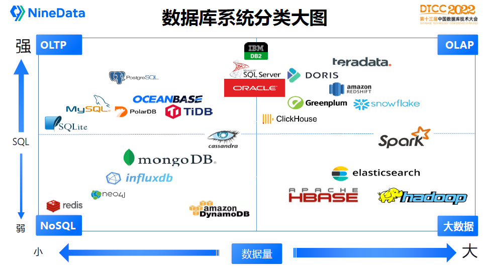

# 数据库

- [数据库](#数据库)
  - [概念](#概念)
  - [分类](#分类)
  - [架构](#架构)
    - [外部](#外部)
      - [单机](#单机)
      - [分组](#分组)
      - [分片](#分片)
    - [内部](#内部)
      - [存储引擎](#存储引擎)
      - [查询引擎](#查询引擎)
  - [设计](#设计)
    - [索引](#索引)
    - [范式](#范式)
  - [展望](#展望)
  - [参考](#参考)

## 概念

**SQL vs NoSQL vs NewSQL**：

- SQL databases, also referred to as relational database management systems (RDBMS), are a traditional approach to storing and managing historical data. In an RDBMS, data is organized in a structured manner using tables or relations.
- On the other hand, NoSQL databases, also known as "not only SQL" databases, utilize various data models such as key-value pairs, documents, graph databases, or wide-column stores, and do not follow a fixed schema like RDBMS. NoSQL databases are also horizontally scalable, which means they can scale out across multiple servers, in contrast to RDBMS which are typically scaled vertically by adding more resources to a single server.
- NewSQL databases combine the relational data model of traditional SQL databases with the scalability and performance of NoSQL databases. They offer the benefits of both approaches, enabling high-performance and horizontally scalable relational databases.

**BASE vs ACID**：

- ACID: ACID stands for Atomicity, Consistency, Isolation, and Durability. This is a set of properties that guarantee that database transactions are processed reliably.
- BASE stands for Basically Available, Soft state, Eventual consistency. This is a data consistency model that favors availability and partition tolerance over strict consistency.

**OLAP vs OLTP vs HTAP**：

OLAP（Online Analytical Processing）用于支持在线分析处理应用程序，如商业智能、数据挖掘、数据分析等。OLAP通常需要处理大量的数据，而且需要进行复杂的查询和分析操作。OLAP系统通常使用列式存储和向量化查询技术来提高查询性能。

OLTP（Online Transaction Processing）用于支持在线事务处理应用程序，如电子商务、金融交易、库存管理等。OLTP系统需要处理大量的事务，需要保证数据的一致性和可靠性，并且需要支持高并发的访问。

HTAP（Hybrid Transactional and Analytical Processing）是一种将OLTP和OLAP结合起来的数据处理方式。在HTAP系统中，数据可以同时用于事务处理和分析处理。HTAP系统通常使用混合存储引擎，可以在行式存储和列式存储之间灵活切换，以支持不同的应用场景。

**Database vs Data Warehouse vs Data Lake**：

- A database stores the current data required to power an application.
- A data warehouse stores current and historical data from one or more systems in a predefined and fixed schema, which allows business analysts and data scientists to easily analyze the data.
- A data lake stores current and historical data from one or more systems in its raw form, which allows business analysts and data scientists to easily analyze the data.

## 分类

主流的数据库有几十种，这张图描述了当前数据库主流产品定位，通过管理数据量大小和SQL功能强弱把各个产品分为四大类：

- OLTP：在线事务处理平台，一般都是关系型数据库来支撑，常见的数据库有：SQLite、MySQL、PostgreSQL、PolarDB、TiDB、OceanBase
- OLAP：在线分析业务，一般是数据仓库，常见的产品有：Teradata、Clickhouse、Doris、Greenplum、Snowflake、AWS Redshift
- NoSQL：新数据模型，互联网行业用得非常多，代表产品有：Redis、Neo4j、InfluxDB、MongoDB、Cassandra、AWS DynamoDB
- BigData：大数据业务，和数据仓库比较类似，但是更擅长处理大规模数据分析业务，主流产品有：HBase、Hadoop、ElasticSearch、Spark

## 架构

### 外部

我们可以根据数据库节点部署整体架构分为几大种类：

#### 单机

计算节点和存储节点一般在同一台机器上，通常存储节点是本地硬盘，如单机版的MySQL、Oracle。单机模式没有高可用保障，常用于临时开发测试或者个人学习场景，生产环境不建议使用。

#### 分组

**主从**：

一个主数据库负责所有写操作和一部分读操作，而其他一个或多个从数据库则通过复制主数据库的数据来提供读操作。

**主备**：

一个主数据库负责处理所有写操作和一部分读操作，而集群中一个备用数据库则通过复制数据库（不提供读操作）来保证主数据库挂之后的可用性。

**主主**：

多个数据库都可以处理写操作，而其他数据库则通过复制彼此的数据来提供读操作。

#### 分片

分片是将数据库中的数据分为多个片段或分片，每个分片可以单独存储在不同的服务器上。这种技术被广泛应用于分布式数据库中，以提高系统的可扩展性和性能。

### 内部

#### 存储引擎

**HEAP**:

HEAP存储引擎是一种基于内存的存储引擎，它将数据存储在内存中而不是磁盘上，因此具有快速的读写速度。使用HEAP存储引擎的表不具有任何索引或约束，因此适用于临时存储数据或缓存数据。

**B+ TREE**:

B+ TREE存储引擎是一种基于磁盘的存储引擎，它将数据存储在磁盘上，支持高效的查找、插入和删除操作。B+ TREE存储引擎通常用于管理关系型数据库中的索引数据。

**COLUMN STORE**:

COLUMN STORE存储引擎是一种基于列的存储引擎，它将表中的每个列存储在独立的列簇中，以提高查询性能和压缩比率。COLUMN STORE存储引擎通常用于处理大型数据集和分析查询。

**LSM-TREE**:

LSM-TREE存储引擎是一种基于磁盘的存储引擎，它将数据存储在内存中的多个层次结构和磁盘上，以提高写入性能和查询性能。LSM-TREE存储引擎通常用于处理大量写入操作和高吞吐量的查询操作，例如日志记录和分析系统。

#### 查询引擎

## 设计

### 索引

**概述**：

索引是对数据库表中一或多个列的值进行排序的结构，是帮助MySQL高效获取数据的数据结构。

**分类**：

- B-Tree索引：查找、排序和分组
- Hash索引：只能查找，且无法范围查找

**失效**：

- 查询条件中有or
- like查询是以'%'开头
- 对查询的列上有运算或者函数的
- 如果列类型是字符串，那一定要在条件中将数据使用引号引用起来,否则不使用索引
- 左连接查询或者右连接查询查询关联的字段编码格式不一样

**优化**：

用explain 命令查看执行计划，然后针对性的修改sql语句。

### 范式

规范化（Normalization）是指将关系型数据库设计成符合特定范式的过程。通过规范化，可以消除冗余数据，提高数据的一致性和可维护性。

目前常见的范式包括1NF、2NF、3NF和BCNF范式。

## 展望

**流式数据库**：

流式数据库（Streaming Database）是一类专门用于处理实时数据流的数据库系统。与传统的批处理数据库不同，流式数据库支持高并发、低延迟的数据访问和处理，并可以在数据流传输的同时进行实时的数据处理和分析。

**时序数据库**：

时序数据库（Time-Series Database，简称TSDB）是一种专门用于存储和处理时间序列数据的数据库系统。时间序列数据是指在时间轴上按照一定时间间隔采集的数据，例如传感器数据、日志数据、监控数据等。

## 参考

- [程序员必须掌握的数据库原理](https://dev.amazoncloud.cn/column/article/63ef527a65a6d47c5e10b97c)
- [SQL vs NoSQL vs NewSQL: An In-depth Literature Review](https://blog.reachsumit.com/posts/2022/06/sql-nosql-newsql/)
- [Databases vs. Data Warehouses vs. Data Lakes](https://www.mongodb.com/databases/data-lake-vs-data-warehouse-vs-database)
