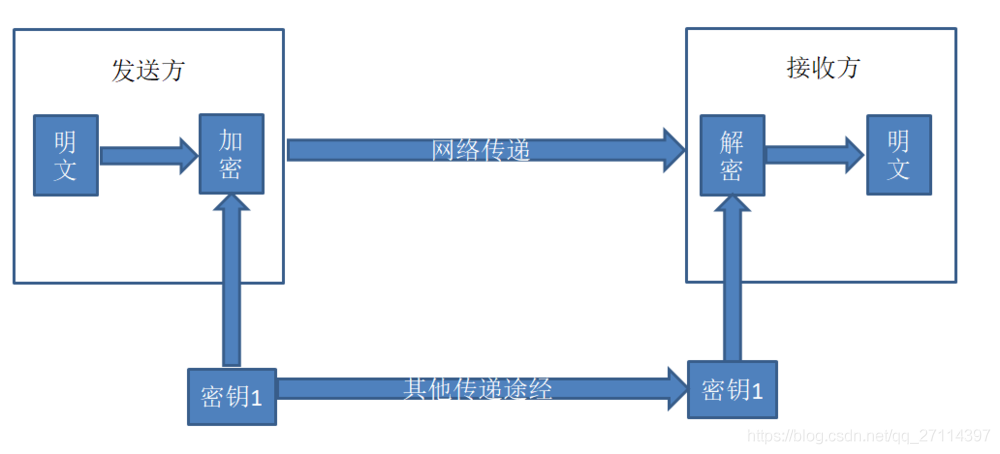
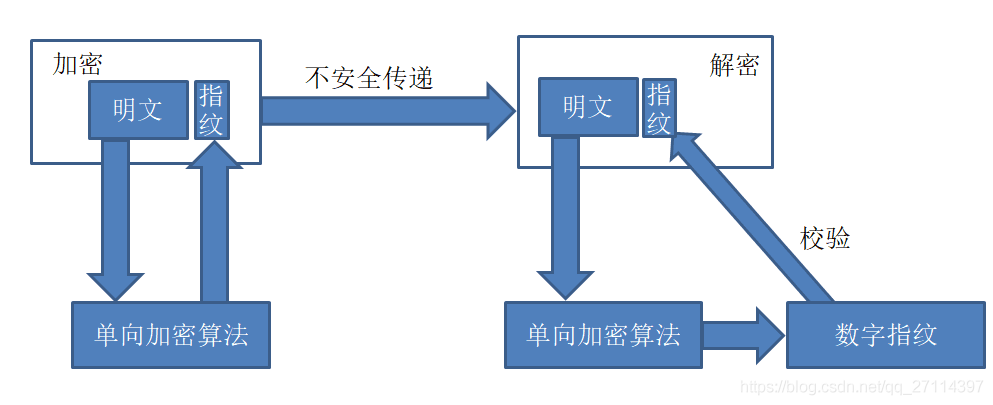

# 系统安全

- [系统安全](#系统安全)
  - [加密算法 Encryption Algorithm](#加密算法-encryption-algorithm)
    - [密钥分类](#密钥分类)
    - [加密算法的应用](#加密算法的应用)
    - [哈希算法 vs 加密算法](#哈希算法-vs-加密算法)
  - [认证和授权 Authentication and Authorization](#认证和授权-authentication-and-authorization)
    - [Cookie and Session](#cookie-and-session)
    - [Token and JWT](#token-and-jwt)
    - [OAuth](#oauth)
  - [常见的安全问题](#常见的安全问题)

## 加密算法 Encryption Algorithm

数据加密是指对原来为明文的文件或数据按某种算法进行处理，使其成为不可读的一段代码为“密文”。想要读取这段“密文”，只能使用相应的密钥进行解密。

### 密钥分类

**密钥**：

密钥是在明文转换为密文或将密文转换为明文的算法中输入的参数。而加密算法也通常根据其所使用的密钥特点分为两大类：对称加密算法和非对称加密算法。

**对称加密算法**：

其中，对称加密算法就是指加密和解密使用相同密钥的加密算法。一般来说，这种算法的密钥都是双方协商，以物理的方式传递给对方或者利用第三方平台传递给对方。换句话说，密钥的安全传递是保证这种算法安全性的关键。

总的来说，对称加密的优势是算法公开、计算量小、加密速度和效率高，而缺点则是密钥单一、密钥管理困难。

**非对称加密算法**：

至于，非对称加密则是指加密和解密使用不同密钥的加密算法，它也被称为公私钥加密。它的特点包括：

- 安全性高、算法强度负复杂
- 加解密耗时长、速度慢，只适合对少量数据进行加密

如上图所示，其基本加密流程如下：

- 发送方Bob从接收方Alice获取其对应的公钥，并结合相应的非对称算法将明文加密后发送给Alice。
- Alice接收到加密的密文后，结合自己的私钥和非对称算法解密得到明文。
- 这种简单的非对称加密算法的应用其安全性比对称加密算法来说要高，但是其不足之处在于无法确认公钥的来源合法性以及数据的完整性。

### 加密算法的应用

**HTTPS/SSL/TSL**：

HTTPS（Hypertext Transfer Protocol Secure）是HTTP协议的安全版本。它通过使用SSL（Secure Sockets Layer）或TLS（Transport Layer Security）协议对HTTP进行加密和身份验证，确保数据在网络传输过程中的保密性和完整性。HTTPS使用加密的SSL/TLS证书来验证服务器和客户端的身份，并使用非对称加密和对称加密来加密通信数据。

**数字证书**：

数字证书是指在互联网通讯中标志通讯各方身份信息的一个数字认证，人们可以在网上用它来识别对方的身份。它通常包含了网站的公钥、域名信息、证书颁发机构信息等，用于验证网站的身份和加密通信。

### 哈希算法 vs 加密算法

除了加密算法之外，哈希算法也常常用于数据完整性检查、数字签名、密码存储、散列存储等方面，常见的哈希算法包括MD5、SHA-1、SHA-256等。其工作流程如下图所示。

相比之下，哈希算法是一种单向加密算法，用于将任意长度的输入数据转换为固定长度的哈希值（散列值）。而加密算法是一种双向加密算法，用于将数据转换为密文以保护数据的机密性，同时可以通过解密密文还原原始数据。

## 认证和授权 Authentication and Authorization

- **认证**：你是谁
- **授权**：你有权限干什么

### Cookie and Session

**Cookie**：

Cookie和Session用于存储用户状态和识别用户，使得Web应用能够提供个性化服务和持久化登录。其中，Cookie是服务器发送到浏览器并保存在用户电脑中的一小段数据。它与特定的Web文档关联在一起，保存了该用户访问这个Web文档时的状态信息，以便其再次访问使可以恢复至前一次状态。此外，Cookie可通过在HTTP报文的首部中添加Cookie字段进行传递。

**Session**：

至于Session，它则是在服务器端存储用户状态的一种机制。通过在服务器端创建一个唯一的会话标识（Session ID），将用户的状态信息存储在服务器上。有些Session的实现依赖于Cookie，它使用Cookie在浏览器和服务端之间传递Session ID。

**单服务器Cookie+Session鉴权**：

一般来说，使用Cookie+Session进行认证和授权的流程如下：

- 用户向服务器发送用户名、密码、验证码用于登陆系统。
- 服务器验证通过后，服务器为用户创建一个Session，并将相关信息存储起来。
- 接着，服务器将SessionID返回给客户端，并将其写入用户的Cookie。
- 此后，当用户保持登录状态时，每个请求中的Cookie字段都将填入SessionID。而服务端再接收到这些请求后会将其和存储在内存中或者数据库中的Session信息进行比较以验证用户的身份，并返回其相关信息。

**多服务器Cookie+Session鉴权**：

- 某个用户的所有请求都通过特性的哈希策略分配给同一个服务器处理。
- 每一个服务器保存的Session信息都是互相同步的，也就是说每一个服务器都保存了全量的Session信息。
- 单独使用一个所有服务器都能访问到的数据节点（比如缓存）来存放Session信息。为了保证高可用，数据节点尽量要避免是单点。

### Token and JWT

令牌（Token）是指服务器为客户端颁发的一种授权凭证。而JWT（JSON Web Token）则是一种用于跨域身份验证的开放标准，通过在用户和服务器之间传递JSON格式的令牌来实现认证和授权。

### OAuth

OAuth是一种用于授权第三方应用访问用户数据的开放标准，通过令牌进行身份验证和授权，通常与JWT结合使用。具体来说，它会给第三方应用颁发一个有时效性的令牌Token，使得第三方应用能够通过该令牌获取相关的资源。

## 常见的安全问题

- 跨站脚本攻击（Cross-Site Scripting, XSS）：XSS攻击是指攻击者向网页注入恶意脚本，当用户访问该页面时，恶意脚本会在用户浏览器中执行，从而窃取用户信息或执行恶意操作。
- 跨站请求伪造（Cross-Site Request Forgery, CSRF）：CSRF攻击是指攻击者利用用户已经通过认证的会话来伪造用户请求，以执行未经授权的操作。
- 拒绝服务攻击（Denial of Service, DoS）：拒绝服务攻击是通过向目标服务器发送大量请求或占用大量网络带宽，导致服务器无法正常处理合法请求，从而导致服务不可用。
- 分布式拒绝服务攻击（Distributed Denial of Service, DDoS）：分布式拒绝服务攻击是多个恶意主机同时向目标服务器发起大量请求，以使目标服务器超载或崩溃。
- SQL注入攻击：SQL注入是一种利用应用程序对用户输入数据的不正确过滤和验证，从而向数据库发送恶意SQL查询的攻击方式，以获取敏感信息或修改数据库内容。
