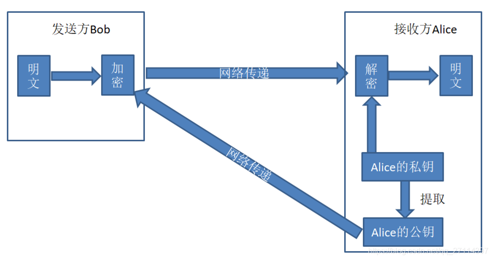
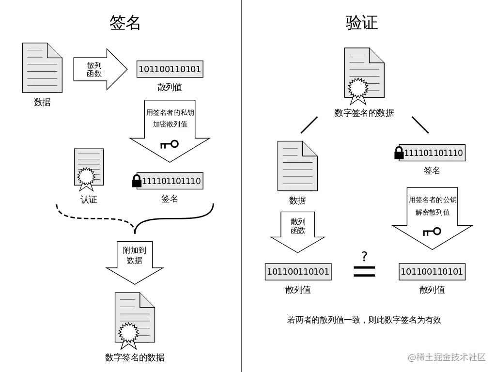

# 系统安全

- [系统安全](#系统安全)
  - [加密算法Encryption Algorithm](#加密算法encryption-algorithm)
    - [概述](#概述)
    - [目的](#目的)
    - [分类](#分类)
  - [对称加密算法](#对称加密算法)
    - [简介](#简介)
    - [流程](#流程)
    - [优缺点](#优缺点)
  - [非对称加密算法](#非对称加密算法)
    - [简介](#简介-1)
    - [流程](#流程-1)
    - [优缺点](#优缺点-1)
  - [加密算法的应用](#加密算法的应用)
    - [数字签名](#数字签名)
      - [简介](#简介-2)
      - [流程](#流程-2)
    - [Https](#https)
      - [简介](#简介-3)
      - [Https使用的加密方式](#https使用的加密方式)
    - [数字证书](#数字证书)
      - [简介](#简介-4)
      - [实现](#实现)
      - [流程](#流程-3)
  - [哈希算法与加密算法](#哈希算法与加密算法)
  - [认证和授权 Authentication \& Authorization](#认证和授权-authentication--authorization)
  - [简介](#简介-5)
    - [概述](#概述-1)
    - [RBAC 模型 Role-Based Acess Control](#rbac-模型-role-based-acess-control)
  - [技术](#技术)
    - [HTTP Basic Authentication](#http-basic-authentication)
    - [Cookie + Session](#cookie--session)
      - [Cookie](#cookie)
      - [Session](#session)
      - [流程](#流程-4)
      - [问题](#问题)
    - [Token \& JWT](#token--jwt)
      - [简介](#简介-6)
    - [流程](#流程-5)
    - [OAuth](#oauth)
      - [简介](#简介-7)
  - [# 前端安全问题](#-前端安全问题)
  - [跨站脚本攻击 XSS](#跨站脚本攻击-xss)
    - [防范](#防范)
  - [跨站请求伪造 CSRF](#跨站请求伪造-csrf)
    - [概述](#概述-2)
    - [分类](#分类-1)
      - [GET类型CSRF](#get类型csrf)
      - [POST类型CSRF](#post类型csrf)
  - [CDN劫持](#cdn劫持)
  - [参考](#参考)
  - [参考](#参考-1)

## 加密算法Encryption Algorithm

### 概述

- 数据加密的基本过程就是对原来为明文的文件或数据按某种算法进行处理，使其成为不可读的一段代码为“密文”，使其只能在输入相应的密钥之后才能显示出原容，通过这样的途径来达到保护数据不被非法人窃取、阅读的目的

### 目的

- 在安全领域，利用密钥加密算法来对通信的过程进行加密是一种常见的安全手段。利用该手段能够保障数据安全通信的三个目标：
  - 数据的保密性，防止用户的数据被窃取或泄露；
  - 保证数据的完整性，防止用户传输的数据被篡改；
  - 通信双方的身份确认，确保数据来源与合法的用户；

### 分类

- 加密算法通常根据其密钥特点分为两大类：“对称式”和“非对称”
  - 至于密钥，则是一种参数。
    - 它是在明文转换为密文或将密文转换为明文的算法中输入的参数。
    - 密钥分为对称密钥与非对称密钥。

## 对称加密算法

### 简介

- 对称加密指加密和解密使用相同密钥的加密算法

### 流程

- 密钥通常来说是通过双方协商，以物理的方式传递给对方，或者利用第三方平台传递给对方；
- 收发双方分别使用密钥进行解密和加密，从而使得信息得以保密传递。
- 但由于加解密算法是公开的，密钥的安全传递就成为了保证秘密性的关键了。

### 优缺点

- 算法公开、计算量小、加密速度和效率高
- 密钥单一、密钥管理困难

## 非对称加密算法

### 简介

- 非对称加密指加密和解密使用不同密钥的加密算法，也称为公私钥加密

### 流程

- 发送方Bob从接收方Alice获取其对应的公钥，并结合相应的非对称算法将明文加密后发送给Alice；
- Alice接收到加密的密文后，结合自己的私钥和非对称算法解密得到明文。
- 这种简单的非对称加密算法的应用其安全性比对称加密算法来说要高，但是==其不足之处在于无法确认公钥的来源合法性以及数据的完整性==。

### 优缺点

- 安全性高、算法强度负复杂
- 加解密耗时长、速度慢，只适合对少量数据进行加密

## 加密算法的应用

### 数字签名

#### 简介

- 数字签名是一个带有密钥的消息摘要算法
  - 数字摘要是利用哈希算法将需要加密的明文“摘要”成固定长度密文的技术

#### 流程

- 一套 **数字签名** 通常定义两种 **互补** 的运算，一个用于 **签名**，另一个用于 **验证**
- 分别由 **发送者** 持有能够 **代表自己身份** 的 **私钥** (私钥不可泄露),由 **接受者** 持有与私钥对应的 **公钥** ，能够在 **接受** 到来自发送者信息时用于 **验证** 其身份

### Https

#### 简介

- HTTPS 并不是新协议，而是让 HTTP 先和 SSL（Secure Sockets Layer）通信，再由 SSL 和 TCP 通信，也就是说 HTTPS 使用了隧道进行通信

#### Https使用的加密方式

- 使用非对称密钥加密方式，传输对称密钥加密方式所需要的 Secret Key，从而保证安全性;
- 获取到 Secret Key 后，再使用对称密钥加密方式进行通信，从而保证效率。

### 数字证书

#### 简介

- 数字证书是指在互联网通讯中标志通讯各方身份信息的一个数字认证，人们可以在网上用它来识别对方的身份
- 数字证书认证机构（CA，Certificate Authority）是客户端与服务器双方都可信赖的第三方机构

#### 实现

- 数字证书实际上就是通过数字签名实现的

#### 流程

**申请证书**：

服务器的运营人员向 CA 提出公开密钥的申请，CA 在判明提出申请者的身份之后，会对已申请的公开密钥做数字签名，然后分配这个已签名的公开密钥，并将该公开密钥放入公开密钥证书后绑定在一起。

**使用证书**：

- 进行 HTTPS 通信时，服务器会把证书发送给客户端。
- 客户端取得其中的公开密钥之后，先使用数字签名进行验证，如果验证通过，就可以开始通信了。

## 哈希算法与加密算法

- 在数据安全领域， 通常比较加密和散列，但为什么会这样。

  - 加密是一种双向功能，其中数据以明文形式传入，以密文形式传出，这是不可读的。由于加密是双向的，因此数据可以被解密，因此可以再次读取。
  - 另一方面，散列是单向的，这意味着明文通过使用无法解密的盐被加扰成唯一的摘要。从技术上讲，散列可以反转，但解密所需的计算能力使得解密不可行。

- 哈希的工作方式是使用散列算法

  - 该算法在抗碰撞时最有效。防碰撞意味着所有摘要都是唯一的，并且不会相互重叠。
  - 这意味着散列算法必须足够复杂以至于没有重叠的散列，但又不能复杂到需要太长时间来计算散列。

- 哈希算法实现数据验证的流程：

  

- 总的来说，

  - 如果被保护数据仅仅用作比较验证，在以后不需要还原成明文形式，则使用哈希；
  - 如果被保护数据在以后需要被还原成明文，则需要使用加密。

## 认证和授权 Authentication & Authorization

## 简介

### 概述

**认证**

- 你是谁

**授权**

- 你有权限干什么

### RBAC 模型 Role-Based Acess Control

**描述**

- 这是一种角色关联权限，角色同时又关联用户的授权的方式。

- 简单来说：一个用户可以拥有若干角色，每一个角色又可以被分配若干权限，这样就构造成“用户-角色-权限” 的授权模型。
  - 在这种模型中，用户与角色、角色与权限之间构成了多对多的关系。

## 技术

### HTTP Basic Authentication

**简介**

- 这种授权方式是浏览器遵守HTTP协议实现的基本授权方式。
- HTTP协议进行通信的过程中，HTTP协议定义了基本认证认证允许HTTP服务器对客户端进行用户身份证的方法。

### Cookie + Session

#### Cookie

**描述**

- cookie是浏览器保存在用户电脑上的一小段文本。

**作用**

- 会话状态管理（如用户登录状态、购物车、游戏分数或其它需要记录的信息）；
- 个性化设置（如用户自定义设置、主题等）；
- 浏览器行为跟踪（如跟踪分析用户行为等）。

#### Session

**描述**

- Session是一种被成为“会话控制”的计算机网络技术。

**作用**

- Session技术能够利用==Session对象==存储特定用户会话所需的属性及配置信息。

#### 流程

- 用户向服务器发送用户名、密码、验证码用于登陆系统。
- 服务器验证通过后，服务器为用户创建一个 `Session`，并将 `Session` 信息存储起来。
- 服务器向用户返回一个 `SessionID`，写入用户的 `Cookie`。
- 当用户保持登录状态时，`Cookie` 将与每个后续请求一起被发送出去。
- 服务器可以将存储在 `Cookie` 上的 `SessionID` 与存储在内存中或者数据库中的 `Session` 信息进行比较，以验证用户的身份，返回给用户客户端响应信息的时候会附带用户当前的状态。

#### 问题

**描述**

- 多服务器Cookie - Session鉴权方式怎么实现？
- 没有Cookie 还能使用Session鉴权吗？

**解决**

- 对于问题1，可以有一下几种解决方案：

  - 某个用户的所有请求都通过特性的哈希策略分配给同一个服务器处理。

  - 每一个服务器保存的 Session 信息都是互相同步的，也就是说每一个服务器都保存了全量的 Session 信息。
  - 单独使用一个所有服务器都能访问到的数据节点（比如缓存）来存放 Session 信息。为了保证高可用，数据节点尽量要避免是单点。

- 对于问题2，并不是没有 `Cookie` 之后就不能用 `Session` 了，比如你可以将 `SessionID` 放在请求的 `url` 里面`https://javaguide.cn/?Session_id=xxx` 。这种方案的话可行，但是安全性和用户体验感降低。

### Token & JWT

#### 简介

- 令牌Token是指服务器为客户端颁发的一种授权凭证。

- JWT 全称 JSON Web Tokens ，是一种规范化的 token。可以理解为对 token 这一技术提出一套规范，是在 **RFC 7519** 中提出的。

### 流程

- 客户端使用用户名跟密码请求登录
- 服务端收到请求，去验证用户名与密码
- 验证成功后，服务端会签发一个`Token`，再把这个`Token`发送给客户端
- 客户端收到`Token`以后可以把它存储起来，比如放在`Cookie`里或者`Local Storage`里
- 客户端每次向服务端请求资源的时候需要带着服务端签发的`Token`
- 服务端收到请求，然后去验证客户端请求里面带着的`Token`，如果验证成功，就向客户端返回请求的数据

### OAuth

#### 简介

- OAuth 是一个行业的标准授权协议，主要用来授权第三方应用获取有限的权限。
- 实际上它就是一种授权机制，它的最终目的是为第三方应用颁发一个有时效性的令牌 Token，使得第三方应用能够通过该令牌获取相关的资源。

## # 前端安全问题

## 跨站脚本攻击 XSS

Cross-Site Scripting（跨站脚本攻击）简称 XSS，是一种代码注入攻击。攻击者通过在目标网站上注入恶意脚本，使之在用户的浏览器上运行。利用这些恶意脚本，攻击者可获取用户的敏感信息如 Cookie、SessionID 等，进而危害数据安全。

为了和 CSS 区分，这里把攻击的第一个字母改成了 X，于是叫做 XSS。

### 防范

## 跨站请求伪造 CSRF

### 概述

CSRF（Cross-site request forgery）跨站请求伪造：攻击者诱导受害者进入第三方网站，在第三方网站中，向被攻击网站发送跨站请求。利用受害者在被攻击网站已经获取的注册凭证，绕过后台的用户验证，达到冒充用户对被攻击的网站执行某项操作的目的。

### 分类

#### GET类型CSRF

#### POST类型CSRF

## CDN劫持

## 参考

- [前端常见的安全问题及防范措施](https://segmentfault.com/a/1190000041454108)
- [如何放置CSRF攻击？](https://tech.meituan.com/2018/10/11/fe-security-csrf.html)
- [吃透浏览器安全](https://juejin.cn/post/6991888178890145828)

## 参考

- [认证和授权基础](https://javaguide.cn/system-design/security/basis-of-authority-certification.html#%E8%AE%A4%E8%AF%81-authentication-%E5%92%8C%E6%8E%88%E6%9D%83-authorization-%E7%9A%84%E5%8C%BA%E5%88%AB%E6%98%AF%E4%BB%80%E4%B9%88)
- [四种常见鉴权方式说明](https://blog.51cto.com/u_14785218/2878553)
- [聊聊鉴权那些事](https://segmentfault.com/a/1190000020146855)