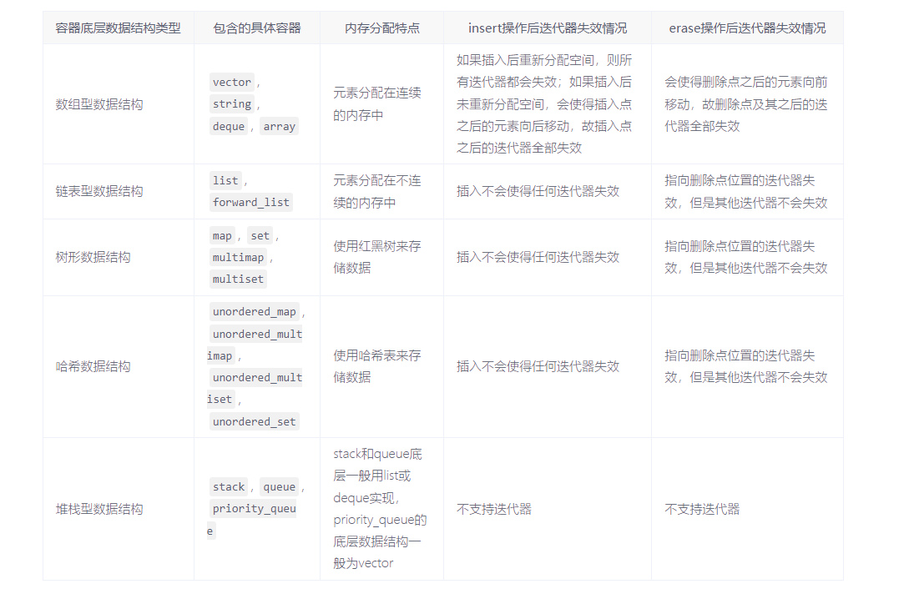

# 迭代器

- [迭代器](#迭代器)

**分类**：

C++中迭代器分成以下几种：

- 插入迭代器
- 流迭代器
- 反向迭代器
- 移动迭代器

**失效**：

> [C++容器类插入和删除时迭代器的失效情况总结](https://www.cnblogs.com/richenyunqi/p/14892993.html)

**萃取与迭代器**：

迭代器类别萃取器一般需要支持的特性：

- value type
- difference type
- reference type
- pointer type
- iterator category
