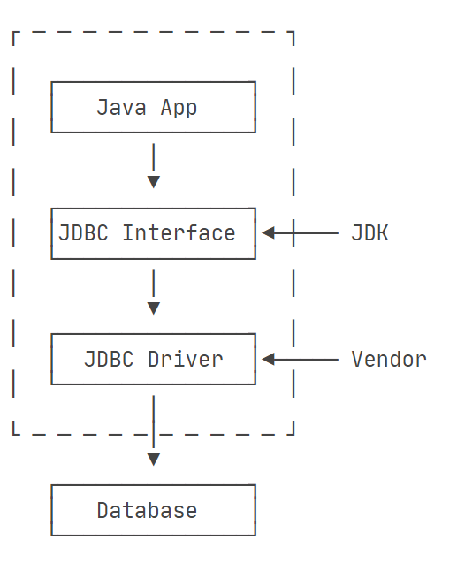

# Java Web

- [Java Web](#java-web)
  - [History](#history)
  - [Servlet](#servlet)
    - [HelloServlet：A simple servlet example](#helloservleta-simple-servlet-example)
    - [Servlet Basis](#servlet-basis)
    - [Filter](#filter)
    - [Listener](#listener)
  - [JSP](#jsp)
    - [Welcome.jsp: A simple JSP example](#welcomejsp-a-simple-jsp-example)
    - [JSP Workflow](#jsp-workflow)
  - [Data Access](#data-access)
    - [JDBC](#jdbc)
    - [JPA](#jpa)
    - [ORM Framework](#orm-framework)
  - [EJB](#ejb)
  - [JAX-RS](#jax-rs)
  - [MVC](#mvc)
    - [J2EE Web Application](#j2ee-web-application)
    - [Spring MVC](#spring-mvc)
  - [Design Style](#design-style)
  - [Tomcat](#tomcat)
    - [Standalone Tomcat](#standalone-tomcat)
    - [Embedded Tomcat](#embedded-tomcat)
    - [Maven Tomcat Plugin](#maven-tomcat-plugin)

## History

**CGI & Servlet**：

早期的动态网页技术主要包括CGI（通用网关接口，Common Gateway Interface）和Servlet。其中，CGI通过定义Web服务器与外部程序的标准接口，使得外部程序能够根据Web请求生成动态内容。CGI模式的具体工作流程如图1所示。


相比之下，尽管两者的整体工作架构类似，但Servlet模式把服务器中接收请求和返回响应的部分封装起来了，免去了开发者重复造轮子的工作。开发者只需要根据JDK中Servlet API实现业务逻辑即可。换句话说，开发者编写的Servlet程序其实就类似CGI模式下的外部程序。此外，Servlet拥有更好的可移植性和更高的运行效率，因为Servlet对象运行在JVM上且由Servlet容器管理，可以持久驻留在内存中为多个请求服务，而不需要像CGI一样每次请求都启动一个新进程来执行外部程序。

**JSP：HTML Template**：

在CGI和Servlet的模式下，服务代码往往和HTML大量杂糅在一起。为了处理更复杂的应用并且方便后期维护，人们开始尝试把HTML返回中固定的部分存起来（我们称之为模版），把动态的部分标记出来。当Web请求处理的时候，程序先获取动态数据，再把模版读入进来，把动态数据填充进去，形成最终返回。因此，各种服务器端脚本语言开始出现:

- ASP(1996) - 微软推出 Active Server Pages，使用 VBScript 等语言来渲染动态页面。
- PHP(1995 发布，2000 年代开始流行) - 简单的服务器端脚本语言，适用于构建动态网站。
- JSP/Servlet(1997) - Sun 公司发布 Java Server Pages，使用 Java 语言开发 Web 应用。

其中，JSP(JavaServer Pages)是一种基于Java的Web开发技术，它使HTML页面具备动态内容生成能力。JSP本质上也是一种Servlet，它将Java代码和HTML标签混合编写，然后由Web容器将其转译为一个Servlet类并执行。

**MVC: J2EE vs ASP.NET**:

随着网络应用复杂度不断提高，尤其是在构造大型应用是在可扩展性、容错性等方面的需求催生了J2EE和ASP.NET的平台。事实上，前文所提到的Java Servlet和JSP正是J2EE中的核心组件。

这个时期，人们开始考虑将Servlet和JSP的优势结合起来，分别使用Servlet和JSP实现各种复杂的业务逻辑和编写HTML，也就是后续在Web开发中广泛应用的MVC模式。MVC模式最早由Trygve Reenskaug在1978年提出。它是软件工程中的一种软件架构模式，把软件系统分为三个基本部分：

- 模型（Model）：负责数据访问和算法实现；
- 视图（View）：负责界面显示；
- 控制器（Controller）：负责处理请求。

在J2EE Web应用的体系中，Servlet和JSP分别承担了Controller和View的职责，而Model则是由J2EE的另一个重要组件EJB（Enterprise Java Bean）负责。类似的，由微软推出的ASP.NET平台也同样采用了MVC架构模式。

**JavaScript Popularity And AJAX Occurrence ：Frontend Backend Split**：

随着JavaScript在浏览器中的广泛应用以及AJAX(Asynchronous JavaScript and XML)技术的出现，Web应用程序架构发生了重大转变。因为JavaScript能够直接操作DOM局部更新页面内容，而AJAX技术又使得其能与服务器进行异步通信获取所需数据。这种新模式逐渐取代了传统的JSP技术，改善了服务端大包大揽的状况，使得交互和显示的任务从服务端被剥离出来，进一步形成了前端负责界面显示和用户交互而后端专注于业务逻辑处理的现代Web应用架构。

**More Framework**:

此后，前后端分离的格局形成，大量Web框架涌现。在前端领域，Vue和React等现代JavaScript框架应运而生，提供了更高效、组件化的方式构建用户界面。与此同时，Node.js的出现使JavaScript可以运行在服务器端，开发人员能够使用同一种语言编写前后端代码，提高了开发效率，也催生了以MERN（MongoDB+Express+Node+React）等为代表的全栈工程师。

在后端领域，各种语言的框架百花齐放。其中，Python有Flask和Django，JavaScript有Express，而在Java阵营中，Spring框架则凭借其轻量、模块化的设计，成为了最主要和流行的企业级Web应用开发框架之一。

## Servlet

Java Servlet的全称是Java Server Applet，也就是Java服务器小程序。利用它开发者能根据业务逻辑动态生成内容返回给客户端。

Servlet技术是2000年代重要的动态网页技术之一，直至今天也仍然作为大型Java Web框架的中重要组成部分而存在（Spring的核心组件DispatcherServlet）。因此，了解Servlet工作原理是学习Java Web是绕不开的话题。

### HelloServlet：A simple servlet example

一个最简单的HelloServlet程序如下：

```java
public class HelloServlet extends HttpServlet {
    public void doGet(HttpServletRequest req, HttpServletResponse res) throws ServletException, IOException {
        res.setContentType("text/html");
        //We need printwriter object to write html content
        PrintWriter pw = res.getWriter();

        // writing html in the stream
        pw.println("<html><body>");
        pw.println("Welcome to my first servlet");
        pw.println("</body></html>");

        pw.close();// close the stream
    }
}
```

将它打包并部署到Tomcat的webapps目录中，并修改Tomcat的web.xml配置文件如下。

``` xml
<?xml version="1.0" encoding="UTF-8"?>
<web-app version="2.5"
         xmlns:xsi="http://www.w3.org/2001/XMLSchema-instance"
         xmlns="http://java.sun.com/xml/ns/javaee"
         xsi:schemaLocation="http://java.sun.com/xml/ns/javaee http://java.sun.com/xml/ns/javaee/web-app_2_5.xsd">
    <display-name>Java Creed | How To Run Embedded Tomcat with Maven</display-name>

    <servlet>
        <servlet-name>hello</servlet-name>
        <servlet-class>org.example.HelloServlet</servlet-class>
    </servlet>

    <servlet-mapping>
        <servlet-name>hello</servlet-name>
        <url-pattern>/hello</url-pattern>
    </servlet-mapping>
</web-app>
```

最终，我们可以得到图2所示效果。


### Servlet Basis

**Servlet API**:

在这个示例中，HelloServlet类继承于HttpServlet类，并实现了doGet方法来处理HTTP GET请求。而HttpServlet正是一个重要的Servlet接口类，可见Servlet程序就是使用JDK中Servlet API根据业务逻辑实现的一个类。

Java Servlet API是一套用于在服务器上实现响应请求的标准。它由javax.servlet和javax.servlet.http两个核心包组成，定义了Servlet组件的生命周期方法和客户端请求响应处理等规范。常用的Servlet接口和类包括:

- GenericServlet类
- HttpServlet类
- Request对象
- Response对象
- ServletConfig对象
- ServletContext对象

**Servlet Container**:

Servlet程序并没有main函数，需要部署在Servlet容器(如Tomcat)中运行。Servlet容器负责创建、管理和销毁Servlet对象，并根据HTTP请求调用相应的Servlet程序。整个调用过程如图3所示:


除了提供通信支持和资源管理之外，使用Servlet容器还提供多线程支持。容器会自动为它所接收的每个Servlet请求创建一个新的线程，并且当运行完相应的http服务方法，这个线程就会自动结束。当然，这并不是说开发者就不再不需要考虑线程安全性，只不过这样能减少做很多重复的工作。

**Servlet Lifecycle**:

查看JDK中提供的Servlet接口我们发现，其中最核心的就是三个函数init、service和destroy，这也正好对应了一个Servlet对象的生命周期。

```java
public interface Servlet {
    void init(ServletConfig var1) throws ServletException;

    ServletConfig getServletConfig();

    void service(ServletRequest var1, ServletResponse var2) throws ServletException, IOException;

    String getServletInfo();

    void destroy();
}
```

以下是 Servlet 遵循的过程：

Servlet 初始化后调用 init () 方法。
Servlet 调用 service() 方法来处理客户端的请求。
Servlet 销毁前调用 destroy() 方法。
最后，Servlet 是由 JVM 的垃圾回收器进行垃圾回收的。

### Filter

在一个比较复杂的Web应用程序中，通常都有很多URL映射，对应的，也会有多个Servlet来处理URL。假设现在有一个论坛Web 应用，它有5个Servlet。其中，ProfileServlet、PostServlet和ReplyServlet都需要用户登录后才能操作，否则，应当直接跳转到登录页面。我们可以直接把判断登录的逻辑写到这3个Servlet中，但是，同样的逻辑重复3次没有必要，并且，如果后续继续加Servlet并且也需要验证登录时，还需要继续重复这个检查逻辑。

为了把一些公用逻辑从各个Servlet中抽离出来，JavaEE的Servlet规范还提供了一种Filter组件，即过滤器，它的作用是，在HTTP请求到达Servlet之前，可以被一个或多个Filter预处理，类似打印日志、登录检查等逻辑，完全可以放到Filter中。

### Listener

除了Servlet和Filter外，JavaEE的Servlet规范还提供了第三种组件：Listener。Listener顾名思义就是监听器，用于监听Web应用中的事件，以实现一些全局操作。如监听Web应用的启动和停止，会话对象的创建和销毁等。比如，下面这个例子就实现了一个ServletContextListener接口的类。

```java
@WebListener
public class AppListener implements ServletContextListener {
    // 在此初始化WebApp,例如打开数据库连接池等:
    public void contextInitialized(ServletContextEvent sce) {
        System.out.println("WebApp initialized.");
    }

    // 在此清理WebApp,例如关闭数据库连接池等:
    public void contextDestroyed(ServletContextEvent sce) {
        System.out.println("WebApp destroyed.");
    }
}
```

任何标注为@WebListener，且实现了特定接口的类会被Web服务器自动初始化。上述AppListener实现了ServletContextListener接口，它会在整个Web应用程序初始化完成后，以及Web应用程序关闭后获得回调通知。我们可以把初始化数据库连接池等工作放到contextInitialized()回调方法中，把清理资源的工作放到contextDestroyed()回调方法中，因为Web服务器保证在contextInitialized()执行后，才会接受用户的HTTP请求。

## JSP

正如前面历史介绍中所提到的那样，JSP（Java服务端网页，Java Server Page）是一种基于HTML模板的动态网页技术。早期Servlet程序是将HTML语句拆成一行一行嵌入Java源文件，并用ServletResponse中PrintWriter写入返回响应之中，而JSP则是在需要动态输出的地方使用JSP标签将Java代码嵌入HTML文件中。

### Welcome.jsp: A simple JSP example

有一个简单的Welcome.jsp内容如下，将其放置在Tomcat的webapps目录下。其中，out是JSP内置的变量，表示当前HttpServletResponse的PrintWriter。

```java
<%@ page contentType="text/html;charset=UTF-8" language="java" %>
<html>
<head>
    <title>Welcome</title>
</head>
<body>
    <h1><%
        out.println("Hello "+request.getParameter("name")+"!");
    %></h1>
</body>
</html>
```

接着，访问[http://localhost:9090/welcome.jsp?name=Zhytou](http://localhost:9090/welcome.jsp?name=Zhytou)这个链接，即可得到如图4所示效果。


### JSP Workflow

JSP的工作流程是怎么样的呢？我们可以在Tomcat的工作目录下找到一个名为welcome_jsp.java的文件，其内容如下：

```java
/*
 * Generated by the Jasper component of Apache Tomcat
 * Version: Apache Tomcat/7.0.47
 * Generated at: 2024-05-07 17:05:35 UTC
 * Note: The last modified time of this file was set to
 *       the last modified time of the source file after
 *       generation to assist with modification tracking.
 */
package org.apache.jsp;

import javax.servlet.*;
import javax.servlet.http.*;
import javax.servlet.jsp.*;

public final class welcome_jsp extends org.apache.jasper.runtime.HttpJspBase
    implements org.apache.jasper.runtime.JspSourceDependent {

  private static final javax.servlet.jsp.JspFactory _jspxFactory =
          javax.servlet.jsp.JspFactory.getDefaultFactory();

  private static java.util.Map<java.lang.String,java.lang.Long> _jspx_dependants;

  private javax.el.ExpressionFactory _el_expressionfactory;
  private org.apache.tomcat.InstanceManager _jsp_instancemanager;

  public java.util.Map<java.lang.String,java.lang.Long> getDependants() {
    return _jspx_dependants;
  }

  public void _jspInit() {
    _el_expressionfactory = _jspxFactory.getJspApplicationContext(getServletConfig().getServletContext()).getExpressionFactory();
    _jsp_instancemanager = org.apache.jasper.runtime.InstanceManagerFactory.getInstanceManager(getServletConfig());
  }

  public void _jspDestroy() {
  }

  public void _jspService(final javax.servlet.http.HttpServletRequest request, final javax.servlet.http.HttpServletResponse response)
        throws java.io.IOException, javax.servlet.ServletException {

    final javax.servlet.jsp.PageContext pageContext;
    javax.servlet.http.HttpSession session = null;
    final javax.servlet.ServletContext application;
    final javax.servlet.ServletConfig config;
    javax.servlet.jsp.JspWriter out = null;
    final java.lang.Object page = this;
    javax.servlet.jsp.JspWriter _jspx_out = null;
    javax.servlet.jsp.PageContext _jspx_page_context = null;


    try {
      response.setContentType("text/html;charset=UTF-8");
      pageContext = _jspxFactory.getPageContext(this, request, response, null, true, 8192, true);
      _jspx_page_context = pageContext;
      application = pageContext.getServletContext();
      config = pageContext.getServletConfig();
      session = pageContext.getSession();
      out = pageContext.getOut();
      _jspx_out = out;

      out.write("\r\n");
      out.write("\r\n");
      out.write("<html>\r\n");
      out.write("<head>\r\n");
      out.write("    <title>Welcome</title>\r\n");
      out.write("</head>\r\n");
      out.write("<body>\r\n");
      out.write("    <h1>");

        out.println("Hello "+request.getParameter("name")+"!");
    
      out.write("</h1>\r\n");
      out.write("</body>\r\n");
      out.write("</html>\r\n");
    } catch (java.lang.Throwable t) {
      if (!(t instanceof javax.servlet.jsp.SkipPageException)){
        out = _jspx_out;
        if (out != null && out.getBufferSize() != 0)
          try { out.clearBuffer(); } catch (java.io.IOException e) {}
        if (_jspx_page_context != null) _jspx_page_context.handlePageException(t);
        else throw new ServletException(t);
      }
    } finally {
      _jspxFactory.releasePageContext(_jspx_page_context);
    }
  }
}

```

可见JSP文件会在执行前首先被编译成一个Servlet程序，所以我们访问welcome.jsp时其实是在访问welcome_jsp.java中的Servlet。

## Data Access

在Web应用开发中，除了页面显示和URL请求处理外，数据存储和访问也是非常重要的一个环节。Java为开发者提供了多种数据访问方式，从低层次到高层次，从底层API到高级框架。

### JDBC

JDBC(Java Database Connectivity)是一套Java应用访问数据库的接口规范，主要由java.sql和javax.sql两个包组成。当Java程序尝试访问数据库时，实际上是通过使用该数据库公司提供的JDBC驱动进行访问的，其流程如图5所示。换句话说，第三方提供的JDBC驱动实现了JDBC接口，向上层Java应用隐藏了访问逻辑，从而简化了Java程序员的工作量。



**JDBC Driver**：

想要使用JDBC驱动，我们只需要在工程中添加一个Maven依赖即可，比如使用MySQL的JDBC驱动：

```xml
<dependency>
    <groupId>mysql</groupId>
    <artifactId>mysql-connector-java</artifactId>
    <version>5.1.47</version>
    <scope>runtime</scope>
</dependency>
```

**JDBC Connection**:

使用JDBC时，首先需要加载驱动并建立与数据库的连接。连接过程中需要提供数据库URL、用户名和密码等信息。

```java
// JDBC连接的URL, 不同数据库有不同的格式:
String JDBC_URL = "jdbc:mysql://localhost:3306/test";
String JDBC_USER = "root";
String JDBC_PASSWORD = "password";
// 获取连接:
Connection conn = DriverManager.getConnection(JDBC_URL, JDBC_USER, JDBC_PASSWORD);
// TODO: 访问数据库...
// 关闭连接:
conn.close();
```

**JDBC Query**:

建立连接后，可以通过执行SQL语句来查询数据。JDBC提供了 Statement 和 PreparedStatement 两种方式执行SQL语句。比如：

```java
java Statement stmt = conn.createStatement();
ResultSet rs = stmt.executeQuery("SELECT * FROM users");
```

相比Statement，PreparedStatement会对SQL语句进行预编译处理，而这条预编译的SQL查询语句能在将来的查询中重用，这样一来，在重复查询时，它将比Statement对象生成的查询速度快很多。

**JDBC CURD**:

除了查询，JDBC还可以执行增删改操作。

```java
// 插入
PreparedStatement pstmt = conn.prepareStatement("INSERT INTO users(name, age) VALUES(?, ?)");
pstmt.setString(1, "John");
pstmt.setInt(2, 30);
pstmt.executeUpdate();

// 更新
pstmt = conn.prepareStatement("UPDATE users SET age = ? WHERE id = ?");
pstmt.setInt(1, 31);
pstmt.setInt(2, 1);
pstmt.executeUpdate();

// 删除
pstmt = conn.prepareStatement("DELETE FROM users WHERE id = ?");
pstmt.setInt(1, 1);
pstmt.executeUpdate();
```

**JDBC Transcation**:

数据库事务（Transaction）是由若干个SQL语句构成的一个操作序列，有点类似于Java的synchronized同步。数据库系统保证在一个事务中的所有SQL要么全部执行成功，要么全部不执行，即数据库事务具有ACID特性：

- Atomicity：原子性
- Consistency：一致性
- Isolation：隔离性
- Durability：持久性

要在JDBC中执行事务，本质上就是如何把多条SQL包裹在一个数据库事务中执行。

### JPA

JPA(Java Persistence API，Java持久层API)是一种对象关系映射(Object-Relational Mapping，ORM)的标准规范，旨在简化Java对象与关系数据库之间的持久化操作。它定义了一组注解和接口，用于描述对象与数据库表之间的映射关系，以及执行持久化操作(如创建、查询、更新和删除)所需的API。

2006，JPA1.0首次作为EJB3.0规范的一部分提出。从J2EE6开始，JPA2.0已发展成单独的规范。值得注意的是，JPA是只针对RDBMS的，对于NoSQL没有作用。

**Entity**:

JPA基于[E-R模型](https://en.wikipedia.org/wiki/Entity%E2%80%93relationship_model)，即一个关系型数据库可以使用实体、属性和关系进行描述。其中，实体可以是有形的、实际存在的事物(如每个员工)，也可以是抽象的、概念上的事物(如一个部门)。

在实际开发中，实体类往往是一个POJO（Plain Old Java Object），比如：

```java
import javax.persistence.*;  
@Entity  
public class Student {  
    @Id  
    private int id;  
    private String name;  
    public Student() {}  
    public Student(int id)   
    {  
      this.id = id;  
    }  
    public int getId()   
    {  
      return id;  
    }  
    public void setId(int id)   
    {  
      this.id = id;  
    }  
    public String getName()  
    {  
      return name;   
    }  
    public void setName(String name)   
    {  
      this.name = name;  
    }  
}  
```

**Entity Manager**:

在 JPA 规范中, EntityManager 是完成持久化操作的核心对象。

**JPQL**：

Java持久化查询语言（Java Persistence query language，简称 JPQL）定义实体及其持久状态的查询。 查询语言允许您编写可用的查询语句，而不用管底层数据是如何实现存储的。

查询语言使用实体的抽象持久化模式（包括其关系）作为其数据模型，并基于此数据模型定义运算符和表达式。查询的范围跨越包装在同一持久单元中的相关实体的抽象模式。查询语言使用类似SQL的语法来基于实体抽象模式类型和它们之间的关系来选择对象或值。

### ORM Framework

ORM 框架是一种对象关系映射技术，它提供了一种将面向对象的对象模型与关系型数据库中的数据模型相互映射的机制。ORM 框架的主要目标是简化数据持久化操作，使开发人员可以像操作对象一样操作数据库中的数据，而无需直接编写 SQL 语句。常见的 ORM 框架有 Hibernate、MyBatis、EclipseLink 等。

## EJB

Enterprise JavaBean(EJB)是用于执行应用程序业务逻辑的服务器端组件。EJB是业务层的一部分，通常与Servlet和JSP结合使用。

EJB由容器加载和管理，容器提供事务管理、安全性和线程等服务。EJB通常使用javax.ejb包来实现，该包提供了三种类型的EJB，包括：

- 会话Bean：会话Bean用于为客户端执行特定任务。
- 实体Bean：实体Bean用于表示持久数据并存储在数据库中。
- 消息驱动Bean：消息驱动Bean用于异步处理消息。

## JAX-RS

## MVC

MVC(模型-视图-控制器)是一种软件架构模式，将应用程序划分为模型(Model)、视图(View)和控制器(Controller)三个部分，各自负责不同的功能。

### J2EE Web Application

Java Web开发中常采用这种模式，比如EJB充当模型，JSP充当视图，而Servlet则充当控制器。换句话说，Servlet程序中不再包含写入html的流了，而完完全全充当一个请求转发器，hua'z


### Spring MVC

但是，直接把MVC搭在Servlet和JSP之上还是不太好，原因如下：

Servlet提供的接口仍然偏底层，需要实现Servlet调用相关接口；
JSP对页面开发不友好，更好的替代品是模板引擎；
业务逻辑最好由纯粹的Java类实现，而不是强迫继承自Servlet。

## Design Style

## Tomcat

Tomcat是一种轻量级的Web应用服务器，也是Servlet/JSP规范的参考实现。它不只是一个静态资源服务器，更是一个动态资源处理容器，能够管理Servlet/JSP应用程序的生命周期。

### Standalone Tomcat

### Embedded Tomcat

Java Web应用程序总是需要一个可以运行这些应用程序的Tomcat，但是在每台开发机器上都安装和配置一个本地Tomcat会非常耗时。此外，开发人员如果想要运行 Web 应用程序，则需要手动管理依赖项。

Maven 有一个 tomcat 插件，可以让我们运行嵌入式 tomcat 实例，而无需安装本地 tomcat 服务器。

### Maven Tomcat Plugin

**Maven plugin config**：
