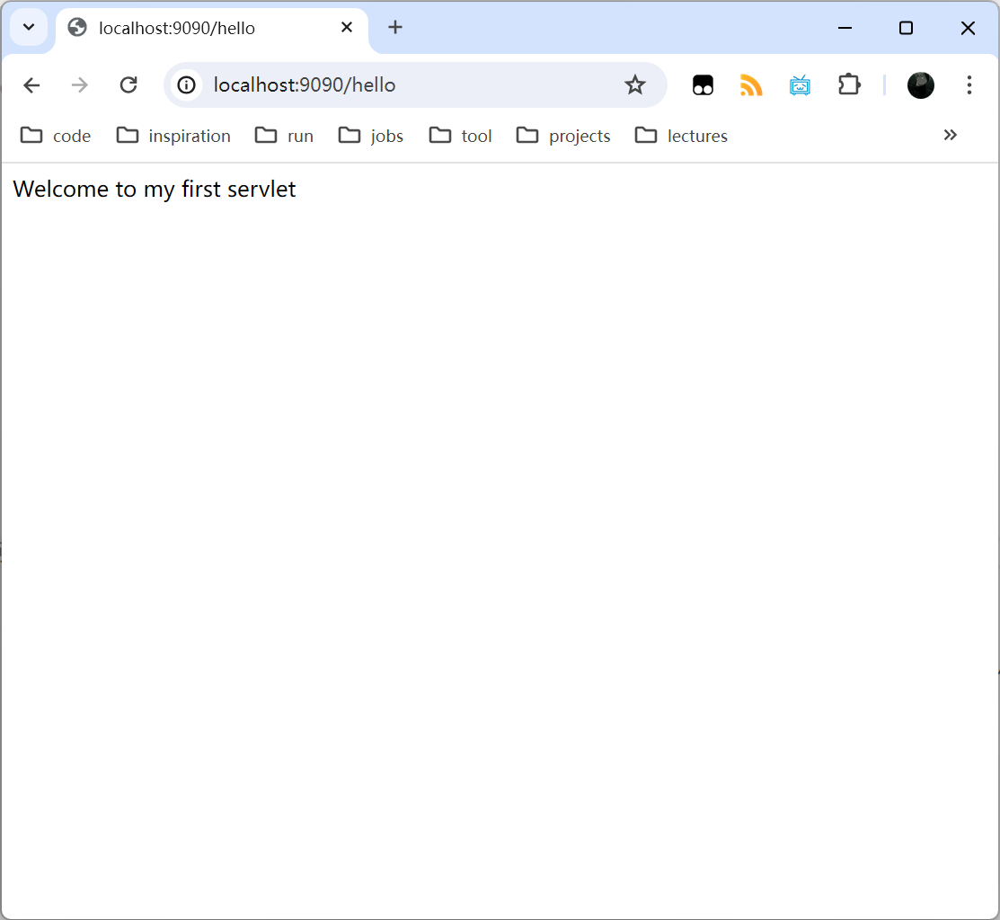

# Java Web

- [Java Web](#java-web)
  - [History](#history)
  - [Servlet](#servlet)
    - [HelloServlet：A simple servlet example](#helloservleta-simple-servlet-example)
  - [Listener/Filter](#listenerfilter)
  - [JSP](#jsp)
  - [Tomcat](#tomcat)
    - [Standalone Tomcat](#standalone-tomcat)
    - [Embedded Tomcat](#embedded-tomcat)
    - [Maven Tomcat Plugin](#maven-tomcat-plugin)
  - [MVC](#mvc)
    - [Java Web Framework](#java-web-framework)

## History

**CGI & Servlet**：

早期的动态网页技术主要包括CGI（通用网关接口，Common Gateway Interface）和Servlet。其中，CGI通过定义Web服务器与外部程序的标准接口，使得外部程序能够根据Web请求生成动态内容。CGI模式的具体工作流程如图1所示。


相比之下，尽管两者的整体工作架构类似，但Servlet把服务器中接收请求和返回响应的部分封装起来了，免去了开发者重复造轮子的工作，使得人们只需要根据JDK中Servlet API实现业务逻辑即可。换句话说，开发者编写的Servlet程序其实就类似CGI模式下的外部程序。此外，Servlet因为JVM拥有更好的可移植性此时，且拥有更高的运行效率，因为CGI每次请求都需要启动一个新的系统进程来执行外部程序。

**JSP：HTML Template**：

在CGI和Servlet的模式下，服务代码往往和HTML大量杂糅在一起。为了处理更复杂的应用并且方便后期维护，人们开始尝试把HTML返回中固定的部分存起来（我们称之为模版），把动态的部分标记出来。当Web请求处理的时候，程序先获取动态数据，再把模版读入进来，把动态数据填充进去，形成最终返回。因此，各种服务器端脚本语言开始出现:

- ASP(1996) - 微软推出 Active Server Pages，使用 VBScript 等语言来渲染动态页面。
- PHP(1995 发布，2000 年代开始流行) - 简单的服务器端脚本语言，适用于构建动态网站。
- JSP/Servlet(1997) - Sun 公司发布 Java Server Pages，使用 Java 语言开发 Web 应用。

其中，JSP(JavaServer Pages)是一种基于Java的Web开发技术，它使HTML页面具备动态内容生成能力。JSP本质上也是一种Servlet，它将Java代码和HTML标签混合编写，然后由Web容器将其转译为一个Servlet类并执行。

**AJAX：Frontend Backend Split**：

随着 AJAX(Asynchronous JavaScript and XML)的提出，Web 应用程序架构发生了变化。AJAX 通过在前端和后端之间使用 XML(后来是 JSON)异步通信来更新局部页面内容，不需要重新加载整个网页，提高了用户体验，前端界面开发和后端业务逻辑开发也因此分离。Spring框架的核心组件DispatcherServlet就是基于这种模式设计的。

因此，了解Servlet工作原理是学习Java Web是绕不开的话题。

## Servlet

Java Servlet的全称是Java Server Applet，也就是Java服务器小程序。它是使用JDK中Servlet API编写的程序。利用它开发者能根据业务逻辑动态生成内容返回给客户端。因此，Servlet技术成为了2000年代重要的动态网页技术之一，直至今天也仍然作为大型Java Web框架的中重要组成部分而存在。

### HelloServlet：A simple servlet example

一个最简单的HelloServlet程序如下：

```java
public class HelloServlet extends HttpServlet {
    public void doGet(HttpServletRequest req, HttpServletResponse res) throws ServletException, IOException {
        res.setContentType("text/html");
        //We need printwriter object to write html content
        PrintWriter pw = res.getWriter();

        // writing html in the stream
        pw.println("<html><body>");
        pw.println("Welcome to my first servlet");
        pw.println("</body></html>");

        pw.close();// close the stream
    }
}
```

将它打包并部署到Tomcat的webapps目录中，并修改Tomcat的web.xml配置文件如下。

``` xml
<?xml version="1.0" encoding="UTF-8"?>
<web-app version="2.5"
         xmlns:xsi="http://www.w3.org/2001/XMLSchema-instance"
         xmlns="http://java.sun.com/xml/ns/javaee"
         xsi:schemaLocation="http://java.sun.com/xml/ns/javaee http://java.sun.com/xml/ns/javaee/web-app_2_5.xsd">
    <display-name>Java Creed | How To Run Embedded Tomcat with Maven</display-name>

    <servlet>
        <servlet-name>hello</servlet-name>
        <servlet-class>org.example.HelloServlet</servlet-class>
    </servlet>

    <servlet-mapping>
        <servlet-name>hello</servlet-name>
        <url-pattern>/hello</url-pattern>
    </servlet-mapping>
</web-app>
```

最终，我们可以得到图2所示效果。



**Servlet API**:

在这个示例中，HelloServlet类继承于HttpServlet类，并实现了doGet方法来处理HTTP GET请求。而HttpServlet正是一个重要的Servlet接口类，可见Servlet程序就是使用JDK中Servlet API根据业务逻辑实现的一个类。

Servlet API由javax.servlet和javax.servlet.http两个核心包组成，定义了Servlet组件的生命周期方法和客户端请求响应处理等规范。常用的Servlet接口和类包括:

- GenericServlet类
- HttpServlet类
- Request对象
- Response对象
- ServletConfig对象
- ServletContext对象

**Servlet Container**:

Servlet程序并没有main函数，需要部署在Servlet容器(如Tomcat)中运行。Servlet容器负责创建、管理和销毁Servlet对象，并根据HTTP请求调用相应的Servlet程序。整个调用过程如图3所示:


**Servlet Lifecycle**:

## Listener/Filter

Listener用于监听Web应用中的事件，以实现一些全局操作。如监听Web应用的启动和停止，会话对象的创建和销毁等。

Filter是一种实现了Filter接口的Web资源对象，可以对Web资源的请求和响应进行过滤和预处理。通常用于编码转换、数据压缩、日志记录等。

## JSP


## Tomcat

Tomcat是一种轻量级的Web应用服务器，也是Servlet/JSP规范的参考实现。它不只是一个静态资源服务器，更是一个动态资源处理容器，能够管理Servlet/JSP应用程序的生命周期。

### Standalone Tomcat

### Embedded Tomcat

Java Web应用程序总是需要一个可以运行这些应用程序的Tomcat，但是在每台开发机器上都安装和配置一个本地Tomcat会非常耗时。此外，开发人员如果想要运行 Web 应用程序，则需要手动管理依赖项。

Maven 有一个 tomcat 插件，可以让我们运行嵌入式 tomcat 实例，而无需安装本地 tomcat 服务器。

### Maven Tomcat Plugin

**Maven plugin config**：

## MVC

MVC(模型-视图-控制器)是一种软件架构模式，将应用程序划分为模型(Model)、视图(View)和控制器(Controller)三个部分，各自负责不同的功能。Java Web开发中常采用这种模式，比如JavaBean充当模型，JSP充当视图，Servlet充当控制器。

### Java Web Framework

基于Servlet/JSP规范，Java界出现了众多优秀的Web框架，提供更高层次的抽象，降低开发难度，如:

Struts - 老牌Web框架，支持MVC模式
WebWork - 经典的MVC框架
Spring MVC - 目前最流行的MVC框架
JSF - 基于组件的MVC框架
这些框架在Servlet/JSP技术之上，提供更多高级功能，扩展性更好，开发效率更高，架构更清晰。在企业级应用中被广泛采用。
