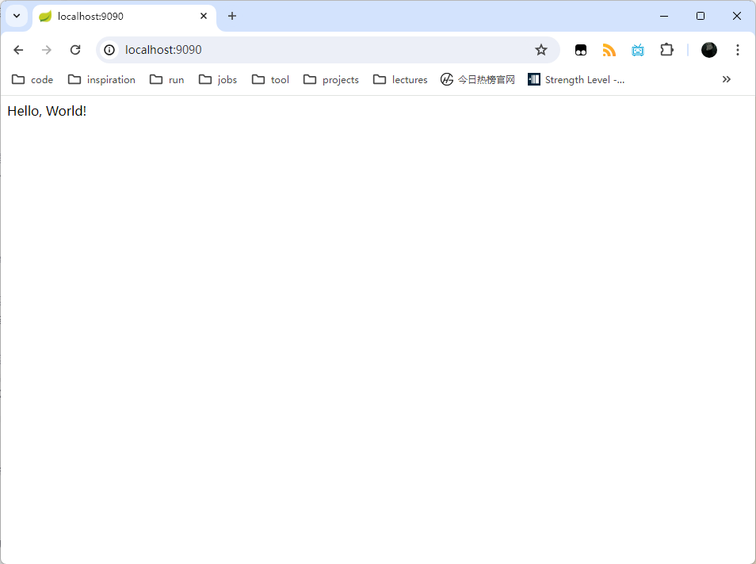

# Spring Boot

- [Spring Boot](#spring-boot)
  - [概述](#概述)
  - [快速入门](#快速入门)
    - [项目结构](#项目结构)
    - [启动流程](#启动流程)
  - [核心功能](#核心功能)
    - [内嵌容器](#内嵌容器)
    - [Starter依赖](#starter依赖)
    - [自动配置](#自动配置)
    - [SpringBoot配置](#springboot配置)
  - [数据访问](#数据访问)
    - [MyBatis集成](#mybatis集成)
    - [事务管理](#事务管理)
  - [任务调度](#任务调度)
    - [@Scheduled注解](#scheduled注解)
    - [异步任务](#异步任务)
  - [日志管理](#日志管理)
  - [安全控制](#安全控制)
    - [Spring Security](#spring-security)
  - [监控管理](#监控管理)

## 概述

**简介**：

Spring Boot是Spring开源组织下的子项目，是Spring组件一站式解决方案，主要是简化了使用Spring的难度，简省了繁重的配置，提供了各种启动器，使开发者能快速上手。

**特性**：

第一，Spring Boot内置了多种Web容器（如Tomcat、Jetty、Undertow和Netty），使得Spring Boot可将项目打包成可执行jar并直接java -jar命令运行，无需额外部署到Web容器中；

第二，Spring Boot提供了一系列的Starter依赖，简化Maven配置。比如：如果要构建一个Web应用，只需添加 spring-boot-starter-web依赖，它就会自动将构建Web应用所需的Spring MVC、JSON支持等相关依赖全部引入。这样做不仅减少了手动添加依赖的工作量，同时还避免了依赖版本不一致的问题，更能方便维护只需升级Starter依赖的版本即可。

第三，Spring Boot根据项目中添加的依赖，自动配置相关的Spring组件和第三方库。例如，对比传统Spring MVC项目，使用Spring Boot时，开发者就无需配置DispatcherServlet、视图解析器等，Spring Boot会根据项目依赖自动配置这些组件。

第四，Spring Boot提供了一系列生产级功能，包括：健康检查、监控、日志和安全管理等。这些功能能够帮助开发者构建可靠、高性能的应用程序。

第五，Spring Boot采用更灵活和简单的配置方式。它不再使用XML进行配置，而是使用Properties或YAML文件。

## 快速入门

Spring Boot旨在简化Spring应用程序的创建过程,让开发者能够快速构建生产级别的应用。让我们从一个简单的Hello World示例开始:

```java
import org.springframework.boot.SpringApplication;
import org.springframework.boot.autoconfigure.SpringBootApplication;
import org.springframework.web.bind.annotation.GetMapping;
import org.springframework.web.bind.annotation.RestController;

@SpringBootApplication
@RestController
public class HelloWorldApplication {
    @GetMapping("/")
    public String hello() {
        return "Hello, World!";
    }

    public static void main(String[] args) {
        SpringApplication.run(HelloWorldApplication.class, args);
    }
}
```

这个示例创建了一个简单的Spring Boot应用程序，包含一个REST端点。当访问根路径时，返回"Hello, World!"字符串，具体效果如下图。



### 项目结构

一个典型的 Spring Boot 项目结构如下:

```text
my-project
├── src
│   ├── main
│   │   ├── java
│   │   │   └── com/example
│   │   │       └── MyProjectApplication.java
│   │   └── resources
│   │       ├── static
│   │       ├── templates
│   │       └── application.properties
│   └── test
│       └── java
│           └── com/example
│               └── MyProjectApplicationTests.java
├── pom.xml
```

- src/main/java 存放应用程序的 Java 源代码
- src/main/resources 存放配置文件和资源文件
- src/test/java 存放测试用例代码
- pom.xml Maven 构建配置文件

### 启动流程

在上面的例子中，SpringApplication.run会使用@SpringBootApplication注解描述的配置类启动Spring应用程序。具体来说，SpringApplication.run方法的执行流程如下：

- 创建一个新的SpringApplication实例；
- 准备Environment(环境)，包括加载外部属性源(如application.properties)到Environment中；
- 为当前应用程序上下文创建Environment并加载单例(single)；
- 初始化Spring容器源(sources)，通过注解或显式配置确定应该加载哪些Bean定义；
- 注册ApplicationContextInitializer以准备上下文；
- 加载源(sources)以构建上下文；
- 刷新应用程序上下文刷新以启动所有单例Bean；
- 完成其他启动步骤，如开始Web服务器(如果是Web应用)。

除此之外，@SpringBootApplication注解修饰的配置类作为传入参数，其作用也同样重要。想要理解它，就需要先理解@SpringBootApplication的作用。其定义如下：

```java
@Target({ElementType.TYPE})
@Retention(RetentionPolicy.RUNTIME)
@Documented
@Inherited
@SpringBootConfiguration
@EnableAutoConfiguration
@ComponentScan(
  excludeFilters = {@Filter(
  type = FilterType.CUSTOM,
  classes = {TypeExcludeFilter.class}
), @Filter(
  type = FilterType.CUSTOM,
  classes = {AutoConfigurationExcludeFilter.class}
)}
)
public @interface SpringBootApplication {
  //...
}
```

可见，它是一个组合注解，最重要的三个注解分别是：

- @Configuration
- @EnableAutoConfiguration
- @ComponentScan

其中，@Configuration和@ComponentScan在Spring IoC容器的配置中已经出现过。使用它们，可以进行完全注解开发而不再使用XML文件进行配置。比如，使用它们定义一个Spring应用的配置。

```java
@Configuration
@ComponentScan(basePackages = {"net.bianchen"})
public class SpringConfig{
    @Bean
    public DataSource dataSource() {
        DriverManagerDataSource dataSource = new DriverManagerDataSource();
        dataSource.setDriverClassName("com.mysql.cj.jdbc.Driver");
        dataSource.setUrl("jdbc:mysql://localhost:3306/mydb");
        dataSource.setUsername("root");
        dataSource.setPassword("password");
        return dataSource;
    }

    // other bean
    //...
}
```

当@ComponentScan注解不指定扫描范围时，它会默认从声明@ComponentScan所在类的包进行扫描。因此，Spring Boot的启动类需要放在根目录下，保证能够扫描完全部的Bean。

至于，@EnableAutoConfiguration注解则是Spring Boot应用的区别于普通Spring应用的特性之一。有了它Spring Boot应用才有了自动配置的功能。它借助@Import的帮助，将所有符合自动配置条件的bean定义加载到Ioc容器。其具体定义如下：

```java
@Target({ElementType.TYPE})
@Retention(RetentionPolicy.RUNTIME)
@Documented
@Inherited
@AutoConfigurationPackage
@Import({AutoConfigurationImportSelector.class})
public @interface EnableAutoConfiguration {
    String ENABLED_OVERRIDE_PROPERTY = "spring.boot.enableautoconfiguration";

    Class<?>[] exclude() default {};

    String[] excludeName() default {};
}
```

## 核心功能

### 内嵌容器

Spring Boot可以内嵌Tomcat、Jetty或Undertow等容器，无需部署WAR包即可以作为独立程序运行。内嵌容器默认会将项目静态资源和JSP页面放在src/main/resources/public目录下。

### Starter依赖

Spring Boot提供了大量的Starter依赖，用于简化应用程序构建。例如spring-boot-starter-web依赖会自动引入并配置好Tomcat、Spring MVC等Web开发所需的依赖，而spring-boot-starter依赖则是Spring Boot应用最基础的启动器依赖，它集成了自动配置、日志和YAML等核心特性。

Starter背后的原理是Spring Boot利用了Maven或Gradle解析依赖的传递性特性。这使得开发者可以按需引入所需的Starter，而无需关心底层的具体依赖和它们的配置。

### 自动配置

Spring Boot应用程序的自动配置是由@SpringBootApplication注解中的@EnableAutoConfiguration注解实现的。有了这个注解，Spring Boot就会开启自动配置功能。其配置的流程如下:

- 从META-INF/spring.factories配置文件中加载自动配置类；
- 去重并排除exclude和excludeName指定的自动配置类；
- 将满足条件(符合 @Conditional 注解指定的条件)的自动配置类返回，创建对应的 Bean。

自动配置极大地简化了Spring应用程序的配置过程，开发者无需手动配置大量Spring组件，只需要添加所需的Starter依赖，Spring Boot就会自动配置相关的Bean。

### SpringBoot配置

Spring Boot支持多种配置方式，包括：Properties文件、YAML文件、系统环境变量和命令行参数。比如：可以通过命令行参数直接设置Spring Boot服务器端口号。

```bash
java -jar springboot-demo-0.0.1-SNAPSHOT.jar --server.port=8081
```

配置文件的加载顺序如下：

- 命令行参数；
- 系统环境变量；
- Spring Boot应用内部的配置文件（Properties和YAML）。

高优先级的配置会覆盖低优先级的配置。

**Properties**：

其中，Properties文件是Spring Boot默认的配置文件。新建一个Spring Boot项目时，resources目录下会默认生成一个名为application.properties的空文件。一个常见的Properties配置如下，

```properties
# 配置项目启动端口号
server.port=8088
# 开启调试模式
debug=true
# 配置数据连接信息
spring.datasource.url=jdbc:mysql://127.0.0.0:3306/dbname?characterEncoding=utf8
spring.datasource.username=root
spring.datasource.password=root
spring.datasource.driver-class-name=com.mysql.cj.jdbc.Driver
```

**YAML**：

YAML（Yet Another Markup Language）是一种标记语言，它支持更多的开发语言，可以用在 Java、PHP、Python、Ruby、JavaScript、Perl、Golang、Dart等语言中。相比于Properties来说，YAML的语法更简洁，并且可读性更高。比如，上面使用Properties文件描述的配置修改成YAML格式如下：

```yml
# 配置项目启动端口号
server:
  port: 9090
# 开启调试模式
debug: true
# 配置数据连接信息
spring:
  datasource:
    url: jdbc:mysql://127.0.0.0:3306/dbname?characterEncoding=utf8
    username: root
    password: root
    driver-class-name: com.mysql.cj.jdbc.Driver
```

YAML的基本语法格式是key: value的形式，且冒号后面的空格是不能被省略的，否则项目启动会报错。此外，YAML还支持对象、集合等数据类型，比如：

```yml
student1: {id: 1, name: Java, age: 18}

student2:
  id: 1
  name: Java
  age: 18

animal: [Dog, Cat]
```

另外，YAML文件还可以使用---将文件分割成多个部分，从而支持Profile特性。比如：

```yml
server:
  port: 8081
spring:
  profiles:
    active: prod

---
server:
  port: 8083
spring:
  profiles: dev

---

server:
  port: 8084
spring:
  profiles: prod
```

**Profile**：

Spring Boot支持根据不同环境采用不同配置，这种特性被称为Profile。可以通过命令行参数spring.profiles.active来指定激活的环境配置。例如：

```bash
java -jar spring-boot-02-config-0.0.1-SNAPSHOT.jar --spring.profiles.active=dev
```

Spring Boot自动加载application-dev.properties文件或application.yml中dev的部分。此外，也可以在配置文件中使用@Profile 注解来指定该部分配置属于哪个环境。

## 数据访问

### MyBatis集成

首先，在pom.xml中添加mybatis-spring-boot-starter和mysql-connector-java依赖。其中，mybatis-spring-boot-starter是MyBatis官方提供的Spring Boot启动器依赖，用于集成 MyBatis到Spring Boot应用中。它会引入MyBatis相关依赖并进行自动配置。

```xml
<dependency>
    <groupId>org.mybatis.spring.boot</groupId>
    <artifactId>mybatis-spring-boot-starter</artifactId>
    <version>2.2.2</version>
</dependency>
<dependency>
    <groupId>mysql</groupId>
    <artifactId>mysql-connector-java</artifactId>
</dependency>
```

接着，在application.properties中配置数据源和MyBatis。

```properties
spring.datasource.url=jdbc:mysql://localhost:3306/mydb
spring.datasource.username=root
spring.datasource.password=root
mybatis.type-aliases-package=com.example.model
mybatis.mapper-locations=classpath:mapper/*.xml
```

最后，创建Mapper接口和对应的XML映射文件，并在Service中使用@Autowired注入Mapper接口。

### 事务管理

## 任务调度

### @Scheduled注解

### 异步任务

## 日志管理

## 安全控制

### Spring Security

用户认证
权限控制

## 监控管理

Actuator
端点(Endpoint)
健康检查
