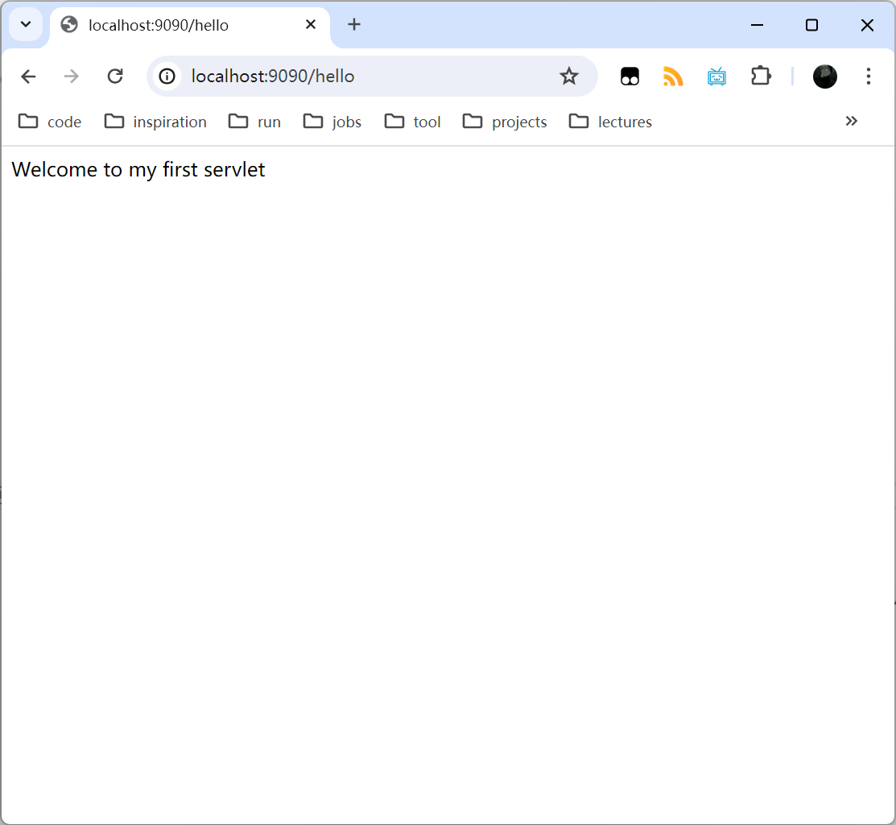
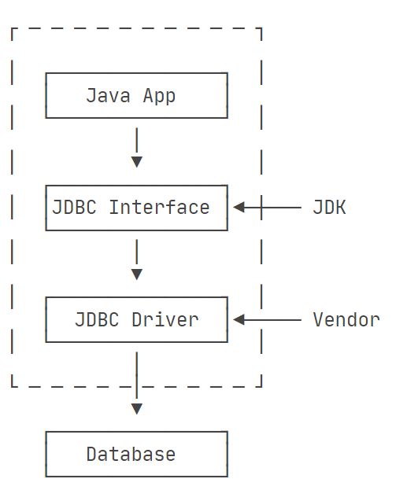

# Spring

- [Spring](#spring)
  - [框架概述](#框架概述)
    - [Spring Framework](#spring-framework)
    - [Spring Boot](#spring-boot)
    - [Spring Cloud](#spring-cloud)
  - [前置概念](#前置概念)
    - [Servlet](#servlet)
    - [Bean](#bean)
    - [Context](#context)
  - [控制反转 IoC](#控制反转-ioc)
    - [依赖注入 DI](#依赖注入-di)
    - [IoC容器](#ioc容器)
      - [IoC容器的原理](#ioc容器的原理)
      - [IoC容器的配置](#ioc容器的配置)
  - [面向切面编程 AOP](#面向切面编程-aop)
    - [AspectJ](#aspectj)
    - [Spring AOP](#spring-aop)
      - [String AOP实现原理](#string-aop实现原理)
      - [String AOP例子](#string-aop例子)
      - [Spring AOP的注解配置](#spring-aop的注解配置)
  - [Web开发 Spring MVC](#web开发-spring-mvc)
    - [核心组件](#核心组件)
    - [工作流程](#工作流程)
    - [常用注解](#常用注解)
    - [SpringMVC配置](#springmvc配置)
  - [SSM集成](#ssm集成)
    - [集成配置](#集成配置)
    - [启动流程](#启动流程)
  - [数据访问 Data Access](#数据访问-data-access)
    - [JDBC](#jdbc)
    - [JPA](#jpa)
    - [ORM Framework](#orm-framework)
    - [Sharding-JDBC](#sharding-jdbc)
  - [事务管理 Transcational Management](#事务管理-transcational-management)
    - [数据库事务](#数据库事务)
    - [声明式事务](#声明式事务)
  - [参考 Reference](#参考-reference)

## 框架概述

Spring是一款开源的轻量级Java开发框架，旨在提高开发人员的开发效率以及系统的可维护性。它包含了Spring Framework、Spring Boot、Spring Cloud等等模块。

### Spring Framework

其中，Spring Framework就是我们平时说的Spring框架。它Spring的基石，提供了许多核心特性和功能，比如：

- 核心机制
  - 依赖注入(DI)和控制反转(IoC)
  - 面向切面编程(AOP)
- 数据访问
  - DAO
  - ORM
  - 事务管理
- Web编程模块(如Spring MVC)
- 测试支持

其中，它提供的Spring MVC功能大大简化了Java企业级Web应用的开发，也是SSM框架（Spring+Spring MVC+MyBatis）的重要组成部分。

Spring Framework体系结构如下图：


### Spring Boot

Spring Boot是Spring生态系统中的另一个重要项目，它建立在Spring Framework的基础之上。Spring Boot的目的是简化Spring应用的配置和部署。它提供的功能包括：提供自动配置的开箱即用体验、内嵌Tomcat/Jetty等Servlet容器、提供生产级监控和管理功能和集成大量开源中间件等等。通过Spring Boot，开发人员可以更快速地构建基于Spring的应用程序，省去大量样板配置代码。

此外，相比于SSM框架在DAO层限制只能使用MyBatis，Spring Boot更灵活。它没有和任何MVC框架绑定，也没有和任何持久层框架绑定，同样也没有和任何其他业务领域的框架绑定。

### Spring Cloud

Spring Cloud是Spring官方支持的微服务全家桶，主要目标是简化分布式系统的开发。它基于Spring Boot，并整合了众多开源组件:

- 服务发现和注册(如Eureka)
- 智能路由(如Zuul)
- 客户端负载均衡(如Ribbon)
- 断路器模式(如Hystrix)
- 配置中心
- 分布式跟踪

Spring Cloud提供了一整套微服务架构的解决方案，帮助开发人员快速构建分布式、高可用、高扩展的微服务系统。

## 前置概念

### Servlet

Servlet的全称是Java Server Applet，也就是Java服务器小程序。它是2000年代重要的动态网页技术之一，直至今天也仍然作为大型Java Web框架的中重要组成部分而存在（Spring的核心组件DispatcherServlet）。因此，了解Servlet工作原理是学习Java Web是绕不开的话题。

**Servlet API**：

Java Servlet API是一套用于在服务器上实现响应请求的标准。它由javax.servlet和javax.servlet.http两个核心包组成，定义了Servlet组件的生命周期方法和客户端请求响应处理等规范。常用的Servlet接口和类包括:

- GenericServlet类
- HttpServlet类
- Request对象
- Response对象
- ServletConfig对象
- ServletContext对象

**Servlet Workflow**：

查看JDK中提供的Servlet接口我们发现，其中最核心的就是三个函数init、service和destroy，这也正好对应了一个Servlet对象的生命周期。

```java
public interface Servlet {
    void init(ServletConfig var1) throws ServletException;

    ServletConfig getServletConfig();

    void service(ServletRequest var1, ServletResponse var2) throws ServletException, IOException;

    String getServletInfo();

    void destroy();
}
```

以下是 Servlet 遵循的过程：

- Servlet 初始化后调用 init () 方法。
- Servlet 调用 service() 方法来处理客户端的请求。
- Servlet 销毁前调用 destroy() 方法。
- 最后，Servlet 是由 JVM 的垃圾回收器进行垃圾回收的。

**Servlet Example**：

一个最简单的HelloServlet程序如下：

```java
public class HelloServlet extends HttpServlet {
    public void doGet(HttpServletRequest req, HttpServletResponse res) throws ServletException, IOException {
        res.setContentType("text/html");
        //We need printwriter object to write html content
        PrintWriter pw = res.getWriter();

        // writing html in the stream
        pw.println("<html><body>");
        pw.println("Welcome to my first servlet");
        pw.println("</body></html>");

        pw.close();// close the stream
    }
}
```

将它打包并部署到Tomcat的webapps目录中，并修改Tomcat的web.xml配置文件如下。

``` xml
<?xml version="1.0" encoding="UTF-8"?>
<web-app version="2.5"
         xmlns:xsi="http://www.w3.org/2001/XMLSchema-instance"
         xmlns="http://java.sun.com/xml/ns/javaee"
         xsi:schemaLocation="http://java.sun.com/xml/ns/javaee http://java.sun.com/xml/ns/javaee/web-app_2_5.xsd">
    <display-name>Java Creed | How To Run Embedded Tomcat with Maven</display-name>

    <servlet>
        <servlet-name>hello</servlet-name>
        <servlet-class>org.example.HelloServlet</servlet-class>
    </servlet>

    <servlet-mapping>
        <servlet-name>hello</servlet-name>
        <url-pattern>/hello</url-pattern>
    </servlet-mapping>
</web-app>
```

最终，我们可以得到如图所示效果。



**Servlet Container**：

Servlet程序并没有main函数，需要部署在Servlet容器(如Tomcat)中运行。Servlet容器负责创建、管理和销毁Servlet对象，并根据HTTP请求调用相应的Servlet程序。整个调用过程如图3所示:


**Listener & Filter**：

除了最基础的Servlet之外，Servlet API还提供了Listener和Filter组件。其中，Listener顾名思义就是监听器，用于监听Web应用中的事件，以实现一些全局操作。如监听Web应用的启动和停止，会话对象的创建和销毁等；而Filter过滤器的作用则是为了把一些公用逻辑从各个Servlet中抽离出来，在请求到达Servlet之前进行预处理。

### Bean

Bean并非一个Spring新提出的一个概念，Java语言本身就有JavaBean的概念。它通常是指一个有以下3种特点的公共Java类：

- 有一个无参的构造方法（默认构造方法）；
- 所有属性都是private的，类外部需要通过public的getter和setter来访问属性；
- 实现了Serializable接口。

除此之外，J2EE平台也提供了另一种Bean规范，即企业级JavaBean（Enterprise JavaBean，EJB）。它是一个封装有业务逻辑且可重用的服务器端组件，并包含以下特性：

- 由容器在运行时管理；
- 用户需要通过容器访问企业级Bean；
- 能在部署时根据运行环境定制；
- 能通过注解或XML在编译或部署时指定其中使用的一些配置信息（可配置）；
- 只使用了EJB规范中规定的服务的企业级Bean能在任意EJB容器中使用（可移植）；
- 企业级Bean可以不需要重新编译就被封装在一个企业级应用中。

由此可见，EJB和JavaBeans其实是有挺大区别的，可以说一个EJB并不一定是一个JavaBean。一个EJB也不一定有无参构造方法和实现Serializable接口。

而对于Spring来说，Bean就是指一个由Spring IoC容器创建、组装和管理的对象。

**Spring Bean的作用域**是指Bean在Spring整个框架中的某种行为模式。常见的作用域类型包括：

- singleton：单例作用域
- prototype：原型作用域（多例作用域）
- request：请求作用域
- session：会话作用域
- application：全局作用域

**Spring Bean的生命周期**：

- 实例化 Instantiation
- 属性赋值 Populate
- 初始化 Initialization
- 销毁 Destruction

### Context

Context是程序执行中的上下文，包含了特定时间程序执行的环境和状态信息。以下是几个常出现在Java Web开发中的上下文概念：

**ServletContext**：

当Web容器启动的时候，它会为每个Web应用程序创建一个ServletContext对象，其中包含了该Web应用的所有Servlet对象。换句话说，一个Web应用中的所有Servlet共享一个ServletContext对象，所以它们可以通过ServletContext对象来实现彼此之间的通讯。

**ApplicationContext**：

ApplicationContext是Spring应用的上下文。可以简单将其理解成IoC容器，负责创建、装配和销毁Bean。在Spring Web应用中，它通常通过一个名为ContextLoaderListener的监听器触发创建。该监听器定义在web.xml文件中，当Web应用初始化它自己的ServletContext时就会触发该监听器。除了定义监听器之外，还需要指出配置文件位置，比如：

```xml
<?xml version="1.0" encoding="UTF-8"?>
<web-app xmlns:xsi="http://www.w3.org/2001/XMLSchema-instance" 
    xmlns="http://xmlns.jcp.org/xml/ns/javaee" 
    xsi:schemaLocation="http://xmlns.jcp.org/xml/ns/javaee 
    http://xmlns.jcp.org/xml/ns/javaee/web-app_3_1.xsd" 
    id="WebApp_ID" version="3.1">
    <!-- 配置加载Spring文件的监听器-->
    <context-param>
        <param-name>contextConfigLocation</param-name>
        <param-value>classpath:applicationContext.xml</param-value>
    </context-param>
    <listener>
        <listener-class>
            org.springframework.web.context.ContextLoaderListener
        </listener-class>
    </listener>
</web-app>
```

关于两者更详细的比较，可以参考Stackoverflow的[讨论](https://stackoverflow.com/questions/31931848/applicationcontext-and-servletcontext)以及Spring[文档](https://docs.spring.io/spring-framework/reference/core/beans/context-introduction.html)。

**WebApplicationContext**：

WebApplicationContext是Spring MVC应用中的上下文。它继承自ApplicationContext，并且具备和ServletContext通信的能力。一般来说，一个Spring Web应用会在web.xml中定义一个或多个DispatchServlet来处理请求，比如：

```xml
<?xml version="1.0" encoding="UTF-8"?>
<web-app xmlns:xsi="http://www.w3.org/2001/XMLSchema-instance" 
    xmlns="http://xmlns.jcp.org/xml/ns/javaee" 
    xsi:schemaLocation="http://xmlns.jcp.org/xml/ns/javaee 
    http://xmlns.jcp.org/xml/ns/javaee/web-app_3_1.xsd" 
    id="WebApp_ID" version="3.1">
    <!-- 配置Spring MVC前端核心控制器 -->
    <servlet>
        <servlet-name>springmvc</servlet-name>
        <servlet-class>
             org.springframework.web.servlet.DispatcherServlet
        </servlet-class>
        <init-param>
            <param-name>contextConfigLocation</param-name>
            <param-value>classpath:springmvc-config.xml</param-value>
        </init-param>
        <!-- 配置服务器启动后立即加载Spring MVC配置文件 -->
        <load-on-startup>1</load-on-startup>
    </servlet>
    <servlet-mapping>
        <servlet-name>springmvc</servlet-name>
        <!--/:拦截所有请求（除了jsp）-->
        <url-pattern>/</url-pattern>
    </servlet-mapping>
</web-app>
```

关于WebApplicationContext更多的介绍，可以参考Spring MVC的[文档](https://docs.spring.io/spring-framework/reference/web/webmvc/mvc-servlet/context-hierarchy.html)。

## 控制反转 IoC

IoC(Inversion of Control)，即控制反转是面向对象编程中的一种设计原则，可以用来减低计算机代码之间的耦合度。IoC的思想是将原本在程序中手动创建对象的控制权，交由调度框架或程序组件来管理。程序本身只需定义好具体的行为即可，至于行为的执行时机由管理外部对象施加控制。

Spring通过提供一种名为IoC容器的类来帮助管理对象，使用者可以通过配置文件和注解的方式告诉容器要创建哪些对象以及如何配置对象之间的依赖关系。配置完成之后，所有实例不再由应用程序自己创建和配置，而是由IoC容器负责。

### 依赖注入 DI

**IoC vs DI**：

IoC是一种降低模块耦合、提高对象复用的思想，在Spring中它依靠依赖注入(Dependency Injection, DI)的方式实现，但并非所有支持IoC的框架都使用DI实现。因此，我们不能将二者等同。总之，控制反转是一种思想，而依赖注入则是一种设计模式。

**什么是依赖**：

如果在 Class A 中，有 Class B 的实例，则称 Class A 对 Class B 有一个依赖。因此，依赖注入也就是将实例变量传入到一个对象中去。

### IoC容器

IoC容器也就是Spring框架中提供给开发者用于实现反转控制的工具，而被管理的类则被称为Bean。具体来说，Spring提供了IOC容器实现的两种方式（两个接口）：BeanFactory和ApplicationContext。

其中，BeanFactory是IoC容器所具有的最基本形式，也被称为IoC容器的最底层实现。它由org.springframework.beans.factory.BeanFactory接口定义,主要的功能是对Bean的实例化、配置、管理等。而ApplicationContext则是BeanFactory的子接口，它不仅提供BeanFactory所具有的功能，还提供了更多企业级功能，如解析自定义配置、启动和关闭回调、国际化消息、事件传播等。ApplicationContext有多个具体的实现类，比较常用的有：ClassPathXmlApplicationContext、FileSystemXmlApplicationContext和AnnotationConfigApplicationContext等。

一般来说，开发人员更多地使用ApplicationContext，因为它支持更多功能和特性。而BeanFactory则被认为是底层容器，更多地在框架内部使用。

**BeanFactory和ApplicationContext的特点**：

BeanFactory的特点是每次使用时都会创建一个新的Bean实例。因此，多次请求注入同一个Bean时实际得到的都是不同的实例。而ApplicationContext在初始化时，默认会创建并初始化所有的单例Bean。因此，我们可以认为ApplicationContext是以单例模式运行的容器。

**一个基于XML配置的IoC容器使用例子**：

首先定义两个简单的类，一个作为被注入的依赖对象，另一个作为需要依赖注入的类:

``` java
// 依赖对象
public class MessageService {
    public String getMessage() {
        return "Hello from MessageService";
    }
}

// 需要依赖注入的类
public class MessageRenderer {
    private MessageService messageService;

    // 需要通过构造器注入依赖对象
    public MessageRenderer(MessageService messageService) {
        this.messageService = messageService;
    }

    public void renderMessage() {
        System.out.println(messageService.getMessage());
    }
}
```

接下来创建Spring配置文件applicationContext.xml:

``` xml
<?xml version="1.0" encoding="UTF-8"?>
<beans xmlns="http://www.springframework.org/schema/beans"
       xmlns:xsi="http://www.w3.org/2001/XMLSchema-instance"
       xsi:schemaLocation="http://www.springframework.org/schema/beans
        https://www.springframework.org/schema/beans/spring-beans.xsd">

    <!-- 定义 MessageService Bean -->
    <bean id="messageService" class="com.example.MessageService"/>

    <!-- 定义 MessageRenderer Bean, 并注入 MessageService 依赖 -->
    <bean id="renderer" class="com.example.MessageRenderer">
        <constructor-arg ref="messageService"/>
    </bean>

</beans>
```

最后在主程序中使用ApplicationContext获取Bean实例:

```java
import org.springframework.context.ApplicationContext;
import org.springframework.context.support.ClassPathXmlApplicationContext;

public class Main {
    public static void main(String[] args) {
        // 创建 ApplicationContext 容器
        ApplicationContext context = new ClassPathXmlApplicationContext("applicationContext.xml");

        // 从容器中获取 MessageRenderer 实例
        MessageRenderer renderer = context.getBean("renderer", MessageRenderer.class);

        // 调用渲染方法
        renderer.renderMessage();
    }
}
```

#### IoC容器的原理

IoC容器可以动态地创建和管理对象，而其底层原理则涉及到反射和工厂模式。具体来说，使用它创建对象的过程如下：

- XML配置/注解配置解析，得到需要管理类的class属性，即该对象所属类的包位置；
- 反射创建，生成对应类的class类，并加载至内存，等待调用。

**反射**：

反射就是程序在运行的过程中，可以通过类名称创建对象，并获取类中申明的成员变量和方法。

**Class类**：

Class 也是一个 Java 类，保存的是与之对应 Java 类的元信息，用来描述这个类的结构，比如描述一个类有哪些成员，有哪些方法等，一般在反射中使用。实际上，Java 源程序在经过 Java 编译器编译之后就被转换成 Java  字节代码（.class 文件）。类加载器负责读取 Java 字节代码，并转换成 java.lang.Class类的一个实例。也就是说，在 Java 中，每个类都有一个相应的 Class 对象，用于表示这个类的类型信息。

**工厂模式**：

能够创建和管理Bean对象的IoC容器本质上就是一个Bean Factory。

#### IoC容器的配置

Spring框架支持两种IoC容器配置方式:XML配置和注解配置。

**XML方式**：

XML配置是Spring早期使用的配置方式，也是最传统的方式。开发人员需要在一个或多个XML文件中定义Bean及其依赖关系。下面是一个简单的XML配置示例:

``` xml
<?xml version="1.0" encoding="UTF-8"?>
<beans xmlns="http://www.springframework.org/schema/beans"
       xmlns:xsi="http://www.w3.org/2001/XMLSchema-instance"
       xsi:schemaLocation="http://www.springframework.org/schema/beans
        https://www.springframework.org/schema/beans/spring-beans.xsd">

    <bean id="messageService" class="com.example.MessageService"/>

    <bean id="renderer" class="com.example.MessageRenderer">
        <property name="messageService" ref="messageService"/>
    </bean>
</beans>
```

其中，配置文件的含义解释如下：

- xmlns是XML NameSpace的缩写，因为XML文件的标签名称都是自定义的，自己写的和其他人定义的标签很有可能会重复命名，而功能却不一样，所以需要加上一个namespace来区分这个xml文件和其他的xml文件，类似于java中的package。
- xmlns:xsi指出了XML文件遵守XML规范，其中xsi全称是xml schema instance。
- xsi:schemaLocation是指本文档里的XML元素所遵守的规范，这些规范都是由Spring官方制定的。
- bean则是IoC容器的具体配置。其中，属性id是标识符；属性class指明包所在位置；标签property指明被赋值的变量名。

**注解方式**：

注解是代码的特殊标记，其格式格式一般如下@注解名称。注意：注解实际上是一类特殊的类

随着Spring版本的不断迭代，注解配置已经成为了主流的配置方式。使用注解可以很大程度上简化XML配置。下面是一个使用注解配置的示例:

```java
import org.springframework.context.annotation.Bean;
import org.springframework.context.annotation.Configuration;

@Configuration
public class AppConfig {
    @Bean
    public MessageService messageService() {
        return new MessageService();
    }

    @Bean
    public MessageRenderer renderer() {
        MessageRenderer renderer = new MessageRenderer();
        renderer.setMessageService(messageService());
        return renderer;
    }
}
```

事实上，使用注解的方式配置IoC容器除了在类文件中加上注解之外，还需要引入依赖和开启组件扫描。其中，前者引入org.springframework.context.annotation.Bean等jar包使注解可用；后者启用自动扫描机制，并为符合条件的类创建 Bean 对象。这样就避免了在配置文件中一个一个的使用`<bean>`标签显式定义Bean。下面就是两个组件扫描配置的例子，它们有不同的扫描范围。

``` xml
<!--扫描范围——net/biancheng/文件夹下的所有文件 -->
<context:component-scan base-package="net.biancheng" />


<!--扫描范围——只扫描net/biancheng/文件夹下Controller注解 -->
<context:component-scan base-package="net.biancheng" user-default-filters="false">
  <context:include-filter type="annotation" expression="org.springframework.sterotype.Controller">
</context:component-scan>
```

最后来具体介绍一下，Spring提供的注解。它们可以按对象创建和属性注入分两类。以下这些注解都是用于标记Spring管理的Bean组件，只是分别对应不同的应用层:

- @Component 通用组件
- @Service 服务层组件
- @Controller 表现层组件
- @Repository 持久层组件

换句话说，一旦某个类被上面这些注解标注之后，那么它的对象创建和管理都将交由Spring框架负责。此外，还有另一类注解用于说明依赖注入关系，它们往往用在类的成员变量、构造方法和方法上。比如：

- @Autowired 自动装配Bean：根据Bean的类型自动注入，可注入到构造器、方法、属性上
- @Resource 注入Bean：@Resource与@Autowired功能相似，支持根据类型和名称自动装配
- @Qualifier 限定描述Bean：配合@Autowired使用，当有多个同类型Bean时，指定注入哪个Bean
- @Value 注入常量：常用于注入基本类型/String的属性值

下面是一个使用这些注解的一个例子。

``` java
@Component("fooFormatter")
public class FooFormatter implements Formatter {
    public String format() {
        return "foo";
    }
}

@Component("barFormatter")
public class BarFormatter implements Formatter {
    public String format() {
        return "bar";
    }
}

@Component
public class FooService {
    @Autowired
    @Qualifier("barFormatter")
    private Formatter formatter;
    
    //todo 
}
```

**完全注解方式**：

除了XML和注解这两种方式之外，Spring还支持的另一种配置方式，即：只使用注解配置。

通过创建一个配置类SpringConfig并使用@Configuration注解标记，该类就成为了Spring的配置类，相当于以前的XML配置文件。比如：

``` java
@Configuration
@ComponentScan(basePackages = {"net.bianchen"})
public class SpringConfig{
    @Bean
    public DataSource dataSource() {
        DriverManagerDataSource dataSource = new DriverManagerDataSource();
        dataSource.setDriverClassName("com.mysql.cj.jdbc.Driver");
        dataSource.setUrl("jdbc:mysql://localhost:3306/mydb");
        dataSource.setUsername("root");
        dataSource.setPassword("password");
        return dataSource;
    }

    // other bean
    //...
}
```

其中，@ComponentScan注解指定需要扫描的包路径，Spring将自动发现这些包及子包下标注了@Component、@Service、@Repository、@Controller等注解的类，并自动将它们注册为Bean。这个功能类似于 XML 配置中的 <context:component-scan> 元素。而@Bean注解则用于修饰方法，其返回值将作为一个Bean注册到Spring的IoC容器中。

通过使用AnnotationConfigApplicationContext并将配置类SpringConfig.class作为参数传入，即可创建一个基于注解配置的Spring应用上下文环境。

``` java
ApplicationContext context = new AnnotationConfigApplicationContext(SpringConfig.class);
```

或者在main函数中通过SpringApplication.run方法启动整个Spring应用。

```java
public static void main(String[] args) {
    SpringApplication.run(HelloWorldApplication.class, args);
}
```

## 面向切面编程 AOP

AOP(Aspect Oriented Programming) 面向切面编程是一种编程范式，可以将遵循单一职责原则的代码进行解耦，把分布于多个模块中的与业务无关的代码重新集中到一个共同维护的模块中，从而提高代码复用性。这种与业务无关的横切代码被称为横切关注点，比如日志、事务管理、安全检查等。

传统的面向对象编程只关注对象，而AOP则关注横切多个对象的行为，将对象内的散乱完成多个特定行为的语句进行封装，从而让编程逻辑更加清晰简洁。在AOP编程中，我们经常会遇到下面的概念：

- 连接点（Jointpoint）：表示需要在程序中插入横切关注点的扩展点，连接点可能是类初始化、方法执行、方法调用、字段调用或处理异常等等，Spring只支持方法执行连接点，在AOP中表示为在哪里干；
- 切入点（Pointcut）： 选择一组相关连接点的模式，即可以认为连接点的集合，Spring支持perl5正则表达式和AspectJ切入点模式，Spring默认使用AspectJ语法，在AOP中表示为在哪里干的集合；
- 通知（Advice）：在连接点上执行的行为，通知提供了在AOP中需要在切入点所选择的连接点处进行扩展现有行为的手段；包括前置通知（before advice）、后置通知(after advice)、环绕通知（around advice），在Spring中通过代理模式实现AOP，并通过拦截器模式以环绕连接点的拦截器链织入通知；在AOP中表示为干什么；
- 方面/切面（Aspect）：横切关注点的模块化，比如上边提到的日志组件。可以认为是通知、引入和切入点的组合；在Spring中可以使用Schema和@AspectJ方式进行组织实现；在AOP中表示为在哪干和干什么集合；
- 引入（inter-type declaration）：也称为内部类型声明，为已有的类添加额外新的字段或方法，Spring允许引入新的接口（必须对应一个实现）到所有被代理对象（目标对象）, 在AOP中表示为干什么（引入什么）；
- 目标对象（Target Object）：需要被织入横切关注点的对象，即该对象是切入点选择的对象，需要被通知的对象，从而也可称为被通知对象；由于Spring AOP 通过代理模式实现，从而这个对象永远是被代理对象，在AOP中表示为对谁干；
- 织入（Weaving）：把切面连接到其它的应用程序类型或者对象上，并创建一个被通知的对象。这些可以在编译时（例如使用AspectJ编译器），类加载时和运行时完成。Spring和其他纯Java AOP框架一样，在运行时完成织入。在AOP中表示为怎么实现的；
- AOP代理（AOP Proxy）：AOP框架使用代理模式创建的对象，从而实现在连接点处插入通知（即应用切面），就是通过代理来对目标对象应用切面。在Spring中，AOP代理可以用JDK动态代理或CGLIB代理实现，而通过拦截器模型应用切面。在AOP中表示为怎么实现的一种典型方式。

此外，通知（Advice）又可以根据执行位置分成以下类型：

- 前置通知（Before advice）：在某连接点之前执行的通知，但这个通知不能阻止连接点之前的执行流程（除非它抛出一个异常）。
- 后置通知（After returning advice）：在某连接点正常完成后执行的通知：例如，一个方法没有抛出任何异常，正常返回。
- 异常通知（After throwing advice）：在方法抛出异常退出时执行的通知。最终通知（After (finally) advice）：当某连接点退出的时候执行的通知（不论是正常返回还是异常退出）。
- 环绕通知（Around Advice）：包围一个连接点的通知，如方法调用。这是最强大的一种通知类型。环绕通知可以在方法调用前后完成自定义的行为。它也会选择是否继续执行连接点或直接返回它自己的返回值或抛出异常来结束执行。

### AspectJ

AspectJ是一个基于Java语言的AOP完整解决方案。它扩展了Java语法，并且定义了AOP中的重要概念，同时还提供了一个专门的编译器用于编译和织入切面。可以说，AspectJ就是可以说是最成熟和标准的AOP实现框架。值得一提的是，对于AspectJ来说，它采用静态织入的方式，首先使用AspectJ的acj编译器将AspectJ相关的类编译成字节码之后，再在Java目标类编译时将其织入，即先编译AspectJ类再编译目标类。

不过，AspectJ本身不是Spring的一部分。直到Spring 2.0开始，Spring AOP才引入了对AspectJ的支持。在新版本的Spring框架中，建议使用AspectJ方式进行AOP编程，即：使用AspectJ风格的注解进行开发。但是，AOP在运行时仍是纯Spring AOP，并不依赖于AspectJ的编译器或织入器。

### Spring AOP

Spring框架对AOP的概念提供了支持，称为Spring AOP。Spring AOP为程序提供了面向切面增强的编程能力，允许程序员定义方法执行的拦截规则，甚至可以新增增强处理，从而实现功能上的织入。不过和AspectJ相比，String AOP功能更受限。String AOP仅支持Bean实例中的方法级编织，且只能运行时织入（所以更慢）。

#### String AOP实现原理

Spring AOP使用动态代理机制实现，有两种实现方式:

- 基于JDK动态代理，为接口创建代理对象。Spring通过java.lang.reflect.Proxy类实现，它会为目标对象创建一个实现了相同接口的代理对象，并在代理对象的方法调用前后织入切面逻辑。
- 基于CGLib动态代理，为指定类创建子类的代理对象。Spring使用net.sf.cglib.proxy.Enhancer类创建代理对象。它会为目标对象创建一个子类代理对象，并在代理对象的方法调用前后织入切面逻辑。

#### String AOP例子

类似IoC容器，在String中实现AOP操作也可以通过XML和注解的两种方式。比如：下面就是一个使用AOP注解实现日志打印的例子。

首先，定义一个业务逻辑类和日志切面类。

```java
package com.example.service;

import org.springframework.stereotype.Service;

@Service
public class UserService {
    public void addUser(String username) {
        System.out.println("Adding user: " + username);
    }
}

package com.example.aspect;

import org.aspectj.lang.annotation.Aspect;
import org.aspectj.lang.annotation.Before;
import org.springframework.stereotype.Component;

@Aspect
@Component
public class LoggingAspect {
    @Before("execution(* com.example.service.UserService.addUser(..))")
    public void logBefore() {
        System.out.println("LoggingAspect: Before method addUser() is called");
    }
}
```

其中，拦截器@Before表示在UserService.addUser方法执行之前，调用logBefore方法。接着，在配置类中添加@EnableAspectJAutoProxy注解启用AOP自动代理，并在主函数中使用该配置类创建Spring应用。

```java
package com.example;

import org.springframework.context.annotation.ComponentScan;
import org.springframework.context.annotation.EnableAspectJAutoProxy;
import org.springframework.context.annotation.Configuration;

@Configuration
@EnableAspectJAutoProxy
@ComponentScan(basePackages = "com.example")
public class AppConfig {
    public static void main(String[] args) {
        ApplicationContext context = new AnnotationConfigApplicationContext(AppConfig.class);
        UserService userService = context.getBean(UserService.class);
        userService.addUser("John Doe");
    }
}
```

可见，在Spring中使用注解实现AOP只需要：

- 定义切面，并且添加@Component和@Aspect注解；
- 定义切面中方法，并在方法上通过AspectJ的拦截器注解告诉Spring应该在何处调用此方法；
- 在@Configuration类上标注@EnableAspectJAutoProxy或在XML配置文件中添加`<aop:aspectj-autoproxy/>`开启AOP自动代理。

#### Spring AOP的注解配置

除了上面例子中使用的@Aspect和@Before之外，Spring AOP还提供了一些其他的注解如下：

- @After：这种拦截器先执行目标代码，再执行拦截器代码。无论目标代码是否抛异常，拦截器代码都会执行；
- @AfterReturning：和@After不同的是，只有当目标代码正常返回时，才执行拦截器代码；
- @AfterThrowing：和@After不同的是，只有当目标代码抛出了异常时，才执行拦截器代码；
- @Around：能完全控制目标代码是否执行，并可以在执行前后、抛异常后执行任意拦截代码，可以说是包含了上面所有功能。

在上面的例子中，拦截器@Before注解使用了`execution(* xxx.Xyz.*(..))`的语法来定义什么情况执行该方法。不过，更好的方法是使用一个自定义注解标注在需要被拦截的方法之上更加直观和不易出错。比如：

首先，定义用于标识的注解。

```java
@Target(ElementType.METHOD)
@Retention(RetetionPolicy.RUNTIME)
public @interface MetricTime {
    String value();
}
```

接着，定义切面。

```java
@Aspect
@Component
public class MetricAspect {
    @Around("@annotation(metricTime)")
    public Object metric(ProceedingJoinPoint joinPoint, MetricTime metricTime) throws Throwable {
        String name = metricTime.value();
        long start = System.currentTimeMillis();
        try {
            return joinPoint.proceed();
        } finally {
            long t = System.currentTimeMillis() - start;
            // 写入日志或发送至JMX:
            System.err.println("[Metrics] " + name + ": " + t + "ms");
        }
    }
}
```

最后，在Service层使用该注解标识哪些方法需要被拦截并执行AOP方法。

```java
@Service
public class UserService {
    // 监控register()方法性能:
    @MetricTime("register")
    public User register(String email, String password, String name) {
        //...
    }
    ...
}
```

## Web开发 Spring MVC

Spring Web MVC是一种基于Java的实现了Web MVC设计模式的请求驱动类型的轻量级Web框架。它使用了MVC架构模式的思想，将Web层进行职责解耦，基于请求驱动指的就是使用请求-响应模型，框架的目的就是帮助我们简化开发，Spring Web MVC也是要简化我们日常Web开发的。

### 核心组件

- DispatcherServlet：前端控制器，接收所有请求并统一分发。
- HandlerMapping：处理请求与处理器之间的映射关系。
- HandlerAdapter：处理适配器，调用具体的处理器。
- Controller：处理用户请求的核心业务逻辑。
- ViewResolver：视图解析器，将逻辑视图名解析为具体的视图。
- View：视图，用于渲染模型数据。

### 工作流程


首先用户发送请求——>DispatcherServlet，前端控制器收到请求后自己不进行处理，而是委托给其他的解析器进行处理，作为统一访问点，进行全局的流程控制；

DispatcherServlet——>HandlerMapping， HandlerMapping将会把请求映射为HandlerExecutionChain对象（包含一个Handler处理器（页面控制器）对象、多个HandlerInterceptor拦截器）对象，通过这种策略模式，很容易添加新的映射策略；

DispatcherServlet——>HandlerAdapter，HandlerAdapter将会把处理器包装为适配器，从而支持多种类型的处理器，即适配器设计模式的应用，从而很容易支持很多类型的处理器；

HandlerAdapter——>处理器功能处理方法的调用，HandlerAdapter将会根据适配的结果调用真正的处理器的功能处理方法，完成功能处理；并返回一个ModelAndView对象（包含模型数据、逻辑视图名）；

ModelAndView的逻辑视图名——> ViewResolver，ViewResolver 将把逻辑视图名解析为具体的View，通过这种策略模式，很容易更换其他视图技术；

View——>渲染，View会根据传进来的Model模型数据进行渲染，此处的Model实际是一个Map数据结构，因此 很容易支持其他视图技术；

返回控制权给DispatcherServlet，由DispatcherServlet 返回响应给用户，到此一个流程结束。

### 常用注解

**@Conntroller**：控制器的注解，表示是表现层，不能用用别的注解代替。

**@RestController**：控制器的注解，同时表示控制器内部所有方法都返回数据而不是逻辑页面名称。

**@RequestMapping**：用于处理请求url映射的注解，可用于类或方法上。用于类上，则表示类中的所有响应请求的方法都是以该地址作为父路径。其常用的3个参数如下所示：

- value：指定映射的URL地址，如index
- method：指定映射的请求类型，如GET请求、POST请求等
- produces：指定返回的response的媒体类型和字符集，如application/json;charset=UTF-8。

**@RequestParam**：

**@RequestBody**：

注解实现接收http请求的json数据，将json转换为java对象。

**@ResponseBody**：注解实现将conreoller方法返回对象转化为json对象响应给客户。

### SpringMVC配置

正如前面讲到的Spring配置文件applicationContext.xml一样，Spring MVC也通常有自己独立的配置文件springmvc-config.xml。比如：

```xml
<beans xmlns="http://www.springframework.org/schema/beans"
  xmlns:xsi="http://www.w3.org/2001/XMLSchema-instance" 
  xmlns:mvc="http://www.springframework.org/schema/mvc"
  xmlns:context="http://www.springframework.org/schema/context"
  xmlns:tx="http://www.springframework.org/schema/tx"
  xsi:schemaLocation="http://www.springframework.org/schema/beans 
  http://www.springframework.org/schema/beans/spring-beans-4.3.xsd 
  http://www.springframework.org/schema/mvc 
  http://www.springframework.org/schema/mvc/spring-mvc-4.3.xsd 
  http://www.springframework.org/schema/context 
  http://www.springframework.org/schema/context/spring-context-4.3.xsd">
    <!-- 配置包扫描器，扫描@Controller注解的类 -->
    <context:component-scan base-package="com.itheima.controller" />
    <!-- 加载注解驱动 -->
    <mvc:annotation-driven />

    <!--配置静态资源的访问映射，此配置中的文件，将不被前端控制器拦截 -->
    <mvc:resources location="/js/" mapping="/js/**"/>
    <mvc:resources location="/css/" mapping="/css/**"/>
    <mvc:resources location="/fonts/" mapping="/fonts/**"/>
    <mvc:resources location="/images/" mapping="/images/**"/>
    <mvc:resources location="/lib/" mapping="/lib/**"/>
    <mvc:resources location="/layui_exts/" mapping="/layui_exts/**"/>

    <!-- 配置视图解析器 -->
    <bean class="org.springframework.web.servlet.view.InternalResourceViewResolver">
        <property name="prefix" value="/WEB-INF/jsp/" />
        <property name="suffix" value=".jsp" />
    </bean>
</beans>
```

## SSM集成

SSM是指Spring、SpringMVC和MyBatis，它们是当前较为流行的Java Web技术栈。

### 集成配置

一个基于SSM的Web项目中往往会有4种配置文件。它们的关系以及项目启动过程如下:

**web.xml**：这是整个Web应用的入口，也是与服务器进行交互的配置文件。它一般位于'web/WEB-INF'目录下，其中主要定义了:

- 配置Spring的ContextLoaderListener，用于启动Spring的根应用上下文；
- 配置DispatcherServlet，用于启动SpringMVC的上下文。

**applicationContext.xml**：这是Spring的配置文件，通常定义以下内容:

- 数据源、事务管理器等中间件相关配置；
- 整合MyBatis的相关配置，如SqlSessionFactory等；
- Service层相关Bean，开启注解扫描或者使用bean标签逐个定义。

**spring-mvc.xml**：这是SpringMVC配置文件，它主要定义了SpringMVC中使用的相关Bean包括:

- 视图解析器
- 静态资源映射
- 注解适配器和映射器等

**mybatis-config.xml**：这是MyBatis自身的全局配置文件，其中可以定义:

- 数据源配置
- MyBatis 行为配置
- 映射器位置

### 启动流程

当Web服务器启动时，会去读取web.xml配置，找到ContextLoaderListener监听器，该监听器会初始化Spring的根上下文，并读取applicationContext.xml配置文件去初始化其中定义好的Bean。

同时，web.xml中还配置了DispatcherServlet。该Servlet也会启动一个SpringMVC的上下文,并读取spring-mvc.xml相关配置，包括视图解析器的Bean定义和静态资源的解析配置等。比如：

```xml
<!--配置静态资源的访问映射，此配置中的文件，将不被前端控制器拦截 -->
<mvc:resources location="/js/" mapping="/js/**"/>
<mvc:resources location="/css/" mapping="/css/**"/>
<mvc:resources location="/fonts/" mapping="/fonts/**"/>
<mvc:resources location="/images/" mapping="/images/**"/>
<mvc:resources location="/lib/" mapping="/lib/**"/>
<mvc:resources location="/layui_exts/" mapping="/layui_exts/**"/>

<!-- 配置视图解析器 -->
<bean class="org.springframework.web.servlet.view.InternalResourceViewResolver">
    <property name="prefix" value="/WEB-INF/jsp/" />
    <property name="suffix" value=".jsp" />
</bean>
```

此外，DispatcherServlet的上下文会作为子上下文，从根上下文中继承相关的Bean定义，如Service层的Bean定义。此时，当HTTP请求发往DispatcherServlet，它就会将相应的请求分发给不同的Controller，而Controller则会使用其中被Spring注入的Service组件从而完成相应的业务处理。

至于数据访问层，根上下文的配置applicationContext.xml中还会配置MyBatis的SqlSessionFactoryBean，并指定mybatis-config.xml配置文件的位置。这样就实现了Spring与MyBatis的整合。

关于这部分更详细的介绍，可以参考[知乎 ContextLoaderListener解析](https://zhuanlan.zhihu.com/p/65258266)。

## 数据访问 Data Access

### JDBC

JDBC(Java Database Connectivity)是一套Java应用访问数据库的接口规范，主要由java.sql和javax.sql两个包组成。当Java程序尝试访问数据库时，实际上是通过使用该数据库公司提供的JDBC驱动进行访问的，其流程如图5所示。换句话说，第三方提供的JDBC驱动实现了JDBC接口，向上层Java应用隐藏了访问逻辑，从而简化了Java程序员的工作量。



**JDBC Driver**：

想要使用JDBC驱动，我们只需要在工程中添加一个Maven依赖即可，比如使用MySQL的JDBC驱动：

```xml
<dependency>
    <groupId>mysql</groupId>
    <artifactId>mysql-connector-java</artifactId>
    <version>5.1.47</version>
    <scope>runtime</scope>
</dependency>
```

**JDBC Connection**:

使用JDBC时，首先需要加载驱动并建立与数据库的连接。连接过程中需要提供数据库URL、用户名和密码等信息。

```java
// JDBC连接的URL, 不同数据库有不同的格式:
String JDBC_URL = "jdbc:mysql://localhost:3306/test";
String JDBC_USER = "root";
String JDBC_PASSWORD = "password";
// 获取连接:
Connection conn = DriverManager.getConnection(JDBC_URL, JDBC_USER, JDBC_PASSWORD);
// TODO: 访问数据库...
// 关闭连接:
conn.close();
```

**JDBC Query**:

建立连接后，可以通过执行SQL语句来查询数据。JDBC提供了 Statement 和 PreparedStatement 两种方式执行SQL语句。比如：

```java
java Statement stmt = conn.createStatement();
ResultSet rs = stmt.executeQuery("SELECT * FROM users");
```

相比Statement，PreparedStatement会对SQL语句进行预编译处理，而这条预编译的SQL查询语句能在将来的查询中重用，这样一来，在重复查询时，它将比Statement对象生成的查询速度快很多。

**JDBC CURD**:

除了查询，JDBC还可以执行增删改操作。

```java
// 插入
PreparedStatement pstmt = conn.prepareStatement("INSERT INTO users(name, age) VALUES(?, ?)");
pstmt.setString(1, "John");
pstmt.setInt(2, 30);
pstmt.executeUpdate();

// 更新
pstmt = conn.prepareStatement("UPDATE users SET age = ? WHERE id = ?");
pstmt.setInt(1, 31);
pstmt.setInt(2, 1);
pstmt.executeUpdate();

// 删除
pstmt = conn.prepareStatement("DELETE FROM users WHERE id = ?");
pstmt.setInt(1, 1);
pstmt.executeUpdate();
```

**JDBC Transcation**:

数据库事务（Transaction）是由若干个SQL语句构成的一个操作序列，有点类似于Java的synchronized同步。数据库系统保证在一个事务中的所有SQL要么全部执行成功，要么全部不执行，即数据库事务具有ACID特性：

- Atomicity：原子性
- Consistency：一致性
- Isolation：隔离性
- Durability：持久性

要在JDBC中执行事务，本质上就是如何把多条SQL包裹在一个数据库事务中执行。

### JPA

JPA(Java Persistence API，Java持久层API)是一种对象关系映射(Object-Relational Mapping，ORM)的标准规范，旨在简化Java对象与关系数据库之间的持久化操作。它定义了一组注解和接口，用于描述对象与数据库表之间的映射关系，以及执行持久化操作(如创建、查询、更新和删除)所需的API。

2006，JPA1.0首次作为EJB3.0规范的一部分提出。从J2EE6开始，JPA2.0已发展成单独的规范。值得注意的是，JPA是只针对RDBMS的，对于NoSQL没有作用。

**Entity**:

JPA基于[E-R模型](https://en.wikipedia.org/wiki/Entity%E2%80%93relationship_model)，即一个关系型数据库可以使用实体、属性和关系进行描述。其中，实体可以是有形的、实际存在的事物(如每个员工)，也可以是抽象的、概念上的事物(如一个部门)。

在实际开发中，实体类往往是一个POJO（Plain Old Java Object），比如：

```java
import javax.persistence.*;  
@Entity  
public class Student {  
    @Id  
    private int id;  
    private String name;  
    public Student() {}  
    public Student(int id)   
    {  
      this.id = id;  
    }  
    public int getId()   
    {  
      return id;  
    }  
    public void setId(int id)   
    {  
      this.id = id;  
    }  
    public String getName()  
    {  
      return name;   
    }  
    public void setName(String name)   
    {  
      this.name = name;  
    }  
}  
```

**Entity Manager**:

在 JPA 规范中, EntityManager 是完成持久化操作的核心对象。

**JPQL**：

Java持久化查询语言（Java Persistence query language，简称 JPQL）定义实体及其持久状态的查询。 查询语言允许您编写可用的查询语句，而不用管底层数据是如何实现存储的。

查询语言使用实体的抽象持久化模式（包括其关系）作为其数据模型，并基于此数据模型定义运算符和表达式。查询的范围跨越包装在同一持久单元中的相关实体的抽象模式。查询语言使用类似SQL的语法来基于实体抽象模式类型和它们之间的关系来选择对象或值。

### ORM Framework

ORM 框架是一种对象关系映射技术，它提供了一种将面向对象的对象模型与关系型数据库中的数据模型相互映射的机制。ORM 框架的主要目标是简化数据持久化操作，使开发人员可以像操作对象一样操作数据库中的数据，而无需直接编写 SQL 语句。常见的 ORM 框架有 Hibernate、MyBatis、EclipseLink 等。

### Sharding-JDBC

[Sharding-JDBC快速入门第一课](https://www.cnblogs.com/cjsblog/p/13154158.html)

## 事务管理 Transcational Management

### 数据库事务

事务是数据库中进行一系列操作的基本单位。因此，事务管理和数据访问技术(如JDBC、MyBatis、JPA等)是紧密相关的。对于RDBMS来说，它的事务往往具有ACID的特性：

- 原子性(Atomicity)：事务中的全部操作在数据库中是不可分割的，要么全部完成，要么全部不执行。
- 一致性(Consistency)：几个并行执行的事务，其执行结果必须与按某一顺序串行执行的结果相一致。
- 隔离性(Isolation)：事务的执行不受其他事务的干扰，事务执行的中间结果对其他事务必须是透明的。
- 持久性(Durability):对于任意已提交事务，系统必须保证该事务对数据库的改变不被丢失，即使数据库出现故障。

而对于NoSQL来说，它的事务则具有BASE的特性：

- 基本可用(Basically Available)：系统保证基本的可用性，即系统在面对分区故障时仍能提供服务。这意味着系统可以在一些节点发生故障或无法通信的情况下继续运行。
- 软状态(Soft State)：系统允许一段时间内不同节点的数据副本之间存在不一致。在一些时刻，系统的状态可能是不确定的，允许出现中间状态。
- 最终一致性(Eventually Consistent)：系统最终会达到一致的状态，但不要求实时一致性。在系统进行一些更新后，最终所有节点的数据会达到一致状态，但这个过程可能需要一些时间。

### 声明式事务

Spring提供了统一的编程模型来管理事务，并与各种数据访问技术无缝集成。在Spring应用中，事务管理主要通过两种方式实现：编程式事务管理和声明式事务管理。其中，编程式事务管理并不常用，因为需要手动编写冗余代码。比如：

```java
TransactionTemplate transactionTemplate = new TransactionTemplate(transactionManager);
transactionTemplate.execute(new TransactionCallbackWithoutResult() {
    protected void doInTransactionWithoutResult(TransactionStatus status) {
        // 执行数据访问操作
    }
});
```

相比之下，声明式事务使用起来就相对方便和简单。比如：

```java
@Transactional(propagation = Propagation.REQUIRES_NEW, isolation = Isolation.REPEATABLE_READ, timeout = 30, rollbackFor = Exception.class)
public void processOrder(Order order) {
    // 处理订单逻辑
}
```

**@Transcational属性**：

可见，声明式事务主要依靠@Transcational注解实现，并且可以设置该注解中某些属性实现更高级的事务配置。这些属性包括：

- 传播行为(Propagation): 指定事务的传播方式，如新建事务、嵌套事务等。
  - REQUIRED(默认值)：如果当前存在事务，则加入该事务，如果当前不存在事务，则创建一个新的事务。
  - SUPPORTS：如果当前存在事务，则加入该事务；如果当前不存在事务，则以非事务方式继续运行。
  - MANDATORY：如果当前存在事务，则加入该事务；如果当前不存在事务，则抛出异常。
  - REQUIRES_NEW：重新创建一个新的事务，如果当前存在事务，暂停当前的事务。
  - NOT_SUPPORTED：以非事务的方式运行，如果当前存在事务，暂停当前的事务。
  - NEVER：以非事务的方式运行，如果当前存在事务，则抛出异常。
  - NESTED：和 REQUIRED 效果一样。
- 隔离级别(Isolation): 指定事务的隔离级别，以防止并发问题。
  - DEFAULT(默认值)：使用底层数据库默认的隔离级别。
  - READ_UNCOMMITTED：未提交读。无法防止。
  - READ_COMMITTED：可提交读。可以防止脏读。
  - REPEATABLE_READ：可重复读。可以防止脏读、可重复读。mysql 默认隔离级别。
  - SERIALIZABLE：串行事务。最高事务隔离级别，可以防止脏读、可重复读、幻读。
- 只读(Readony): 将事务设置为只读，可提高性能。
- 超时(Timeout): 指定事务超时时间，防止死锁。
- 回滚规则(rollbackFor/noRollbackFor): 指定发生哪些异常时需要回滚事务。
- 事务管理器(transactionManager): 指定使用的事务管理器。

**@Transcational修饰对象**：

此外，@Transcational还可以作用在接口、类和方法上。

- 作用于类：当把@Transactional注解放在类上时，表示所有该类的public方法都配置相同的事务属性信息。
- 作用于方法：当类配置了@Transactional，方法也配置了@Transactional，方法的事务会覆盖类的事务配置信息。
- 作用于接口：不推荐这种使用方法，因为一旦标注在Interface上并且配置了Spring AOP 使用CGLib动态代理，将会导致@Transactional注解失效。

**@Transcational缺陷**：

首先，声明式事务有一个局限，那就是他的最小粒度要作用在方法上。也就是说，如果想要给一部分代码块增加事务的话，那就需要把这个部分代码块单独独立出来作为一个方法。

其次，声明式事务容易被开发者忽略，而事务一旦被忽略就容易造成很多故障。比如，在@Transcational修饰的方法中加入一些如RPC远程调用、消息发送、缓存更新、文件写入等操作。当这些操作被包在事务中会出现两个问题：

- 这些操作自身是无法回滚的，这就会导致数据的不一致。可能RPC调用成功了，但是本地事务回滚了，可是PRC调用无法回滚了(这里不讨论分布式事务)。
- 在事务中有远程调用，就会拉长整个事务。那么久会导致本事务的数据库连接一直被占用，那么如果类似操作过多，就会导致数据库连接池耗尽。

有些时候，即使没有在事务中进行远程操作，但是有些人还是可能会不经意的进行一些内存操作，如运算。或者如果遇到分库分表的情况，有可能不经意间进行跨库操作。

最后，声明式事务在某些场景下容易失效，比如：

- @Transactional应用在非public修饰的方法上；
- @Transactional注解属性propagation或rollbackFor设置错误；
- 同一个类中方法调用，导致@Transactional失效。

**@Transcational实现机制**：

- @Transactional 声明目标方法后，Spring Framework 默认使用 AOP 代理，代码运行时生成一个代理对象，根据 @Transactional 的属性配置，代理对象决定该声明 @Transactional 的目标方法是否由拦截器 TransactionInterceptor 来使用拦截。
- 在 TransactionInterceptor 拦截时，会在目标方法开始执行之前创建并加入事务，并执行目标方法的逻辑, 最后根据执行情况是否出现异常，利用抽象事务管理器 AbstractPlatformTransactionManager 操作数据源 DataSource 提交或回滚事务。
- Spring AOP 代理有 CglibAopProxy 和 JdkDynamicAopProxy 两种，以 CglibAopProxy 为例，对于 CglibAopProxy，需要调用其内部类的 DynamicAdvisedInterceptor 的 intercept 方法。对于 JdkDynamicAopProxy，需要调用其 invoke 方法。
- 默认的代理模式下，只有目标方法由外部调用，才能被 Spring 事务拦截器拦截。在同一个类中的两个方法直接调用，是不会被 Spring 的事务拦截器拦截。

## 参考 Reference

[Spring Framework文档](https://docs.spring.io/spring-framework/reference/)
