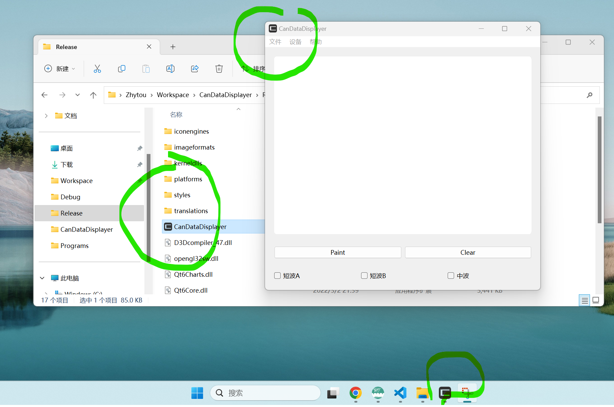

# Qt

## 简介

Qt是跨平台用于开发GUI的C++库。此外，Qt 还存在Python、Ruby、Perl等脚本语言的绑定，也就是说可以使用脚本语言开发基于 Qt 的程序。

**Qt与MFC的比较**：

> 微软基础类库（Microsoft Foundation Classes，简称MFC）是微软公司提供的一个类库（class libraries），以C++类的形式封装了Windows API，并且包含一个应用程序框架，以减少应用程序开发人员的工作量。其中包含大量Windows句柄封装类和很多Windows的内建控件和组件的封装类。

MFC更底层，效率较高，但大量的Windows API和消息机制使得其较难理解，不易用；QT封装较好，易用且跨平台，但效率较低。

## 安装

- 前往[官网](https://www.qt.io/download)，下载安装包；
- 双击运行安装，选择QT Creator 和 MSVC 对应版本模块即可。（注意：MinGW模块一般用于跨平台QT软件开发，若只需要开发Windows图形程序，建议使用MSVC，因为配置简单）。

- 在扩展-管理扩展-联机中找到QT Visual Studio Tool，安装即可；
- 退出VS重新进入后，配置 MSVC 路径，就可以在VS中使用QT开发了。

## 使用

### 添加图标

为了让我们的项目显得高大上，我们常常需要为可执行程序添加一些精美的图标，包括其执行窗口、任务栏以及其可执行文件的图标。其效果如下图所示：



**窗口&任务栏图标**：

对于窗口和任务栏图标，只需要在主窗口文件中添加如下代码即可。

```c++
// 设置图标
QIcon icon(":/CanDataDisplayer/ico/CAN.ico");
this->setWindowIcon(icon);
```

**可执行文件图标**：

对于可执行文件图标，我们则可以使用VS中添加资源文件的功能来达成目的。其具体操作可以参考这篇CSDN博客[vs+qt 给打包程序添加图标](https://blog.csdn.net/qq_32867925/article/details/131386373)。

**自定义图标**：

至于想要找到更多更好看的图标，除了可以使用[Favicon.ico](https://www.logosc.cn/logo/favicon)网站生成外，还可以使用[这个网站](https://tool.lu/favicon/)将本机图片剪切获取。

### 打包发布

在完成QT项目开发并完成测试后，我们通常都需要将其进一步打包才能交付用户或者上线。因为仅仅是在VS中使用Release模式编译得到的可执行文件，往往缺少一些Qt的库。幸运的是Qt为我们提供了windeployqt.exe这一Windows环境下的打包工具。

**windeployqt**：

windeployqt.exe默认是安装在Qt的MSCV目录下，我们只需要使用这个程序执行以下命令即可让它帮忙找到所需的所有dll库。命令如下：

```cmd
windeployqt ~\workspace\proj\x64\Release\xxx.exe
```

更详细的操作则可以参考这一篇CSDN博客[VS2019+QT5.13.2中生成Release模式下可执行的exe文件](https://blog.csdn.net/qq_45445740/article/details/119035433)。

**vs installer projecets**：

如果我们想要进一步让我们的项目变得高大上，还可以使用Microsoft Visual Studio Installer Projects这个插件来将项目打包成一个安装器。其具体操作可以参考这篇CSDN博客[使用vs将应用程序打包成安装包，并设置图标、卸载程序等](https://blog.csdn.net/qq_43153377/article/details/117232087)。

## 参考

[Qt 编程指导](https://qtguide.ustclug.org/)
