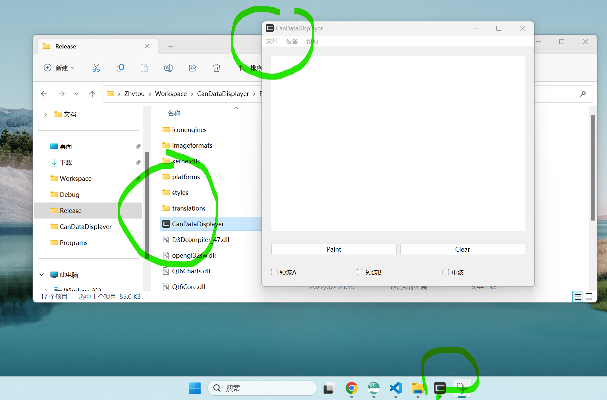

# Qt中一些常用的技巧

- [Qt中一些常用的技巧](#qt中一些常用的技巧)
  - [添加图标](#添加图标)
  - [打包发布](#打包发布)

## 添加图标

为了让我们的项目显得高大上，我们常常需要为可执行程序添加一些精美的图标，包括其执行窗口、任务栏以及其可执行文件的图标。其效果如下图所示：



**窗口&任务栏图标**：

对于窗口和任务栏图标，只需要在主窗口文件中添加如下代码即可。

```c++
// 设置图标
QIcon icon(":/CanDataDisplayer/ico/CAN.ico");
this->setWindowIcon(icon);
```

**可执行文件图标**：

对于可执行文件图标，我们则可以使用VS中添加资源文件的功能来达成目的。其具体操作可以参考这篇CSDN博客[vs+qt 给打包程序添加图标](https://blog.csdn.net/qq_32867925/article/details/131386373)。

**自定义图标**：

至于想要找到更多更好看的图标，除了可以使用[Favicon.ico](https://www.logosc.cn/logo/favicon)网站生成外，还可以使用[这个网站](https://tool.lu/favicon/)将本机图片剪切获取。

## 打包发布

在完成QT项目开发并完成测试后，我们通常都需要将其进一步打包才能交付用户或者上线。因为仅仅是在VS中使用Release模式编译得到的可执行文件，往往缺少一些Qt的库。幸运的是Qt为我们提供了windeployqt.exe这一Windows环境下的打包工具。

**windeployqt**：

windeployqt.exe默认是安装在Qt的MSCV目录下，我们只需要使用这个程序执行以下命令即可让它帮忙找到所需的所有dll库。命令如下：

```cmd
windeployqt ~\workspace\proj\x64\Release\xxx.exe
```

更详细的操作则可以参考这一篇CSDN博客[VS2019+QT5.13.2中生成Release模式下可执行的exe文件](https://blog.csdn.net/qq_45445740/article/details/119035433)。
