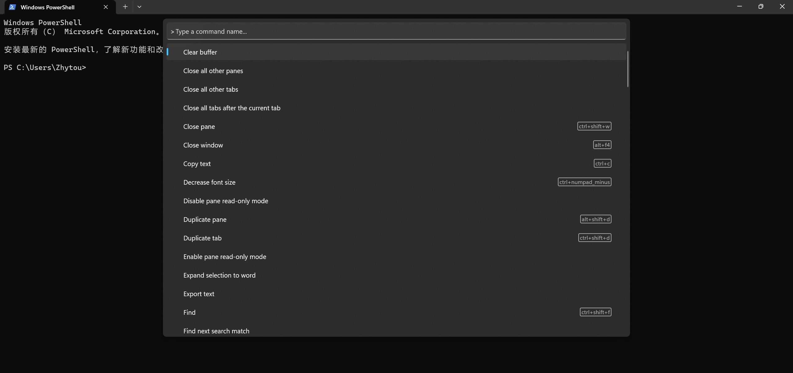

# Terminal Setup

- [Terminal Setup](#terminal-setup)
  - [Prettify Shell on WSL](#prettify-shell-on-wsl)
    - [Zsh](#zsh)
    - [Oh-my-zsh](#oh-my-zsh)
    - [Zsh Themes：Powerlevel10k](#zsh-themespowerlevel10k)
  - [Prettify Shell on Windows](#prettify-shell-on-windows)
    - [PowerShell](#powershell)
    - [On-my-posh](#on-my-posh)
    - [PowerShell Themes](#powershell-themes)
  - [Use Windows Terminal to Mange All Your Shells](#use-windows-terminal-to-mange-all-your-shells)
    - [Introduction](#introduction)
    - [Simple Usage](#simple-usage)
  - [References](#references)

## Prettify Shell on WSL

**简介**：

WSL指的是`Windows Subsystem for Linux`，我们可以在其中运行未经修改过的原生`Linux ELF`可执行文件。

**安装**：

可以在Microsoft商店中下载。之后需要分别在Windows和bios中设置启用Windows的Linux子系统和启用虚拟化技术。

### Zsh

### Oh-my-zsh

**简介**：

`Oh My Zsh`是一款社区驱动的命令行工具，正如它的主页上说的，`Oh My Zsh`是一种生活方式。它基于`zsh`命令行，提供了主题配置，插件机制，已经内置的便捷操作，给我们一种全新的方式使用命令行。

总的来说，`Oh My Zsh`就是基于`zsh shell`的一个扩展工具集，能够帮助你定制你的`zsh shell`。

**安装**：

``` bash
sudo apt-get install oh-my-zsh
```

### Zsh Themes：Powerlevel10k

**安装**：

``` bash
git clone --depth=1 https://gitee.com/romkatv/powerlevel10k.git ~/powerlevel10k
echo 'source ~/powerlevel10k/powerlevel10k.zsh-theme' >>~/.zshrc
```

## Prettify Shell on Windows

### PowerShell

### On-my-posh

**安装**：

在Microsoft商店中下载。

**配置**：

``` bash
# 使用vscode编辑启动powershell脚本
code .$PROFILE or notepad .$PROFILE
# 打开后，在该脚本中添加以下指令
 oh-my-posh init pwsh | Invoke-Expression
# 接着保存退出，启用该脚本
. $PROFILE
# 注意：若PowerShell报错不允许执行任何脚本，则需要在管理员模式下执行以下命令后再次启用$PROFILE
set-ExecutionPolicy RemoteSigned
```

### PowerShell Themes

**配置**：

``` bash
# 获取Oh-my-posh主题
Get-PoshThemes
# 选择脚本，修改$PROFILE为以下
oh-my-posh init pwsh | Invoke-Expression
oh-my-posh init pwsh --config 'C:\Users\[Your Name]\AppData\Local\Programs\oh-my-posh\themes\[Theme Name].omp.json'| Invoke-Expression
# 重新启用$PROFILE
. $PROFILE
```

**其他**：

一般来说，还需要安装字体（可以前往[这里](https://www.nerdfonts.com/)寻找字体），才能保证显示正常。

安装完成后，在终端设置-默认值-外观-字体中选择新下载的字体，即可正常显示。

## Use Windows Terminal to Mange All Your Shells

### Introduction

**概述**：

`PowerShell`是命令行程序，真正执行指令的程序，而`Windows Terminal`则是管理各种命令行的工具。

**下载**：

Microsoft商店中下载。

### Simple Usage

**Tab vs Pane**：

在 Windows Terminal 中，Pane 和 Tab 都是用于分割终端窗口和管理多个终端会话的功能，但它们之间有一些区别：

- 每个 Tab 都是一个独立的终端会话。
- Pane 是一种将终端会话分割成多个窗格的方式。

这里和Tmux中有些概念相关。

**快捷键**：



打开/关闭终端：Ctrl+Alt+T 或 Win+Shift+Enter
创建新的标签页：Ctrl+Shift+T
关闭标签页：Ctrl+Shift+W
切换标签页：Ctrl+Tab 或 Ctrl+Shift+Tab
切换全屏模式：F11
缩放终端：Ctrl+鼠标滚轮 或 Ctrl++/-
复制文本：Ctrl+Shift+C
粘贴文本：Ctrl+Shift+V
打开命令面板：Ctrl+Shift+P 或 F1
改变字体大小：Ctrl+鼠标滚轮
以管理员身份运行当前终端：Ctrl+Shift+Enter

## References

- [PowerShell 美化配置](https://blog.csdn.net/qq_33618417/article/details/126856501)
- [PowerShell 脚本禁用解决](https://blog.csdn.net/llf_cloud/article/details/81069099)
