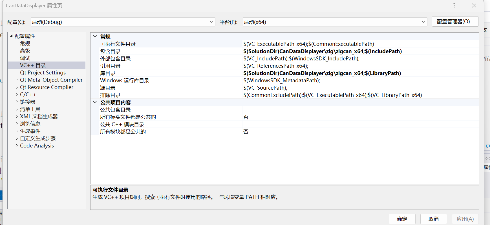
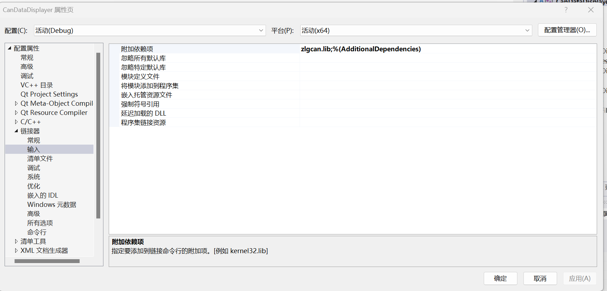

# Visual Studio

> 记录一下我学习使用vs的经验

- [Visual Studio](#visual-studio)
  - [新建](#新建)
  - [美化](#美化)
  - [编码](#编码)
  - [环境](#环境)
  - [优化](#优化)
  - [其他](#其他)
    - [Qt](#qt)
    - [Vcpkg](#vcpkg)
  - [参考](#参考)

## 新建

**项目**：项目是Visual Studio中的基本构建块，代表着一个单独的软件项目。一个项目可以包含一组相关的源代码文件、资源文件、配置文件等。项目定义了构建、编译、运行和管理代码的方式。在Visual Studio中，每个项目都有自己的设置、引用和构建选项。

**解决方案**：解决方案是一个容器，用于组织和管理相关的项目。一个解决方案可以包含一个或多个项目。它提供了一个统一的环境，允许你同时打开、构建和调试多个项目。解决方案还可以包含解决方案级别的设置、配置和共享资源。

**文件结构**：文件结构指的是项目中的文件组织方式和层次结构。在一个项目中，你可以按照需要创建文件夹和子文件夹来组织代码文件、资源文件、配置文件等。文件结构可以帮助你更好地组织和管理项目中的文件，使其更易于理解和维护。

## 美化

设置Save With Formatting

## 编码

**IDE编码方式**：

在我经常使用VS之后，我发现由其编辑的文件，比如：Cpp文件，如果使用其他编辑器打开，其中的汉字注释往往会乱码。查阅了资料之后，我了解到VS的默认保存编码是按照电脑设置来的。因此，对于简体中文的windows电脑VS就会默认保存为GBK编码。

除了通过修改电脑的默认编码来间接修改VS的编码格式之外，还可以直接在VS中找到其高级保存选项-将其中的当前编码格式修改为UTF-8。更详细的操作可以参考这篇博客[CSDN 修改VS的默认编码格式](https://blog.csdn.net/qq_41868108/article/details/105750175)。

**MSVC**：

除了将VS编辑的文件保存为UTF-8以外，还有一种情况也值得我们关注。那就是使用其他编辑器（如VSCode）写的Cpp文件，构建一个VS项目时，往往会出现一些莫名其妙的编译错误。这一点我也是深有感悟，当时在WSL写[SRE](https://github.com/Zhytou/SimpleRenderEngine)项目时，想将其迁移到Windows上做一个新[SRE-VS](https://github.com/Zhytou/SimpleRenderEngine-VS)的版本，结果明明在WSL上编译完全正常的文件，在MSVC编译死活不过。搞了半天，最后才发现要将其设置为UTF-8。具体操作可以参考这个链接[Microsoft Learn 将源字符集和执行字符集设置为 UTF-8](https://learn.microsoft.com/zh-cn/cpp/build/reference/utf-8-set-source-and-executable-character-sets-to-utf-8?view=msvc-170&redirectedfrom=MSDN)。

## 环境

在VS中使用第三方库时，我们往往需要修改项目的引用目录、库目录以及链接器输入，来帮助编译器和链接器找到对应文件。

具体来说，我们需要通过项目属性-VC++目录-包含目录/库目录来修改项目引用目录和库目录；通过项目属性-链接器-输入来添加第三方库的lib文件。（注意，dll文件不能添加到链接器输入中，而是需要复制到执行文件目录中。）如下图所示：

**VC++目录**：

下面补充一些关于VC++目录的作用。总的来说，在VS中VC++目录就是用于配置C++项目的各种目录路径，从而帮助编译器和链接器找到所需的头文件和库文件。除了上面提到的引用目录以及库目录之外，VC++目录还包括：

- 可执行文件目录（Executable Directories）：指定生成的可执行文件的输出目录。在运行时，如果可执行文件依赖于其他文件（如动态链接库），它们将在这个目录中被查找。
- 源文件目录（Source Directories）：指定项目源代码文件的位置。这个目录通常是项目的根目录或包含源代码文件的文件夹。
- 中间目录（Intermediate Directory）：指定生成的中间文件（如.obj文件）的输出目录。这些中间文件是在编译过程中生成的临时文件。

**宏**：

类似GCC，MSVC也定义了一些宏，比如：

- `_WIN32`：当编译器将代码编译为 Windows 应用程序时，该宏会被定义。
- `_DEBUG`：在调试构建中，该宏会被定义。可以使用该宏来包含调试特定的代码或开启调试信息。
- `NDEBUG`：当未定义调试宏时（即非调试构建），该宏会被定义。
- `__FILE__`：当前源文件的名称（包括路径）。
- `__LINE__`：当前源文件中的行号。
- `__FUNCTION__`：当前函数的名称

除此之外，MSVC中额外定义了一些项目宏和解决方案宏。其作用类似CMAKE中预定义的变量，用于获取有关项目、构建和系统的信息，比如：

- CMAKE_PROJECT_NAME: 当前项目的名称。
- CMAKE_SYSTEM: 当前操作系统的名称。
- CMAKE_C_COMPILER: C 编译器的路径。
- CMAKE_CXX_COMPILER: C++ 编译器的路径。
- CMAKE_BUILD_TYPE: 构建类型（例如 Debug、Release）。
- CMAKE_INSTALL_PREFIX: 安装目录的路径。
- CMAKE_LIBRARY_OUTPUT_DIRECTORY: 库文件输出目录的路径。
- CMAKE_RUNTIME_OUTPUT_DIRECTORY: 可执行文件输出目录的路径

对我来说，MSVC中的项目宏和解决方案宏就是用来配置VC++目录。常见的项目宏和解决方案宏有：

- $(ProjectDir)：表示当前项目的根目录路径。
- $(ProjectName)：表示当前项目的名称。
- $(SolutionDir)：表示当前解决方案的根目录路径。
- $(SolutionName)：表示当前解决方案的名称。
- $(TargetDir)：表示生成输出文件的目标目录路径。
- $(TargetName)：表示生成输出文件的名称（不包括扩展名）。

## 优化

> [vs性能分析工具](https://blog.csdn.net/luoweifu/article/details/51470998)

VS中自带了类似valgrind的性能分析工具，可以使用快捷键`F2 + Alt`开始使用。

## 其他

### Qt

在VS中使用Qt，只需要安装Qt MSVC和Qt Visual Studio Tools即可。

### Vcpkg

个人认为在VS中使用Vcpkg的最大好处就是不用对每一个第三方包都去配置引用目录、库目录以及链接器输入。除此之外，它还能像Pip管理Python包那样方便的下载、更新和删除第三方包。其具体安装、配置和使用方法可以参考我的另一篇笔记[Vcpkg](https://github.com/Zhytou/CS-Notes/blob/main/tool/vckpg/vckpg.md)。

## 参考

[玩转Visual Studio](https://www.kancloud.cn/digest/visualstudio/110058)
